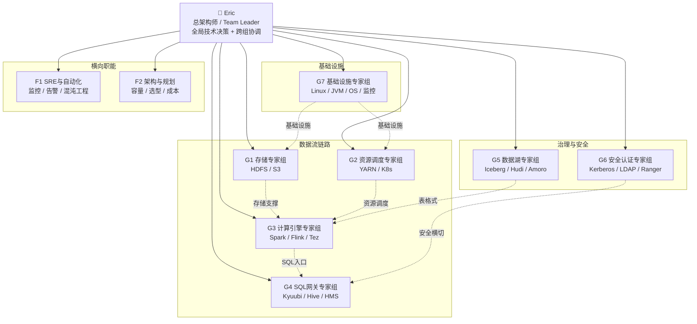

# Eric 大数据运维专家团队架构 v1.1

> **Team Leader**: Eric (AI 运维架构师)
> **创建人**: Kailong Liu（大哥）
> **创建时间**: 2026-04-05 | **更新时间**: 2026-04-05
> **团队定位**: 顶配大数据运维专家团队 — 全组件专家级能力对齐
> **核心方法论**: [源码精通方法论 v2.0](./spark/源码/学习方法论.md) + [问题分析方法论 v1.0](./00-问题分析方法论.md)

---

## 一、团队愿景与目标

### 1.1 愿景

> **打造业界标杆级大数据运维团队：任何故障 30 分钟内锁定根因，99.99% 平台可用性，零数据丢失。**

### 1.2 核心目标（OKR）

| 维度 | 目标 | 关键结果 |
|------|------|----------|
| **稳定性** | 平台可用性 99.99% | P0 故障 ≤ 1 次/季度，MTTR < 30min |
| **效率** | 日常运维自动化率 > 80% | 人工操作减少 60%，巡检全自动 |
| **深度** | 团队平均技术段位 L3+ | 每人至少 2 个组件达到源码级（L3） |
| **预防** | 故障预防率 > 50% | 通过巡检/混沌工程提前发现并消除隐患 |
| **知识** | 知识库覆盖 100% 组件 | 每个组件至少 3 个线上案例沉淀 |

---

## 二、组织架构

### 2.1 架构总览

```
                         ┌──────────────────────────────┐
                         │      Eric — 总架构师          │
                         │    全局技术决策 · 跨组协调     │
                         │    对外接口 · 架构评审         │
                         └──────────────┬───────────────┘
                                        │
            ┌───────────────────────────┼───────────────────────────┐
            │                           │                           │
    ┌───────┴───────┐          ┌───────┴───────┐          ┌───────┴───────┐
    │ 纵向专家组 ×7  │          │ 横向职能 ×2   │          │ 支撑体系      │
    │ (技术纵深)     │          │ (跨组赋能)    │          │ (运营保障)    │
    └───────┬───────┘          └───────┬───────┘          └───────┬───────┘
            │                           │                           │
  ┌─────────┼─────────┐        ┌───────┼───────┐           ┌──────┤
  │         │         │        │               │           │      │
 G1-G4   G5-G6     G7        F1-SRE        F2-架构     值班制度  知识库
(数据流) (治理面) (基石)     自动化         容量规划    On-Call   运营
```

### 2.2 七大纵向专家组 + 两大横向职能



---

## 三、编制规模与人员矩阵

### 3.1 顶配编制（18-22 人）

| 层级 | 角色 | 人数 | 技术段位要求 | 职级参考 |
|------|------|:----:|:-----------:|---------|
| **L0** | 总架构师 / Team Leader (Eric) | 1 | L4 创造者 | P8/P9 |
| **L1** | 专家组组长 (Tech Lead) | 7 | L3+ 手术刀 | P7/P8 |
| **L2** | 高级运维工程师 | 7-9 | L2+ 地图绘制者 | P6/P7 |
| **L3** | 运维工程师 | 3-5 | L1+ 使用者(成长中) | P4/P5 |
| **—** | **合计** | **18-22** | | |

> 技术段位参考 [源码精通方法论 — 四段位模型](./spark/源码/学习方法论.md):
> - **L1 使用者**: 会用 API，能看懂日志，能改配置
> - **L2 地图绘制者**: 脑中有完整架构图，知道每个模块的职责和边界
> - **L3 手术刀**: 任何 bug 能在 30 分钟内定位到行号，能写生产级 patch
> - **L4 创造者**: 能设计新系统，能发现并修复架构缺陷

### 3.2 各专家组人员配置

| 专家组 | 组长 | 高级 | 工程师 | 小计 | 说明 |
|--------|:----:|:----:|:------:|:----:|------|
| G1 存储 | 1 | 1 | 0-1 | 2-3 | HDFS 是基石，需深厚功力 |
| G2 资源调度 | 1 | 1 | 0-1 | 2-3 | YARN 队列治理是日常高频 |
| G3 计算引擎 | 1 | 2 | 1 | 4-5 | Spark+Flink 是最大工作量 |
| G4 SQL网关 | 1 | 1 | 1 | 3 | Kyuubi+Hive 是用户直接接触面 |
| G5 数据湖 | 1 | 1 | 0-1 | 2-3 | 新兴领域，快速增长 |
| G6 安全认证 | 1 | 0-1 | 0 | 1-2 | 专精方向，可兼任 |
| G7 基础设施 | 1 | 1 | 1 | 3 | OS/JVM/监控是所有人的基础 |

> **兼任策略**: G6 安全认证组长可由 G4 组长兼任（安全问题多发于 SQL 网关层）。F1/F2 横向职能由各组组长轮值担任。

---

## 四、各专家组详细定义

### G1 — 存储专家组 (Storage)

**使命**: 守护数据的最后一道防线，确保数据零丢失、存储高可用。

| 维度 | 内容 |
|------|------|
| **核心组件** | HDFS (NameNode/DataNode/JournalNode)、S3/对象存储、Ozone |
| **关联组件** | ZooKeeper (HA 依赖)、Hive MetaStore (元数据) |
| **日常职责** | NN 健康巡检、Block 完整性检查、Balancer 调度、容量预警、小文件治理 |
| **故障域** | NN SafeMode、DN 磁盘故障、HA Failover 异常、数据块损坏/丢失 |
| **核心能力** | HDFS Federation 架构设计、NN 性能调优（百亿文件级别） |

**必修知识库**:
- [HDFS 源码分析](./hdfs/源码/HDFS源码分析.md) — HA/Federation 架构、故障排查、性能调优
- [ZooKeeper 深度运维手册](./zookeeper/源码/ZooKeeper深度运维手册.md) — ZAB 协议、脑裂防护
- [OS 内核调优手册 §文件系统](./os-kernel/OS内核调优手册.md) — noatime、IO 调度器、预读

**待建设知识**:
- [ ] S3/对象存储与 HDFS 混合存储架构
- [ ] HDFS Federation 深度实战案例
- [ ] DataNode 磁盘管理与坏盘自动替换
- [ ] NameNode GC 调优深度案例（百亿文件场景）

---

### G2 — 资源调度专家组 (Scheduling)

**使命**: 让每一份算力都用在刀刃上，资源利用率最大化。

| 维度 | 内容 |
|------|------|
| **核心组件** | YARN (ResourceManager/NodeManager/Scheduler)、K8s (可选) |
| **关联组件** | Spark AM、Flink JobManager、Tez AM |
| **日常职责** | 队列容量管理、资源使用监控、大作业限流、NodeManager 健康管理 |
| **故障域** | 队列资源饥饿、NM UNHEALTHY、Container 泄漏、资源碎片化、AM 排队 |
| **核心能力** | CapacityScheduler 深度调优、多租户资源隔离、抢占策略设计 |

**必修知识库**:
- [YARN 源码分析](./yarn/源码/YARN源码分析.md) — 架构、调度器选型、命令速查
- [NM 堆外内存泄漏分析](./yarn/案例/NM堆外内存泄漏分析/分析报告.md) — 39KB 深度案例
- [运维脚本] [NMT快照对比.sh](./yarn/案例/NM堆外内存泄漏分析/脚本/NMT快照对比.sh) | [NM堆外内存监控.sh](./yarn/案例/NM堆外内存泄漏分析/脚本/NM堆外内存监控.sh) | [Shuffle泄漏检测.sh](./yarn/案例/NM堆外内存泄漏分析/脚本/Shuffle泄漏检测.sh)

**待建设知识**:
- [ ] CapacityScheduler 深度调优案例（多租户场景）
- [ ] FairScheduler vs CapacityScheduler 迁移实战
- [ ] YARN on K8s 架构与对比
- [ ] 资源碎片化诊断与治理方案
- [ ] Container 泄漏检测自动化脚本

---

### G3 — 计算引擎专家组 (Compute)

**使命**: 让每一条 SQL、每一个 Job 都跑得快、跑得稳、跑得对。

| 维度 | 内容 |
|------|------|
| **核心组件** | Spark (Core/SQL/Streaming)、Flink (DataStream/SQL/CDC)、Tez |
| **关联组件** | YARN (资源)、HDFS (存储)、Iceberg (表格式) |
| **日常职责** | 作业性能调优、数据倾斜治理、OOM 排障、Shuffle 优化、Checkpoint 管理 |
| **故障域** | Executor OOM、Shuffle 失败、Stage 重试、反压、数据倾斜、GC 风暴 |
| **核心能力** | Spark AQE 深度调优、Flink 状态管理、SQL 执行计划分析 |

**必修知识库**:

**Spark**:
- [全局架构地图](./spark/源码/05-全局架构地图.md) — 核心类速查 + SQL 流水线
- [内存管理](./spark/源码/01-内存管理.md) — UnifiedMemoryManager 逐行分析
- [Shuffle 机制](./spark/源码/02-Shuffle机制.md) — 三路写入 + 读取流控
- [调度系统](./spark/源码/03-调度系统.md) — DAGScheduler + TaskSchedulerImpl
- [SQL 引擎与 AQE](./spark/源码/04-SQL引擎与AQE.md) — QueryExecution 完整链路
- [快速排障索引](./spark/源码/00-目录.md) — 按报错信息/线上场景定位

**Flink**:
- [Flink 深度运维手册](./flink/源码/Flink深度运维手册.md) — Checkpoint/反压/State/CDC

**待建设知识**:
- [ ] Flink 源码级深度分析（JobGraph→ExecutionGraph→调度）
- [ ] Flink CDC 3.6.0 升级实战与数据一致性验证
- [ ] Tez 执行引擎深度分析（独立文档，当前在 Hive S10 中有部分覆盖）
- [ ] Spark 4.0 + JDK 17 升级路径
- [ ] 计算引擎选型决策树（什么场景用 Spark vs Flink vs Tez）

---

### G4 — SQL 网关专家组 (SQL Gateway)

**使命**: 用户体验的第一入口，让 SQL 查询又快又准又安全。

| 维度 | 内容 |
|------|------|
| **核心组件** | Kyuubi、HiveServer2、Hive MetaStore、Beeline |
| **关联组件** | Spark Engine、Tez Engine、Kerberos、Ranger |
| **日常职责** | HS2/Kyuubi 健康监控、慢查询治理、Session 管理、引擎池管理 |
| **故障域** | HS2 OOM、编译锁卡住、查询结果不对、连接泄漏、认证失败、HMS 阻塞 |
| **核心能力** | HS2 全链路源码级排障、Kyuubi EngineRef 调度算法 |

> **这是我们知识最深厚的专家组**，已有 430+ KB 源码级知识沉淀。

**必修知识库**:

**Kyuubi（80KB 源码分析）**:
- [Kyuubi 源码分析](./kyuubi/源码/Kyuubi源码分析.md) — 全仓最深文档，EngineRef/Session/HA
- [Kyuubi 排障手册](./kyuubi/案例/Kyuubi问题排查/分析报告.md)
- [运维脚本] [Kyuubi诊断.sh](./kyuubi/案例/Kyuubi问题排查/脚本/Kyuubi诊断.sh) | [引擎监控.sh](./kyuubi/案例/Kyuubi问题排查/脚本/引擎监控.sh) | [清理孤儿Spark应用.sh](./kyuubi/案例/Kyuubi问题排查/脚本/清理孤儿Spark应用.sh)
- [Kyuubi 推荐配置](./kyuubi/案例/Kyuubi问题排查/配置/kyuubi推荐配置.conf)

**Hive（350+ KB 源码 + 案例）**:
- [Hive 基础](./hive/源码/01-Hive基础.md) | [Hive 深度分析](./hive/源码/02-Hive深度分析.md) | [Hive 源码地图](./hive/源码/03-Hive源码地图.md)
- **S01**: HS2 请求全链路 — [Part1](./hive/源码/S01-Part1-请求链路图与Thrift到编译.md) [Part2](./hive/源码/S01-Part2-语义分析到执行与故障点地图.md) [Part3](./hive/源码/S01-Part3-配置参数速查与排障决策树.md)
- **S02**: [HS2 OOM 进程不退出](./hive/源码/S02-HS2-OOM进程不退出端口不响应.md)
- **S04**: HS2 查询结果正确性 — [Part1](./hive/源码/S04-Part1-HS2结果错误源码分析.md) [Part2](./hive/源码/S04-Part2-HS2结果不对排障实战手册.md) [Part3](./hive/源码/S04-Part3-Hive3x高危结果Bug索引.md)
- **S05**: Hive 查询卡住全场景 — [总览](./hive/源码/S05-Part0-Hive-Hang总览与风险矩阵.md) + 11 篇子分析
- **S06**: [MapJoin 回退 CommonJoin](./hive/源码/S06-MapJoin回退CommonJoin源码深度分析.md)
- **S07-S10**: [SQL Parser](./hive/源码/S07-SQL-Parser词法语法解析源码分析.md) → [语义分析](./hive/源码/S08-语义分析SemanticAnalyzer源码分析.md) → [CBO/RBO](./hive/源码/S09-CBO-RBO优化器源码分析.md) → [物理计划+Tez](./hive/源码/S10-物理计划生成与Tez执行源码分析.md)
- **线上案例**: [HS2堆外泄漏](./hive/案例/HS2堆外内存泄漏分析/分析报告.md) | [查询卡住](./hive/案例/Hive查询卡住分析/分析报告.md) | [死锁](./hive/案例/HS2死锁与锁竞争/分析报告.md) | [结果不对](./hive/案例/HS2查询结果不对排障/分析报告.md) | [ACID](./hive/案例/HS2-ACID与Compaction问题/分析报告.md) | [竞态条件](./hive/案例/HS2竞态条件/分析报告.md) | [认证](./hive/案例/HS2认证与Kerberos/分析报告.md) | [连接泄漏](./hive/案例/HS2连接池线程池泄漏/分析报告.md)

**待建设知识**:
- [ ] HMS 独立部署调优（高并发 Metastore 场景）
- [ ] Trino/Presto 网关集成方案
- [ ] Kyuubi + Spark 引擎池智能伸缩策略

---

### G5 — 数据湖专家组 (Data Lake)

**使命**: 让数据湖不变成数据沼泽，自动化治理、高效查询。

| 维度 | 内容 |
|------|------|
| **核心组件** | Iceberg、Hudi、Amoro、数据质量工具 |
| **关联组件** | Hive MetaStore (Catalog)、Spark (Compaction)、Flink (流入湖) |
| **日常职责** | 表 Compaction 管理、Snapshot 清理、孤立文件清理、Schema Evolution 审核 |
| **故障域** | 小文件膨胀、查询变慢、元数据膨胀、Compaction 失败、写入冲突 |
| **核心能力** | 湖仓一体架构设计、Compaction 策略调优 |

**必修知识库**:
- [Iceberg 深度运维手册](./iceberg/源码/Iceberg深度运维手册.md) — Compaction 三策略、Schema Evolution、流式防膨胀
- [Amoro 源码分析](./amoro/源码/Amoro源码分析.md) — Self-optimizing、统一 Catalog

**待建设知识**:
- [ ] Iceberg 源码级深度分析（Metadata 三层架构的源码实现）
- [ ] Hudi COW/MOR 深度对比与选型指南
- [ ] Amoro Self-optimizing 源码级调优
- [ ] 数据质量框架（Great Expectations / Deequ）集成
- [ ] 湖仓一体架构设计最佳实践

---

### G6 — 安全认证专家组 (Security)

**使命**: 让数据安全合规，认证授权无死角。

| 维度 | 内容 |
|------|------|
| **核心组件** | Kerberos (KDC/keytab)、LDAP/AD、Ranger (Plugin/Admin)、Knox |
| **关联组件** | 所有组件（安全是横切面） |
| **日常职责** | 票据续期监控、权限策略管理、审计日志分析、安全合规检查 |
| **故障域** | 认证失败、权限不生效、票据过期、跨域信任异常、策略同步延迟 |
| **核心能力** | Kerberos 跨域认证架构设计、Ranger 数据脱敏方案 |

**必修知识库**:
- [Kerberos 原理与排障](./kerberos/源码/Kerberos原理与排障.md) — 5 步排障法、高频错误速查、票据续期
- [LDAP 原理与排障](./ldap/源码/LDAP原理与排障.md) — UserSync 同步、HS2 LDAP 认证
- [Ranger 源码分析](./ranger/源码/Ranger源码分析.md) — Plugin 架构、权限不生效 4 步排查

**待建设知识**:
- [ ] Knox 网关配置与排障
- [ ] Kerberos 跨域认证深度实战案例
- [ ] Ranger 数据脱敏与行级过滤实战
- [ ] 安全审计自动化方案
- [ ] 零信任架构在大数据平台的落地

---

### G7 — 基础设施专家组 (Infrastructure)

**使命**: 地基打不牢，上层全白搭。OS/JVM/网络/监控是所有人的必修课。

| 维度 | 内容 |
|------|------|
| **核心组件** | Linux OS、JVM (G1/ZGC)、网络、Prometheus/Grafana、ELK |
| **关联组件** | 所有组件（基础设施是地基） |
| **日常职责** | OS 参数巡检、JVM GC 监控、磁盘/网络健康检查、监控体系维护 |
| **故障域** | OOM Kill、Swap 导致 GC 风暴、磁盘满、网络分区、文件描述符耗尽 |
| **核心能力** | Linux 性能深度诊断、JVM GC 调优、全栈监控体系建设 |

**必修知识库**:
- [Linux 操作系统运维手册](./linux/Linux操作系统运维手册.md) — 性能诊断四板斧
- [Java/JVM 调优手册](./java-jvm/Java-JVM调优手册.md) — GC 选型、OOM/Hang 排障
- [OS 内核调优手册](./os-kernel/OS内核调优手册.md) — 部署前调优清单

**待建设知识**:
- [ ] Prometheus + Grafana 大数据监控体系搭建指南
- [ ] ELK 日志分析平台架构
- [ ] 网络深度诊断（TCP 调优、跨机房延迟、丢包排查）
- [ ] 容器化基础（Docker/K8s 基础运维）
- [ ] 自动化运维工具链（Ansible/Terraform）

---

### F1 — SRE 与自动化（横向职能）

**使命**: 用工程化手段消灭重复劳动，用混沌工程提前发现风险。

| 维度 | 内容 |
|------|------|
| **职责** | 监控告警体系建设、自动化巡检脚本开发、混沌工程实践、CI/CD 流水线 |
| **人员** | 由各专家组组长轮值 + 1 名专职 SRE 工程师 |
| **核心产出** | 自动化巡检系统、告警收敛策略、混沌测试方案、运维平台 |

**已有自动化资产**:

| 脚本 | 归属 | 功能 |
|------|------|------|
| [Kyuubi诊断.sh](./kyuubi/案例/Kyuubi问题排查/脚本/Kyuubi诊断.sh) | G4 | Kyuubi Server 全面健康诊断 |
| [引擎监控.sh](./kyuubi/案例/Kyuubi问题排查/脚本/引擎监控.sh) | G4 | Spark Engine 状态监控 |
| [清理孤儿Spark应用.sh](./kyuubi/案例/Kyuubi问题排查/脚本/清理孤儿Spark应用.sh) | G4 | 自动清理泄漏的 Spark 应用 |
| [NMT快照对比.sh](./yarn/案例/NM堆外内存泄漏分析/脚本/NMT快照对比.sh) | G2 | NMT 内存快照采集与对比 |
| [NM堆外内存监控.sh](./yarn/案例/NM堆外内存泄漏分析/脚本/NM堆外内存监控.sh) | G2 | NodeManager 堆外内存持续监控 |
| [Shuffle泄漏检测.sh](./yarn/案例/NM堆外内存泄漏分析/脚本/Shuffle泄漏检测.sh) | G2 | Shuffle 服务内存泄漏检测 |
| [NMT快照对比.sh](./hive/案例/HS2堆外内存泄漏分析/脚本/NMT快照对比.sh) | G4 | HS2 NMT 内存快照对比 |
| [堆外内存监控.sh](./hive/案例/HS2堆外内存泄漏分析/脚本/堆外内存监控.sh) | G4 | HS2 堆外内存监控 |
| [结果Bug验证.sh](./hive/案例/HS2查询结果不对排障/脚本/结果Bug验证.sh) | G4 | Hive 查询结果一致性验证 |

---

### F2 — 架构与规划（横向职能）

**使命**: 站在未来看现在，确保平台架构持续演进、成本可控。

| 维度 | 内容 |
|------|------|
| **职责** | 容量规划与预测、架构评审、技术选型、成本优化、升级路径规划 |
| **人员** | Eric 主导 + 各组组长参与 |
| **核心产出** | 年度容量规划报告、架构演进路线图、技术选型评估文档 |

---

## 五、岗位职责矩阵（RACI）

> R = Responsible (执行) | A = Accountable (负责) | C = Consulted (咨询) | I = Informed (知会)

### 5.1 日常运维场景

| 活动 | Eric | G1 存储 | G2 调度 | G3 计算 | G4 网关 | G5 湖 | G6 安全 | G7 基础 | F1 SRE |
|------|:----:|:------:|:------:|:------:|:------:|:----:|:------:|:------:|:------:|
| 集群巡检 | I | R | R | R | R | R | R | R | A |
| 日志分析 | I | R | R | R | R | R | R | R | C |
| 慢查询治理 | C | I | C | R | A | C | I | C | I |
| 队列资源管理 | C | I | A | R | C | I | I | I | C |
| 安全策略变更 | A | I | I | I | C | I | R | I | I |
| 监控告警维护 | I | C | C | C | C | C | I | C | A |
| 版本升级 | A | R | R | R | R | R | R | R | C |

### 5.2 故障响应场景

| 活动 | Eric | 当值组长 | 相关组 | 其他组 | F1 SRE |
|------|:----:|:-------:|:-----:|:------:|:------:|
| P0 故障止血 | A | R | R | I | C |
| 现场保全 | I | A | R | I | C |
| 定界定位 | C | A | R | C | C |
| 根因分析 | C | A | R | C | I |
| 修复验证 | A | R | R | I | C |
| 复盘沉淀 | A | R | R | I | R |

### 5.3 变更管理场景

| 活动 | Eric | 变更方 | 影响方 | G6 安全 | F1 SRE | F2 架构 |
|------|:----:|:-----:|:------:|:------:|:------:|:------:|
| 变更评审 | A | R | C | C | C | C |
| 灰度发布 | I | R | I | I | A | C |
| 回滚方案 | A | R | C | I | C | C |
| 变更后验证 | I | R | R | C | C | I |

---

## 六、故障响应与升级机制

### 6.1 故障响应升级链

```
┌──────────────────────────────────────────────────────────────────────┐
│                        故障响应升级链                                  │
│                                                                      │
│  L1 值班工程师                                                        │
│  ├─ 5 分钟内响应告警                                                  │
│  ├─ 执行止血 SOP（参考: 问题分析方法论 Step1）                         │
│  ├─ 现场保全（参考: 问题分析方法论 Step2）                              │
│  └─ 15 分钟内未解决 → 升级 L2                                        │
│                                                                      │
│  L2 专家组组长                                                        │
│  ├─ 15 分钟内接手                                                    │
│  ├─ 分层定界（参考: 问题分析方法论 Step3 — 7 层分层模型）               │
│  ├─ 假设验证（参考: 问题分析方法论 Step4 — 五大根因分析工具）            │
│  └─ 30 分钟内未解决 → 升级 L3                                        │
│                                                                      │
│  L3 Eric + 跨组联合 War Room                                         │
│  ├─ 30 分钟内组建 War Room                                            │
│  ├─ 调集跨组专家联合排障                                              │
│  ├─ 决策是否需要外部支援                                              │
│  └─ 1 小时内未解决 → 升级 L4                                         │
│                                                                      │
│  L4 外部支援                                                          │
│  ├─ 社区专家（Apache JIRA / 邮件列表）                                │
│  ├─ 商业厂商支持                                                      │
│  └─ 源码级 Patch 开发                                                 │
└──────────────────────────────────────────────────────────────────────┘
```

### 6.2 故障响应 SOP（标准操作流程）

基于 [问题分析方法论 — 黄金排障六步法](./00-问题分析方法论.md)：

```
Step 1: 止血分流 (Triage)
  ├─ 评估严重等级 (P0/P1/P2/P3)
  ├─ 执行止血手段（重启/回滚/切流/限流）
  └─ 通知相关方

Step 2: 现场保全 (Preserve)
  ├─ 采集 jstack × 3 次（间隔 5s）
  ├─ 保存 GC 日志、应用日志
  ├─ 系统状态快照（top/vmstat/iostat）
  └─ 监控截图（Grafana）

Step 3: 定界定位 (Examine)
  ├─ 分层定界（7 层模型: 客户端→SQL网关→元数据→计算→调度→存储→OS）
  ├─ 二分法切入
  └─ 检查"最后触碰"（最近变更）

Step 4: 假设验证 (Diagnose)
  ├─ 五大工具: 5-Why / 鱼骨图 / 故障树 / 时间线 / 对比分析
  ├─ 每次只验证一个变量
  └─ 记录所有排查步骤（包括否定结果）

Step 5: 修复确认 (Treat)
  ├─ 临时修复 → 正式修复 → 根本修复（三层次）
  └─ 修复验证检查清单

Step 6: 复盘沉淀 (Postmortem)
  ├─ Postmortem 报告
  ├─ 知识晶体化 → 更新知识库
  └─ Action Items 跟踪
```

### 6.3 On-Call 排班制度

| 维度 | 规则 |
|------|------|
| **排班周期** | 周轮转，周一 10:00 交接 |
| **值班编制** | 主值 1 人 + 备值 1 人 |
| **轮转范围** | L2 以上工程师参与，L3 工程师需有 L2 做 backup |
| **响应要求** | P0: 5 分钟内响应；P1: 15 分钟；P2: 1 小时；P3: 当天 |
| **交接内容** | 未关闭问题、进行中的变更、需关注的监控项 |

**On-Call 排班模板**:

```
Week N (MM/DD - MM/DD):
  主值: [姓名] (G? 专家组)  📱 [电话]
  备值: [姓名] (G? 专家组)  📱 [电话]
  交接事项:
    - [ ] 上周未关闭问题: ...
    - [ ] 进行中变更: ...
    - [ ] 需关注监控项: ...
```

---

## 七、技能要求与成长路径

### 7.1 通用技能要求（所有成员）

| 技能类别 | L1 使用者 | L2 地图绘制者 | L3 手术刀 | L4 创造者 |
|----------|----------|--------------|----------|----------|
| **Linux** | 基本命令 | 性能诊断四板斧 | strace/perf/火焰图 | 内核参数调优 |
| **JVM** | jps/jstat | jstack/jmap/MAT | GC 日志分析、堆外诊断 | GC 调优方案设计 |
| **网络** | ping/telnet | tcpdump/ss | 网络分区诊断 | TCP 协议栈调优 |
| **排障** | 会重启/搜索 | 按决策树排查 | 30min 内锁定根因 | 预防性架构设计 |
| **源码** | 能看懂日志 | 能画架构图 | 能定位到行号 | 能写 Patch/SPIP |
| **自动化** | 会用脚本 | 能写脚本 | 能设计自动化方案 | 能建自动化平台 |
| **文档** | 能写操作记录 | 能写排障报告 | 能写根因分析报告 | 能写架构设计文档 |

### 7.2 各专家组专项技能

| 专家组 | L2 必备 | L3 必备 |
|--------|---------|---------|
| G1 存储 | HDFS 架构理解、fsck/balancer | NN 源码级调优、Federation 设计 |
| G2 资源调度 | YARN 队列管理、NM 排障 | Scheduler 源码、抢占策略设计 |
| G3 计算引擎 | Spark SQL 调优、Flink 部署 | 内存/Shuffle/调度源码级排障 |
| G4 SQL网关 | HS2/Kyuubi 运维、慢查询分析 | 全链路源码跟踪、编写修复补丁 |
| G5 数据湖 | Iceberg 表维护、Compaction | 元数据架构、湖仓方案设计 |
| G6 安全认证 | Kerberos kinit、Ranger 策略 | 跨域认证、安全架构设计 |
| G7 基础设施 | OS 诊断、JVM 基本调优 | 全栈监控设计、OS 内核调优 |

### 7.3 成长路径

```
L1 → L2（6-12 个月）
  ├─ 完成本组件基础知识库学习
  ├─ 参与 3+ 次故障排查（跟随 L2/L3）
  ├─ 独立完成 1 个排障案例文档
  └─ 通过 L2 认证考核

L2 → L3（12-24 个月）
  ├─ 深度学习 2+ 个组件的源码（参考 90 天路线图）
  ├─ 独立处理 5+ 次 P1/P2 故障
  ├─ 输出 3+ 篇源码级分析文档
  ├─ 开发 2+ 个自动化运维脚本
  └─ 通过 L3 认证考核

L3 → L4（24-36 个月）
  ├─ 主导 1+ 次架构级优化/迁移项目
  ├─ 向社区提交 2+ 个 Patch
  ├─ 输出 1+ 篇方法论级别文档
  ├─ 培养 2+ 名 L2 工程师
  └─ 通过 L4 认证考核
```

---

## 八、专家级能力标准与能力对齐计划

> **核心原则：每个专家组都要达到专家级，不允许有短板。团队的木桶效应取决于最短的那块板。**

### 8.0 专家级能力标准定义（Expert-Level Baseline）

> 每个组件要达到"专家级"，必须满足以下 **5 个维度全覆盖**：

| # | 维度 | 定义 | 交付标准 | 最低知识量 |
|:-:|------|------|----------|:----------:|
| D1 | **源码/原理深度分析** | 核心模块逐行级源码分析，或协议/架构原理深度剖析 | ≥3 篇深度文档，覆盖核心架构+关键路径+异常处理 | ≥30 KB |
| D2 | **线上故障案例库** | 真实或高仿真的 P0/P1 级故障完整分析报告 | ≥3 个独立案例，按知识晶体化模板 | ≥20 KB |
| D3 | **运维脚本/自动化** | 可直接在生产环境使用的诊断/监控/清理脚本 | ≥2 个生产级脚本 (.sh) | — |
| D4 | **配置参数体系** | 全量关键参数速查表，含默认值/建议值/什么时候改 | 独立配置手册或参数速查文档 | ≥5 KB |
| D5 | **性能调优指南** | 系统化调优方法论+实战案例 | 独立调优文档或章节 | ≥5 KB |

**评分规则**：每个维度满分 2 分（2=优秀 1=及格 0=缺失），总分 10 分。**专家级 ≥ 8 分**。

### 8.1 当前能力评估矩阵（精确到维度）

```
专家级标准线: ████████ (8/10)

组件           D1源码  D2案例  D3脚本  D4配置  D5调优  总分  差距
━━━━━━━━━━━━━━━━━━━━━━━━━━━━━━━━━━━━━━━━━━━━━━━━━━━━━━━━━
G4-Hive        ██ 2   ██ 2   ██ 2   ██ 2   ██ 2   10/10  ✅ 专家级
G4-Kyuubi      ██ 2   ██ 2   ██ 2   ██ 2   ██ 2   10/10  ✅ 专家级
G3-Spark       ██ 2   █░ 1   ░░ 0   █░ 1   █░ 1    5/10  ❌ 差 3 分
G2-YARN        █░ 1   ██ 2   ██ 2   █░ 1   ░░ 0    6/10  ❌ 差 2 分
G1-HDFS        █░ 1   █░ 1   ░░ 0   █░ 1   █░ 1    4/10  ❌ 差 4 分
G1-ZooKeeper   ░░ 0   █░ 1   ░░ 0   █░ 1   █░ 1    3/10  ❌ 差 5 分
G3-Flink       ░░ 0   █░ 1   ░░ 0   █░ 1   █░ 1    3/10  ❌ 差 5 分
G5-Iceberg     ░░ 0   █░ 1   ░░ 0   █░ 1   █░ 1    3/10  ❌ 差 5 分
G5-Amoro       ░░ 0   ░░ 0   ░░ 0   ░░ 0   ░░ 0    0/10  ❌ 差 8 分
G6-Kerberos    █░ 1   █░ 1   ░░ 0   █░ 1   ░░ 0    3/10  ❌ 差 5 分
G6-LDAP        █░ 1   ░░ 0   ░░ 0   █░ 1   ░░ 0    2/10  ❌ 差 6 分
G6-Ranger      ░░ 0   █░ 1   ░░ 0   ░░ 0   ░░ 0    1/10  ❌ 差 7 分
G7-Linux       ─  ─   █░ 1   ░░ 0   ██ 2   ██ 2    5/10  ❌ 差 3 分
G7-JVM         ─  ─   █░ 1   ░░ 0   ██ 2   ██ 2    5/10  ❌ 差 3 分
G7-OS内核      ─  ─   █░ 1   ░░ 0   ██ 2   ██ 2    5/10  ❌ 差 3 分
━━━━━━━━━━━━━━━━━━━━━━━━━━━━━━━━━━━━━━━━━━━━━━━━━━━━━━━━━
团队平均: 4.3/10  |  达标率: 2/15 = 13%  |  目标: 100%
```

### 8.2 能力差距热力图

```
                D1源码  D2案例  D3脚本  D4配置  D5调优
G4-Hive         ●       ●       ●       ●       ●      全绿
G4-Kyuubi       ●       ●       ●       ●       ●      全绿
G3-Spark        ●       ◐       ○       ◐       ◐      需补案例+脚本+配置+调优
G2-YARN         ◐       ●       ●       ◐       ○      需补源码+配置+调优
G1-HDFS         ◐       ◐       ○       ◐       ◐      需补源码+案例+脚本
G1-ZooKeeper    ○       ◐       ○       ◐       ◐      全面不足
G3-Flink        ○       ◐       ○       ◐       ◐      全面不足
G5-Iceberg      ○       ◐       ○       ◐       ◐      全面不足
G5-Amoro        ○       ○       ○       ○       ○      从零开始
G6-Kerberos     ◐       ◐       ○       ◐       ○      需补深度+脚本+调优
G6-LDAP         ◐       ○       ○       ◐       ○      需补案例+脚本
G6-Ranger       ○       ◐       ○       ○       ○      从零开始
G7-Linux        ─       ◐       ○       ●       ●      需补案例+脚本
G7-JVM          ─       ◐       ○       ●       ●      需补案例+脚本
G7-OS内核       ─       ◐       ○       ●       ●      需补案例+脚本

● = 优秀(2分)  ◐ = 及格(1分)  ○ = 缺失(0分)  ─ = 不适用
```

### 8.3 全组件能力对齐计划

> **目标：每个组件 ≥ 8/10 分，全部达到专家级**

#### Wave 1: 核心数据链路（4月 — 最高优先级）

| 组件 | 当前 | 目标 | 需补维度 | 具体交付物 |
|------|:----:|:----:|----------|-----------|
| **Flink** | 3/10 | 8/10 | D1+D2+D3 | ① Flink 架构地图与核心源码分析(JobGraph→ExecutionGraph→调度) ② Checkpoint 源码深度分析 ③ 反压机制源码分析 ④ 3个线上案例(Checkpoint失败/反压瓶颈/State膨胀) ⑤ 2个运维脚本(Flink诊断.sh/Checkpoint监控.sh) |
| **HDFS** | 4/10 | 8/10 | D1+D2+D3 | ① NameNode 源码深度分析(FSNamesystem/BlockManager/EditLog) ② DataNode 源码分析(存储/心跳/复制) ③ 3个线上案例(NN慢/SafeMode/磁盘不均) ④ 2个运维脚本(HDFS健康巡检.sh/小文件检测.sh) |
| **YARN** | 6/10 | 8/10 | D1+D4+D5 | ① CapacityScheduler 源码深度分析(资源分配/抢占/队列层级) ② ResourceManager 核心源码分析 ③ 配置参数全量速查表 ④ YARN 性能调优指南(队列设计+资源碎片化治理) |
| **Spark** | 5/10 | 8/10 | D2+D3+D4+D5 | ① 3个线上案例(OOM排障/数据倾斜/Shuffle失败) ② 2个运维脚本(Spark应用诊断.sh/倾斜检测.sh) ③ Spark 配置参数全量速查表 ④ Spark 性能调优实战指南 |

#### Wave 2: 数据湖与安全（5月）

| 组件 | 当前 | 目标 | 需补维度 | 具体交付物 |
|------|:----:|:----:|----------|-----------|
| **Iceberg** | 3/10 | 8/10 | D1+D2+D3 | ① Metadata 三层架构源码分析(metadata.json→manifest-list→manifest) ② Snapshot/Compaction 源码分析 ③ 3个线上案例(小文件膨胀/查询变慢/写入冲突) ④ 2个运维脚本(Iceberg表健康检查.sh/孤立文件清理.sh) |
| **Amoro** | 0/10 | 8/10 | 全部 | ① AMS 架构与 Self-optimizing 源码深度分析 ② Optimizer 调度与执行源码分析 ③ 统一 Catalog 源码分析 ④ 3个线上案例(优化卡住/小文件堆积/元数据膨胀) ⑤ 2个运维脚本 ⑥ 配置参数全量速查 ⑦ 调优指南 |
| **Ranger** | 1/10 | 8/10 | D1+D2+D3+D4+D5 | ① Plugin 架构源码深度分析(策略同步/鉴权链/缓存) ② Ranger Admin 源码分析(策略管理/审计) ③ 3个线上案例(权限不生效/同步延迟/Admin宕机) ④ 2个运维脚本(权限审计.sh/Plugin健康检查.sh) ⑤ 配置参数速查 ⑥ 调优指南 |
| **Kerberos** | 3/10 | 8/10 | D1+D2+D3+D5 | ① Kerberos 协议深度解析(AS/TGS/AP交互的每个字段) ② 跨域认证架构深度分析 ③ 3个线上案例(跨域失败/票据过期风暴/KDC性能) ④ 2个运维脚本(Kerberos健康巡检.sh/票据监控.sh) ⑤ KDC 调优指南 |
| **LDAP** | 2/10 | 8/10 | D1+D2+D3+D5 | ① LDAP 在大数据集群中的深度集成分析 ② AD/OpenLDAP 架构对比与最佳实践 ③ 3个线上案例(UserSync失败/认证超时/连接池耗尽) ④ 2个运维脚本(LDAP连通性检查.sh/用户同步验证.sh) ⑤ 调优指南 |

#### Wave 3: 基础设施与协调服务（6月）

| 组件 | 当前 | 目标 | 需补维度 | 具体交付物 |
|------|:----:|:----:|----------|-----------|
| **ZooKeeper** | 3/10 | 8/10 | D1+D2+D3 | ① ZAB 协议源码深度分析(Leader选举/原子广播/数据同步) ② Session 管理与 Watcher 机制源码分析 ③ 3个线上案例(脑裂/Session风暴/连接数爆满) ④ 2个运维脚本(ZK集群健康巡检.sh/Watch泄漏检测.sh) |
| **Linux** | 5/10 | 8/10 | D2+D3 | ① 3个深度案例(内核参数导致集群异常/IO调度器选型实战/TCP参数引发超时) ② 2个运维脚本(集群OS健康巡检.sh/大数据节点部署前检查.sh) ③ 网络深度诊断专题(TCP调优/跨机房/丢包) |
| **JVM** | 5/10 | 8/10 | D2+D3 | ① 3个深度案例(NameNode GC调优实战/Spark Executor OOM全链路分析/HS2堆外内存诊断方法论) ② 2个运维脚本(JVM健康巡检.sh/GC日志分析.sh) ③ G1/ZGC 深度对比与迁移指南 |
| **OS内核** | 5/10 | 8/10 | D2+D3 | ① 3个深度案例(THP导致GC风暴/Swap导致服务超时/cgroup资源隔离) ② 2个运维脚本(内核参数审计.sh/性能基线采集.sh) |

#### 额外项: 新增组件（6月+）

| 组件 | 目标 | 具体交付物 |
|------|:----:|-----------|
| **Tez** | 8/10 | ① DAG/Vertex/Task 执行模型源码深度分析 ② AM 资源管理与容器复用源码分析 ③ 3个线上案例 ④ 配置参数速查 ⑤ 调优指南 |
| **Prometheus+Grafana** | 8/10 | ① 大数据监控体系架构设计 ② 全组件监控指标与Dashboard模板 ③ 告警规则最佳实践 ④ 部署运维脚本 |

### 8.4 能力对齐总量估算

| 维度 | 待产出数量 | 说明 |
|------|:----------:|------|
| 源码/原理深度分析文档 | **~30 篇** | 每篇 10-50KB |
| 线上故障案例报告 | **~35 个** | 每个 5-40KB |
| 运维脚本 | **~24 个** | 生产级 .sh 脚本 |
| 配置参数速查表 | **~8 份** | 每份 5-10KB |
| 性能调优指南 | **~8 份** | 每份 5-15KB |
| **预计总增量** | | **~800 KB+（当前 730KB → 目标 1.5MB+）** |

### 8.5 里程碑与验收标准

```
Q2 2026 能力对齐里程碑:

4月底 ─── Wave 1 完成 ──── G1/G2/G3 全部 ≥ 8/10
          │                 ├─ Flink: 3→8  (+5)
          │                 ├─ HDFS:  4→8  (+4)
          │                 ├─ YARN:  6→8  (+2)
          │                 └─ Spark: 5→8  (+3)
          │
5月底 ─── Wave 2 完成 ──── G5/G6 全部 ≥ 8/10
          │                 ├─ Iceberg:  3→8  (+5)
          │                 ├─ Amoro:    0→8  (+8)
          │                 ├─ Ranger:   1→8  (+7)
          │                 ├─ Kerberos: 3→8  (+5)
          │                 └─ LDAP:     2→8  (+6)
          │
6月底 ─── Wave 3 完成 ──── G1(ZK)/G7 全部 ≥ 8/10
          │                 ├─ ZooKeeper: 3→8  (+5)
          │                 ├─ Linux:     5→8  (+3)
          │                 ├─ JVM:       5→8  (+3)
          │                 └─ OS内核:     5→8  (+3)
          │
6月底 ─── 验收 ──────────── 团队能力评分: 15/15 组件 ≥ 8/10
                            知识库总量: ≥ 1.5 MB
                            达标率: 100%
```

### 8.6 能力雷达图（目标态）

```
                        存储 (G1)
                           │
                    10 ···─┼─··· 10
                   ╱       │       ╲
                  ╱    8 ══╪══ 8    ╲       ═══ 目标态（全部 ≥ 8）
     安全 (G6)  ╱   ╱  6 ─┼─ 6  ╲   ╲  资源调度 (G2)
               ╱  ╱  ╱ 4 ─┼─ 4 ╲  ╲  ╲       ─── 当前态
              │ ╱  ╱ ╱  2 ─┼─ 2  ╲ ╲  ╲ │
              ├─────────────┼─────────────┤
              │ ╲  ╲ ╲     │     ╱ ╱  ╱ │
               ╲  ╲  ╲     │    ╱ ╱  ╱
    数据湖 (G5) ╲  ╲        │       ╱  ╱ 计算引擎 (G3)
                  ╲         │      ╱
                   ╲        │     ╱
                    ╲───────┼────╱
                           │
                     SQL网关 (G4)

当前: G4(10) > G2(6) > G3(5) > G7(5) > G1(3.5) > G6(2) > G5(1.5)
目标: 所有 ≥ 8，G4 保持 10
```

---

## 九、团队运营机制

### 9.1 会议制度

| 会议 | 频率 | 参与人 | 时长 | 内容 |
|------|------|--------|------|------|
| **站会** | 每日 | 值班人员 | 10min | 昨日告警回顾、今日风险预告 |
| **周会** | 每周一 | 全员 | 45min | 上周故障回顾、本周计划、知识分享(15min) |
| **月度复盘** | 每月 | 全员 | 90min | SLA 达成回顾、OKR 进度、架构议题 |
| **季度规划** | 每季 | Eric + 组长 | 半天 | 下季度 OKR 制定、知识库建设规划、人员成长评估 |

### 9.2 技术分享机制

| 类型 | 频率 | 要求 |
|------|------|------|
| **周会分享** | 每周 1 次 | 15min，轮值，可以是故障分析、源码心得、工具推荐 |
| **月度深度分享** | 每月 1 次 | 45min，由 L3+ 工程师做深度技术分享 |
| **故障复盘会** | 每次 P0/P1 后 | 按 Postmortem 模板进行，无责文化 |
| **读源码会** | 每两周 1 次 | 选定一个模块，集体阅读讨论 |

### 9.3 知识库运营规范

| 规则 | 说明 |
|------|------|
| **写作标准** | 每篇文档遵循统一模板（概述→架构→故障排查→性能调优→命令速查） |
| **案例要求** | 每次 P0/P1 故障必须产出分析报告，按 [知识晶体化模板](./00-问题分析方法论.md) |
| **Review 机制** | 所有新文档需 1 名 L3+ 工程师 Review |
| **版本管理** | 所有文档变更通过 Git 推送到 [bigdata-study](https://github.com/lklong/bigdata-study) |
| **季度审查** | 每季度检查一次知识库覆盖度，更新补全计划 |

### 9.4 故障复盘文化

> **核心原则**: 复盘不是追责会，而是学习机会。

| 规则 | 说明 |
|------|------|
| **无责文化** | Blameless Postmortem，关注系统改进而非个人错误 |
| **48小时规则** | P0/P1 故障必须在 48 小时内完成复盘 |
| **三问清单** | ① 为什么会发生？② 为什么没提前发现？③ 如何防止再次发生？ |
| **Action 跟踪** | 每个 Action Item 必须有负责人和截止日期 |
| **知识沉淀** | 复盘结论必须更新到对应组件的知识库中 |

---

## 十、团队能力评估总览（5 维度精确评分）

### 10.1 全组件专家级评分卡

| 专家组 | 组件 | D1源码 | D2案例 | D3脚本 | D4配置 | D5调优 | 总分 | 状态 |
|--------|------|:------:|:------:|:------:|:------:|:------:|:----:|:----:|
| G4 | **Hive** | 2 | 2 | 2 | 2 | 2 | **10** | ✅ 专家级 |
| G4 | **Kyuubi** | 2 | 2 | 2 | 2 | 2 | **10** | ✅ 专家级 |
| G3 | Spark | 2 | 1 | 0 | 1 | 1 | **5** | ❌ 补全中 |
| G2 | YARN | 1 | 2 | 2 | 1 | 0 | **6** | ❌ 补全中 |
| G1 | HDFS | 1 | 1 | 0 | 1 | 1 | **4** | ❌ 补全中 |
| G1 | ZooKeeper | 0 | 1 | 0 | 1 | 1 | **3** | ❌ 补全中 |
| G3 | Flink | 0 | 1 | 0 | 1 | 1 | **3** | ❌ 补全中 |
| G5 | Iceberg | 0 | 1 | 0 | 1 | 1 | **3** | ❌ 补全中 |
| G5 | Amoro | 0 | 0 | 0 | 0 | 0 | **0** | ❌ 从零建设 |
| G6 | Kerberos | 1 | 1 | 0 | 1 | 0 | **3** | ❌ 补全中 |
| G6 | LDAP | 1 | 0 | 0 | 1 | 0 | **2** | ❌ 补全中 |
| G6 | Ranger | 0 | 1 | 0 | 0 | 0 | **1** | ❌ 从零建设 |
| G7 | Linux | — | 1 | 0 | 2 | 2 | **5** | ❌ 补全中 |
| G7 | JVM | — | 1 | 0 | 2 | 2 | **5** | ❌ 补全中 |
| G7 | OS内核 | — | 1 | 0 | 2 | 2 | **5** | ❌ 补全中 |

> **专家级标准: ≥ 8/10 | 当前达标: 2/15 (13%) | 目标: 15/15 (100%)**

### 10.2 按专家组汇总

| 专家组 | 组件均分 | 最低分组件 | 到专家级距离 | Wave |
|--------|:--------:|-----------|:-----------:|:----:|
| **G4 SQL网关** | **10.0** | — | **0（已达标）** | — |
| G2 资源调度 | 6.0 | YARN(6) | -2 | W1 |
| G3 计算引擎 | 4.0 | Flink(3) | -5 | W1 |
| G7 基础设施 | 5.0 | 全部(5) | -3 | W3 |
| G1 存储 | 3.5 | ZK(3) | -5 | W1/W3 |
| G6 安全认证 | 2.0 | Ranger(1) | -7 | W2 |
| G5 数据湖 | 1.5 | Amoro(0) | -8 | W2 |

---

## 十一、与 Eric 知识体系的映射关系

### 11.1 专家组 ↔ 知识库组件映射

| 专家组 | 知识库目录 | 文档数 | 总大小 |
|--------|-----------|:------:|:------:|
| G1 存储 | `hdfs/` + `zookeeper/` | 2 | ~8 KB |
| G2 资源调度 | `yarn/` | 6 | ~65 KB |
| G3 计算引擎 | `spark/` + `flink/` | 8 | ~51 KB |
| G4 SQL网关 | `hive/` + `kyuubi/` | 37 | ~530 KB |
| G5 数据湖 | `iceberg/` + `amoro/` | 2 | ~5 KB |
| G6 安全认证 | `kerberos/` + `ldap/` + `ranger/` | 3 | ~7 KB |
| G7 基础设施 | `linux/` + `java-jvm/` + `os-kernel/` | 3 | ~18 KB |
| 方法论 | `00-问题分析方法论.md` + `spark/源码/学习方法论.md` | 2 | ~46 KB |
| **合计** | | **63** | **~730 KB** |

### 11.2 方法论 ↔ 团队流程映射

| 方法论 | 团队流程 | 说明 |
|--------|---------|------|
| [黄金排障六步法](./00-问题分析方法论.md) | 故障响应 SOP | 六步法 = 团队故障处理标准流程 |
| [四段位模型](./spark/源码/学习方法论.md) | 成长路径 | L1→L4 = 团队技能评估标准 |
| [九大法则](./spark/源码/学习方法论.md) | 源码学习规范 | 新人学习指南 |
| [MECE 决策树](./00-问题分析方法论.md) | 排障决策树 | 通用排障入口 |
| [知识晶体化](./00-问题分析方法论.md) | 知识库运营 | 每次故障 → 知识库更新 |

---

## 十二、附录

### A. 专家组组长候选能力画像

**G1 存储组长**: HDFS NameNode 源码级理解，有大规模集群（1000+ 节点）运维经验，熟悉 Federation 架构设计。

**G2 资源调度组长**: YARN CapacityScheduler 源码级理解，有多租户资源治理经验，能设计抢占策略和队列层级。

**G3 计算引擎组长**: Spark Core/SQL 源码级理解，Flink Checkpoint/State 机制深度掌握，能做执行计划分析和性能调优。

**G4 SQL网关组长**: Kyuubi EngineRef + HiveServer2 全链路源码级理解（这是我们最强的方向），能处理编译锁/死锁/结果不对等复杂问题。

**G5 数据湖组长**: Iceberg/Hudi 元数据架构深度理解，有湖仓一体架构设计经验，能做 Compaction 策略优化。

**G6 安全认证组长**: Kerberos 协议深度理解，Ranger Plugin 源码级掌握，有跨域认证和数据脱敏落地经验。

**G7 基础设施组长**: Linux 内核级诊断能力（strace/perf/eBPF），JVM G1/ZGC 深度调优经验，有全栈监控体系建设经验。

### B. 关键联系人模板

```
团队通讯录:
━━━━━━━━━━━━━━━━━━━━━━━━━━━━━━━━━
 角色          │ 姓名    │ 联系方式  │ 专长
━━━━━━━━━━━━━━┼━━━━━━━━━┼━━━━━━━━━━┼━━━━━━━━
 总架构师      │ Eric    │           │ 全局
 G1 存储       │         │           │ HDFS
 G2 资源调度   │         │           │ YARN
 G3 计算引擎   │         │           │ Spark/Flink
 G4 SQL网关    │         │           │ Kyuubi/Hive
 G5 数据湖     │         │           │ Iceberg
 G6 安全认证   │         │           │ Kerberos/Ranger
 G7 基础设施   │         │           │ Linux/JVM
```

### C. 参考文献与标准

| 标准/方法论 | 说明 |
|------------|------|
| Google SRE Book | 站点可靠性工程 — 监控、告警、On-Call、Postmortem |
| [Eric 问题分析方法论](./00-问题分析方法论.md) | 团队排障标准方法论 |
| [Eric 源码精通方法论](./spark/源码/学习方法论.md) | 团队源码学习标准方法论 |
| ITIL v4 | IT 服务管理框架 — 变更管理、事件管理 |
| RACI Matrix | 职责分配矩阵 |

---

*— Eric, 2026.04.05*
*— 大数据运维专家团队架构 v1.1 — 全组件专家级能力对齐版*
