# Spark 3.3.2 string 分区列与数字字面量谓词不下推案例

> **作者**：eric  
> **日期**：2026-06-01  
> **Spark 版本**：3.3.2（线上代码：腾讯 EMR fork `emr-3.3.2`，HEAD `fa3ca00`）  
> **关键词**：分区裁剪 / 谓词下推 / Hive Metastore / TypeCoercion / PromoteStrings / convertFilters / prunePartitionsFastFallback / get_partitions / HMS 假死

---

## 一、TL;DR

在 Spark 3.3.2 + 默认配置下，对一张 **STRING 分区列** 的 Hive 表写：

```sql
SELECT * FROM t WHERE dt = 20260601;   -- 注意 20260601 没加引号
```

会**完全不走 HMS 谓词下推**，触发 `Hive.getAllPartitionsOf` 全表分区元数据拉取。当表分区数达百万级时，此调用打到 MySQL 后端可拖死整个 HMS 进程，driver 端因 JDBC/Thrift 默认无 socketTimeout 进入 TCP 半开假活，**实际现场可观察到 driver 假活 6.92 天不结束**。

正确写法 `WHERE dt = '20260601'` 走真下推，HMS 端 `get_partitions_by_filter` 仅返回命中分区。

本案例已在 EMR 测试集群（172.21.240.4）通过 `HiveCatalogMetrics.METRIC_PARTITIONS_FETCHED` 计数器实测铁证。

---

## 二、现象与时间线

### 2.1 driver 端栈（发起方）

```
java.net.SocketInputStream.socketRead0(Native Method)              <- TCP 半开 RUNNABLE 假活
...
org.apache.thrift.protocol.TBinaryProtocol.readMessageBegin
org.apache.hadoop.hive.metastore.api.ThriftHiveMetastore$Client.recv_get_partitions
org.apache.hadoop.hive.metastore.HiveMetaStoreClient.listPartitions(HiveMetaStoreClient.java:1180)
...
org.apache.hadoop.hive.ql.metadata.Hive.getAllPartitionsOf(Hive.java:2552)              <- ★ 全表分区元数据拉取
org.apache.spark.sql.hive.client.Shim_v0_13.prunePartitionsFastFallback(HiveShim.scala:1159)   <- ★ 降级路径入口
org.apache.spark.sql.hive.client.Shim_v0_13.getPartitionsByFilter(HiveShim.scala:1097)
org.apache.spark.sql.hive.client.HiveClientImpl.$anonfun$getPartitionsByFilter$1(HiveClientImpl.scala:782)
...
org.apache.spark.sql.hive.execution.PruneHiveTablePartitions$$anonfun$apply$1.applyOrElse(PruneHiveTablePartitions.scala:99)
```

持有锁链（自外向内）：
- `QueryExecution@715690652`（commandExecuted lzycompute）
- `HiveExternalCatalog@799128961`（**全局 catalog 锁**，所有走 catalog 的 SQL 全部 BLOCKED）
- `IsolatedClientLoader@586990451`（HiveClient retryLocked）
- `HiveMetaStoreClient$SynchronizedHandler`（client 实例锁）

### 2.2 HMS 端栈（接收方）

```
java.net.SocketInputStream.socketRead0    <- 同样 TCP 半开
com.mysql.jdbc.MysqlIO.sqlQueryDirect
...
org.apache.hadoop.hive.metastore.MetaStoreDirectSql.loopJoinOrderedResult(MetaStoreDirectSql.java:1091)
MetaStoreDirectSql.getPartitionsFromPartitionIds                                        <- 分批 join 7~8 张元数据表
MetaStoreDirectSql.getPartitions(MetaStoreDirectSql.java:512)
ObjectStore.getPartitions(ObjectStore.java:2724)
HMSHandler.get_partitions(HiveMetaStore.java:4518)                                      <- ★ get_partitions 而非 by_filter
ThriftHiveMetastore$Processor$get_partitions
TThreadPoolServer$WorkerProcess.run

elapsed = 597600.40s ≈ 6.92 天
```

### 2.3 时间线

```
T0          客户端发起 SELECT ... WHERE dt = <数字字面量>
T0+ε        Spark Catalyst 改写谓词为 cast(dt as int) = <字面量>
T0+ε        PruneHiveTablePartitions 触发
            → HiveClientImpl.getPartitionsByFilter
            → Shim_v2_3.getPartitionsByFilter
            → convertFilters 失败（cast 包裹分区列）
            → prunePartitionsFastFallback
            → fastFallback=false → getAllPartitionsMethod 全拉
T0+ε        Driver 发起 Thrift get_partitions(db, tbl, max=-1)
T0+ε        HMS Thrift worker 接收，进 ObjectStore.getPartitions → DirectSQL
T0+几分钟    MySQL 端 SQL 跑得很慢（百万分区 + PARTITION_PARAMS 大）
T0+15min    中间 LB / 防火墙静默断连，TCP 半开
T0+...      HMS worker 永等 MySQL，Driver 永等 HMS
T0+6.92 天   现场抓到两端栈，整个调用链假活
```

---

## 三、根因链路总览

```mermaid
flowchart TD
    SQL["SQL: WHERE dt = 20260601<br/>(dt 列声明: STRING)"]:::user

    PROMOTE["Analyzer: PromoteStrings 规则<br/>findCommonTypeForBinaryComparison<br/>(StringType, IntegerType) → IntegerType"]:::yellow
    REWRITE["改写后谓词:<br/>Cast(dt#StringType as IntegerType) = 20260601"]:::yellow

    PRUNE["Optimizer: PruneHiveTablePartitions.apply<br/>L93-108"]:::blue
    LIST["ExternalCatalogUtils.listPartitionsByFilter<br/>→ catalog.listPartitionsByFilter"]:::blue
    HCI["HiveClientImpl.getPartitionsByFilter<br/>L776-786"]:::blue
    SHIM["Shim_v2_3.getPartitionsByFilter<br/>L1086-1136"]:::blue

    CONV["convertFilters(table, predicates)<br/>L857-1074"]:::orange

    EA["ExtractAttribute.unapply L980-990<br/>--<br/>case attr: Attribute → ❌ 不是裸列<br/>case Cast(IntegralType, IntegralType) → ❌ child=String<br/>case _ => None"]:::red

    EMPTY["filter = '' (空串)"]:::red

    DEC1{{"if (filter.isEmpty)<br/>L1096"}}:::yellow
    FF["prunePartitionsFastFallback<br/>L1138-1194"]:::red

    DEC2{{"if !fastFallback<br/>|| predicates.isEmpty<br/>|| TZ-aware<br/>L1155-1157"}}:::yellow

    GAP["getAllPartitionsMethod.invoke<br/>L1159"]:::red

    META["Hive.getAllPartitionsOf<br/>→ IMetaStoreClient.listPartitions(db,tbl,-1)<br/>→ Thrift get_partitions<br/>→ HMS 全表分区元数据拉取"]:::red

    SQL --> PROMOTE --> REWRITE --> PRUNE --> LIST --> HCI --> SHIM --> CONV
    CONV --> EA --> EMPTY --> DEC1
    DEC1 -- "filter 为空" --> FF
    FF --> DEC2
    DEC2 -- "fastFallback 默认 false<br/>第一条短路命中" --> GAP
    GAP --> META

    classDef user fill:#e3f2fd,stroke:#1976d2,color:#000
    classDef blue fill:#bbdefb,stroke:#1976d2,color:#000
    classDef orange fill:#ffe0b2,stroke:#f57c00,color:#000
    classDef yellow fill:#fff9c4,stroke:#f9a825,color:#000
    classDef red fill:#ffcdd2,stroke:#c62828,color:#000
```



---

## 四、源码逐帧（emr-3.3.2，HEAD `fa3ca00`）

### 4.1 类型提升：PromoteStrings → findCommonTypeForBinaryComparison

> ```1086:1090:sql/catalyst/src/main/scala/org/apache/spark/sql/catalyst/analysis/TypeCoercion.scala
>       case p @ BinaryComparison(left, right)
>           if findCommonTypeForBinaryComparison(left.dataType, right.dataType, conf).isDefined =>
>         val commonType = findCommonTypeForBinaryComparison(left.dataType, right.dataType, conf).get
>         p.makeCopy(Array(castExpr(left, commonType), castExpr(right, commonType)))
> ```

> ```884:911:sql/catalyst/src/main/scala/org/apache/spark/sql/catalyst/analysis/TypeCoercion.scala
>   def findCommonTypeForBinaryComparison(
>       dt1: DataType, dt2: DataType, conf: SQLConf): Option[DataType] = (dt1, dt2) match {
>     case (StringType, DateType) ...
>     ...
>     case (l: StringType, r: AtomicType) if canPromoteAsInBinaryComparison(r) => Some(r)
>     case (l: AtomicType, r: StringType) if canPromoteAsInBinaryComparison(l) => Some(l)
>     case (l, r) => None
>   }
> ```

> ```867:875:sql/catalyst/src/main/scala/org/apache/spark/sql/catalyst/analysis/TypeCoercion.scala
>   private def canPromoteAsInBinaryComparison(dt: DataType) = dt match {
>     case _: YearMonthIntervalType | _: DayTimeIntervalType => false
>     case _: StringType => false
>     case _: AtomicType => true
>   }
> ```

### 4.2 即时对照表（紧贴上面源码，免跳转）

| 代码常量 / 函数 | 行为 | 默认值 / 引入版本 |
|---|---|---|
| `PromoteStrings` 规则 | 跑在 Analyzer，遇到 `BinaryComparison(left, right)` 类型不一致触发 | 始终启用 |
| `findCommonTypeForBinaryComparison` | 比较算子专用类型对齐：String + AtomicType → 选 AtomicType（数值方向） | 1.6.0 |
| `canPromoteAsInBinaryComparison` | 守卫：除 Interval / String 自身，所有 AtomicType 都让 String 降级对齐过去 | 3.2.0 |
| `spark.sql.ansi.enabled` | true 时改走 `AnsiTypeCoercion`，规则不同 | 默认 `false`（走本路径）|

**结论**：`(StringType, IntegerType)` → 命中 L908 → `commonType = IntegerType`，改写为 `Cast(dt#StringType as IntegerType) = Literal(20260601, IntegerType)`。

> 注意：实测的 cast 目标类型是 `IntegerType` 而非 `LongType`/`BigIntType`，因为 `20260601` 在 int 范围内（`Int.MaxValue = 2147483647`）。如果字面量超 int 范围（如 `dt = 99999999999`），cast 目标会是 `LongType`，但下游结论不变。

### 4.3 入口规则：PruneHiveTablePartitions

> ```93:108:sql/hive/src/main/scala/org/apache/spark/sql/hive/execution/PruneHiveTablePartitions.scala
>   override def apply(plan: LogicalPlan): LogicalPlan = plan resolveOperators {
>     case op @ PhysicalOperation(projections, filters, relation: HiveTableRelation)
>       if filters.nonEmpty && relation.isPartitioned && relation.prunedPartitions.isEmpty =>
>       val partitionKeyFilters = getPartitionKeyFilters(filters, relation)
>       if (partitionKeyFilters.nonEmpty) {
>         val newPartitions = ExternalCatalogUtils.listPartitionsByFilter(conf,
>           session.sessionState.catalog, relation.tableMeta, partitionKeyFilters.toSeq)
>         val newTableMeta = updateTableMeta(relation, newPartitions, partitionKeyFilters)
>         val newRelation = relation.copy(
>           tableMeta = newTableMeta, prunedPartitions = Some(newPartitions))
>         Project(projections, Filter(filters.reduceLeft(And), newRelation))
>       } else {
>         op
>       }
>   }
> ```

`getPartitionKeyFilters` 只判断"references 是否在分区列集合内"，**不区分谓词形态**——`cast(dt as int) = 20260601` 也算"沾分区列"，会被原样传下去。

### 4.4 关键拐点：HiveClientImpl.getPartitionsByFilter

> ```776:786:sql/hive/src/main/scala/org/apache/spark/sql/hive/client/HiveClientImpl.scala
>   override def getPartitionsByFilter(
>       rawHiveTable: RawHiveTable,
>       predicates: Seq[Expression]): Seq[CatalogTablePartition] = withHiveState {
>     val hiveTable = rawHiveTable.rawTable.asInstanceOf[HiveTable]
>     hiveTable.setOwner(userName)
>     val parts =
>       shim.getPartitionsByFilter(client, hiveTable, predicates, rawHiveTable.toCatalogTable)
>         .map(fromHivePartition)
>     HiveCatalogMetrics.incrementFetchedPartitions(parts.length)
>     parts
>   }
> ```

L782 即 driver 卡死栈中报的 `HiveClientImpl.scala:782`。

### 4.5 核心：Shim_v2_3.getPartitionsByFilter

> ```1086:1136:sql/hive/src/main/scala/org/apache/spark/sql/hive/client/HiveShim.scala
>   override def getPartitionsByFilter(
>       hive: Hive,
>       table: Table,
>       predicates: Seq[Expression],
>       catalogTable: CatalogTable): Seq[Partition] = {
>     val filter = convertFilters(table, predicates)
>     val partitions =
>       if (filter.isEmpty) {
>         prunePartitionsFastFallback(hive, table, catalogTable, predicates)   // ★ 栈里的 L1097
>       } else {
>         logDebug(s"Hive metastore filter is '$filter'.")
>         ...
>         try {
>           recordHiveCall()
>           getPartitionsByFilterMethod.invoke(hive, table, filter)
>             .asInstanceOf[JArrayList[Partition]]
>         } catch {
>           case ex: InvocationTargetException if ex.getCause.isInstanceOf[MetaException] &&
>               shouldFallback =>
>             logWarning(...)
>             prunePartitionsFastFallback(hive, table, catalogTable, predicates)
>           case ex: InvocationTargetException if ex.getCause.isInstanceOf[MetaException] =>
>             throw QueryExecutionErrors.getPartitionMetadataByFilterError(ex)
>         }
>       }
>     partitions.asScala.toSeq
>   }
> ```

**两条进入 fastFallback 的路径**：
- (a) `convertFilters` 直接产出空串（本案例的路径）
- (b) Hive 端解析 filter 抛 MetaException 且 `shouldFallback=true`

### 4.6 致命点：convertFilters 的 ExtractAttribute

> ```980:990:sql/hive/src/main/scala/org/apache/spark/sql/hive/client/HiveShim.scala
>     object ExtractAttribute {
>       @scala.annotation.tailrec
>       def unapply(expr: Expression): Option[Attribute] = {
>         expr match {
>           case attr: Attribute => Some(attr)
>           case Cast(child @ IntegralType(), dt: IntegralType, _, _)
>               if Cast.canUpCast(child.dataType.asInstanceOf[AtomicType], dt) => unapply(child)
>           case _ => None
>         }
>       }
>     }
> ```

**只放过两种形态**：
1. 裸 Attribute（分区列直接出现）
2. **整型** upcast（`cast(int_col as long)` 这种），且必须无损扩宽

逐 case 验证 `Cast(dt#StringType as IntegerType)`：

| Case | 是否匹配 | 原因 |
|---|---|---|
| `case attr: Attribute` | ❌ | 表达式是 Cast，不是裸 Attribute |
| `case Cast(child @ IntegralType(), dt: IntegralType, _, _)` | ❌ | `child.dataType = StringType`，**不是 IntegralType**，第一个守卫直接失配 |
| `case _ => None` | ✅ | **拒绝** |

**核心矛盾**：源码这个 case 是为"整型内部 upcast"写的（解包冗余 cast），**根本没考虑 string ↔ 数值**。社区刻意不做 string→数值解包，因为不是双射（`'20260601'`、`'+20260601'`、`'020260601'` cast 成 int 都等于 20260601）。

### 4.7 convert 主匹配

> ```1031:1037:sql/hive/src/main/scala/org/apache/spark/sql/hive/client/HiveShim.scala
>       case op @ SpecialBinaryComparison(
>           ExtractAttribute(SupportedAttribute(name)), ExtractableLiteral(value)) =>
>         Some(s"$name ${op.symbol} $value")
>
>       case op @ SpecialBinaryComparison(
>           ExtractableLiteral(value), ExtractAttribute(SupportedAttribute(name))) =>
>         Some(s"$value ${op.symbol} $name")
> ```

`SpecialBinaryComparison(EqualTo)` 命中，但 `ExtractAttribute` 已在 4.6 返回 None，整个 case 失配。继续往下匹配 In/Contains/StartsWith/EndsWith/And/Or/Not 等都不是这条谓词的形态，最终落到：

> ```1070:1073:sql/hive/src/main/scala/org/apache/spark/sql/hive/client/HiveShim.scala
>       case _ => None
>     }
>
>     filters.flatMap(convert).mkString(" and ")
> ```

→ `convert(...)` 返回 None → flatMap 丢弃 → **filter = ""**。

### 4.8 降级路径：prunePartitionsFastFallback

> ```1138:1194:sql/hive/src/main/scala/org/apache/spark/sql/hive/client/HiveShim.scala
>   private def prunePartitionsFastFallback(
>       hive: Hive,
>       table: Table,
>       catalogTable: CatalogTable,
>       predicates: Seq[Expression]): java.util.Collection[Partition] = {
>     ...
>     if (!SQLConf.get.metastorePartitionPruningFastFallback ||
>         predicates.isEmpty ||
>         predicates.exists(hasTimeZoneAwareExpression)) {
>       recordHiveCall()
>       getAllPartitionsMethod.invoke(hive, table).asInstanceOf[JSet[Partition]]   // ★ 栈里的 L1159
>     } else {
>       try {
>         val partitionSchema = ...
>         val boundPredicate = ExternalCatalogUtils.generatePartitionPredicateByFilter(
>           catalogTable, partitionSchema, predicates)
>         val allPartitionNames = hive.getPartitionNames(
>           table.getDbName, table.getTableName, -1).asScala
>         val partNames = allPartitionNames.filter { p =>
>           val spec = PartitioningUtils.parsePathFragment(p)
>           boundPredicate.eval(toRow(spec))
>         }
>         recordHiveCall()
>         hive.getPartitionsByNames(table, partNames.asJava)
>       } catch { ... }
>     }
>   }
> ```

**3 个 if 短路条件，任一成立即直接 `getAllPartitions` 全拉**。

`metastorePartitionPruningFastFallback` 默认 `false` → `!false = true` → **第一条直接命中** → `getAllPartitionsMethod.invoke(hive, table)` 全表分区元数据拉取。

### 4.9 关键参数三件套

> ```1135:1176:sql/catalyst/src/main/scala/org/apache/spark/sql/catalyst/internal/SQLConf.scala
>   val HIVE_METASTORE_PARTITION_PRUNING =
>     buildConf("spark.sql.hive.metastorePartitionPruning")
>       .doc(...)
>       .version("1.5.0")
>       .booleanConf
>       .createWithDefault(true)
>
>   val HIVE_METASTORE_PARTITION_PRUNING_FALLBACK_ON_EXCEPTION =
>     buildConf("spark.sql.hive.metastorePartitionPruningFallbackOnException")
>       .doc(...)
>       .version("3.3.0")
>       .booleanConf
>       .createWithDefault(false)
>
>   val HIVE_METASTORE_PARTITION_PRUNING_FAST_FALLBACK =
>     buildConf("spark.sql.hive.metastorePartitionPruningFastFallback")
>       .doc(...)
>       .version("3.3.0")
>       .booleanConf
>       .createWithDefault(false)
> ```

| 代码常量 | 参数名 | 默认值 | 引入版本 | 作用 |
|---|---|---|---|---|
| `HIVE_METASTORE_PARTITION_PRUNING` | `spark.sql.hive.metastorePartitionPruning` | `true` | 1.5.0 | 是否启用 HMS 端分区裁剪 |
| `HIVE_METASTORE_PARTITION_PRUNING_INSET_THRESHOLD` | `spark.sql.hive.metastorePartitionPruningInSetThreshold` | `1000` | 3.1.0 | InSet 谓词下推阈值 |
| `HIVE_METASTORE_PARTITION_PRUNING_FALLBACK_ON_EXCEPTION` | `spark.sql.hive.metastorePartitionPruningFallbackOnException` | **`false`** | 3.3.0 | Hive 抛 MetaException 时是否降级 |
| `HIVE_METASTORE_PARTITION_PRUNING_FAST_FALLBACK` | `spark.sql.hive.metastorePartitionPruningFastFallback` | **`false`** | 3.3.0 | fallback 时用 names+byNames（轻量）还是 getAllPartitions（重量） |

**两个 fallback 默认都关**——这就是 Spark 3.3 一个非常坑的默认值组合。

---

## 五、实测铁证（EMR 测试集群 172.21.240.4）

### 5.1 集群配置

```
spark.sql.hive.metastorePartitionPruning                          true
spark.sql.hive.metastorePartitionPruningFastFallback              <undefined>  → false (默认)
spark.sql.hive.metastorePartitionPruningFallbackOnException       <undefined>  → false (默认)
spark.sql.ansi.enabled                                            false
```

### 5.2 测试表

```sql
CREATE TABLE t_str (id BIGINT) PARTITIONED BY (dt STRING);
INSERT INTO t_str PARTITION (dt='20260601') VALUES (1);
INSERT INTO t_str PARTITION (dt='20260602') VALUES (2);
INSERT INTO t_str PARTITION (dt='20260603') VALUES (3);
```

```
SHOW PARTITIONS t_str;
+-----------+
|  partition|
+-----------+
|dt=20260601|
|dt=20260602|
|dt=20260603|
+-----------+

SELECT dt, count(*) FROM t_str GROUP BY dt;
+--------+--------+
|      dt|count(1)|
+--------+--------+
|20260601|       1|
|20260602|       1|
|20260603|       1|
+--------+--------+
```

实际有 3 个分区。

### 5.3 EXPLAIN 对照（Analyzed 阶段揭示 cast 改写）

```
-- WHERE dt = 20260601（数字字面量）
== Analyzed Logical Plan ==
+- Filter (cast(dt#51 as int) = 20260601)             ← ★ dt 被 cast 成 int
   ...
== Optimized Logical Plan ==
Filter (isnotnull(dt#51) AND (cast(dt#51 as int) = 20260601))
+- HiveTableRelation [..., Pruned Partitions: [(dt=20260601)]]   ← driver 端二次过滤剩 1 个

-- WHERE dt = '20260601'（字符串字面量）
== Analyzed Logical Plan ==
+- Filter (dt#58 = 20260601)                          ← ★ dt 裸列，无 cast
   ...
== Optimized Logical Plan ==
Filter (isnotnull(dt#58) AND (dt#58 = 20260601))
+- HiveTableRelation [..., Pruned Partitions: [(dt=20260601)]]
```

**关键点**：两条 EXPLAIN 的 `Pruned Partitions:` 都显示 `[(dt=20260601)]`，**EXPLAIN 完全无法判别 HMS 端实际拉了几个分区**。这是迷惑性最强的地方。

### 5.4 金标准实测：HiveCatalogMetrics.METRIC_PARTITIONS_FETCHED

`spark-shell --conf spark.sql.hive.metastorePartitionPruningFastFallback=false`

```scala
import org.apache.spark.metrics.source.HiveCatalogMetrics
def fetched(): Long = HiveCatalogMetrics.METRIC_PARTITIONS_FETCHED.getCount

val b0 = fetched()
spark.sql("SELECT * FROM default.t_str WHERE dt = 20260601").collect()
val b1 = fetched();   println(s"dt = 20260601 (number):  delta=${b1 - b0}")

spark.sql("SELECT * FROM default.t_str WHERE dt = '20260601'").collect()
val b2 = fetched();   println(s"dt = '20260601' (string): delta=${b2 - b1}")

spark.sql("SELECT * FROM default.t_str").collect()
val b3 = fetched();   println(s"no filter (full scan):    delta=${b3 - b2}")

spark.sql("SELECT * FROM default.t_str WHERE cast(dt as int) = 20260601").collect()
val b4 = fetched();   println(s"cast(dt as int) = 20260601: delta=${b4 - b3}")
```

输出：

```
dt = 20260601 (number):  delta=3       ← ❌ 全拉 3 个分区（不下推）
dt = '20260601' (string): delta=1      ← ✅ 只拉 1 个（真下推）
no filter (full scan):    delta=3      ← 全拉（预期）
cast(dt as int) = 20260601: delta=3    ← ❌ 全拉（与场景 1 等价）
```

**铁实结论**：

| SQL 谓词 | HMS 实际拉取分区数 | 路径 |
|---|---|---|
| `dt = 20260601`（数字） | **3 = 全表分区数** | `get_partitions(db, tbl, -1)` 全拉 |
| `dt = '20260601'`（字符串） | **1 = 命中分区数** | `get_partitions_by_filter('dt = "20260601"')` 真下推 |
| `cast(dt as int) = 20260601` | **3 = 全表分区数** | 同数字字面量，全拉 |

### 5.5 EXPLAIN 与实际 HMS 调用的"假象"机制

EXPLAIN 显示 `Pruned Partitions: [(dt=20260601)]` 1 个，但 HMS 实际拉了 3 个，原因在 `PruneHiveTablePartitions.apply` L101-102：

```scala
val newPartitions = ExternalCatalogUtils.listPartitionsByFilter(...)   // HMS 返回 3 个
...
val newRelation = relation.copy(
  tableMeta = newTableMeta, prunedPartitions = Some(newPartitions))     // newPartitions 已是 3 个
Project(projections, Filter(filters.reduceLeft(And), newRelation))     // ← 上面再套个 Filter
```

虽然 `prunedPartitions = Some(newPartitions)` 存了 3 个分区，但**外层包了一个 Filter(cast(dt as int) = 20260601, ...)**，driver 端在 `HiveTableScanExec` 后会用这个 Filter 把不命中的过滤掉，最终只读 1 个分区文件。**EXPLAIN 显示的 `Pruned Partitions:` 看的是经过该 Filter 后的最终结果，而非 HMS 返回值**。

这是这次踩坑最具迷惑性的地方：**只看 EXPLAIN 看不出 HMS 端有没有被打爆**，必须看 `HiveCatalogMetrics.METRIC_PARTITIONS_FETCHED` 才能定。

---

## 六、不同分区列类型 × 字面量写法的下推矩阵

经源码分析 + 实测验证（部分场景以源码逻辑推导）：

| 分区列类型 | SQL 谓词 | Analyzed 改写 | 下推 |
|---|---|---|---|
| `STRING` | `dt = '20260601'` | `dt = '20260601'` | ✅ 真下推 |
| `STRING` | `dt = 20260601` | `cast(dt as int) = 20260601` | ❌ 全拉 |
| `STRING` | `cast(dt as int) = 20260601` | 同上 | ❌ 全拉 |
| `STRING` | `cast(dt as bigint) = 20260601` | `cast(dt as bigint) = 20260601` | ❌ 全拉 |
| `STRING` | `substr(dt,1,6) = '202606'` | `substr(...) = '...'` | ❌ 全拉（分区列被函数包裹） |
| `STRING` | `dt LIKE '202606%'` | `StartsWith(dt, '202606')` | ✅ 下推为 `dt like "202606.*"` |
| `STRING` | `dt IN ('20260601', '20260602')` | 命中 In + ExtractableLiterals | ✅ 下推 |
| `STRING` | `dt IN (20260601, 20260602)` | 内部带 cast | ❌ 全拉 |
| `STRING` | `dt <=> '20260601'` | EqualNullSafe | ❌ 全拉（SpecialBinaryComparison 拒绝 null-safe） |
| `INT` | `dt = 20260601` | `dt = 20260601` | ✅ 真下推 |
| `INT` | `dt = '20260601'` | `cast(dt as string) = '20260601'` | ❌ 全拉 |
| `INT` | `dt = 20260601L` | `cast(dt as bigint) = 20260601L`（int upcast 解包）| ✅ 真下推 |
| `BIGINT` | `dt = 20260601` | `dt = 20260601L`（字面量提升）| ✅ 真下推 |
| `BIGINT` | `dt = '20260601'` | `cast(dt as string) = '20260601'` | ❌ 全拉 |
| `VARCHAR(8)` | `dt = '20260601'` | 同类型 | ❌ 全拉（SupportedAttribute 黑名单 varchar/char） |
| `DATE` | `dt = '2026-06-01'` | `dt = DATE '2026-06-01'` | ✅ 真下推 |
| `DATE` | `dt = 20260601` | `cast(dt as int) = 20260601` | ❌ 全拉 |

**铁律**：
- 分区列必须以**裸列**形式（或仅整型 upcast）出现在比较的一边，另一边是与分区列同类型的字面量
- **任何把分区列包在函数 / cast / 类型转换里的写法，全部不下推**

---

## 七、规避手段（按性价比降序）

### 7.1 修 SQL（首选，零成本，根因层面消除）

```sql
-- ❌
SELECT * FROM t WHERE dt = 20260601;

-- ✅
SELECT * FROM t WHERE dt = '20260601';
```

### 7.2 兜底打开 fastFallback（治标，但能避免最坏情况）

```
spark.sql.hive.metastorePartitionPruningFastFallback=true
```

打开后即使 `convertFilters` 失败，HMS 端调用从 `get_partitions`（重量级，7~8 张表 join）变成 `get_partition_names`（轻量级，单表单列扫描）+ `get_partitions_by_names`（按 name 反查命中分区）。**减灾效果**：HMS 慢查询时间通常缩短一个量级。

**强烈建议在 EMR 平台层面 `spark-defaults.conf` 默认打开**。

### 7.3 平台层 SQL 静态审查

在 Kyuubi / Spark Thrift Server 前加 SQL 解析层：发现 `分区列(string) = <数字字面量>` 直接告警 / 自动改写为带引号。

### 7.4 JDBC / Thrift socketTimeout（堵住"假活"那一刀）

无关下推与否，但能把"不下推"造成的灾难从"卡死永等 6.92 天"降级为"超时报错"：

```xml
<!-- HMS Client → HMS 的 thrift socket 超时 -->
<property>
  <name>hive.metastore.client.socket.timeout</name>
  <value>600s</value>
</property>

<!-- HMS → MySQL JDBC URL 加 -->
jdbc:mysql://...?socketTimeout=600000&connectTimeout=10000&tcpKeepAlive=true
```

特别要检查 `hive.metastore.client.socket.timeout` 是不是被改成 0 了——这是常见的"误优化"。

### 7.5 不要用 VARCHAR / CHAR 做分区列

`SupportedAttribute` 源码 L946-949 黑名单显式排除：

> ```944:962:sql/hive/src/main/scala/org/apache/spark/sql/hive/client/HiveShim.scala
>     object SupportedAttribute {
>       // hive varchar is treated as catalyst string, but hive varchar can't be pushed down.
>       private val varcharKeys = table.getPartitionKeys.asScala
>         .filter(col => col.getType.startsWith(serdeConstants.VARCHAR_TYPE_NAME) ||
>           col.getType.startsWith(serdeConstants.CHAR_TYPE_NAME))
>         .map(col => col.getName).toSet
>       ...
>     }
> ```

---

## 八、监控告警建议

| 指标 | 阈值 | 含义 |
|---|---|---|
| HMS `get_partitions` QPS | 突增 | 有人在拉全量分区 |
| HMS `get_partitions` p99 | > 60s | 大表全拉，性能危险 |
| HMS Thrift active worker | 持续 > 池容量 80% | 即将 worker 池打满假死 |
| MySQL `Threads_running` | > 50 | 后端被 metastore 压垮 |
| Spark Driver `HiveCatalogMetrics.METRIC_PARTITIONS_FETCHED` | 单 query > 10000 | 单次查询拉了过多分区元数据 |
| Spark Driver `HiveExternalCatalog` 锁等待 | 任何持续等待 | catalog 全局阻塞，后续 SQL 全部 BLOCKED |
| Driver 日志关键字 `Falling back to fetching all partition metadata` | 出现 | fallback-on-exception 路径触发 |

---

## 九、复现脚本（可直接拷贝跑）

```bash
# 1. 准备表
spark-sql <<'EOF'
DROP TABLE IF EXISTS default.t_str;
CREATE TABLE default.t_str (id BIGINT) PARTITIONED BY (dt STRING);
INSERT INTO default.t_str PARTITION (dt='20260601') VALUES (1);
INSERT INTO default.t_str PARTITION (dt='20260602') VALUES (2);
INSERT INTO default.t_str PARTITION (dt='20260603') VALUES (3);
SHOW PARTITIONS default.t_str;
EOF

# 2. 跑 metric 实测（必须 spark-shell，spark-sql 读不到 JVM 静态字段）
spark-shell --conf spark.sql.hive.metastorePartitionPruningFastFallback=false <<'EOF'
import org.apache.spark.metrics.source.HiveCatalogMetrics
def fetched(): Long = HiveCatalogMetrics.METRIC_PARTITIONS_FETCHED.getCount

val b0 = fetched()
spark.sql("SELECT * FROM default.t_str WHERE dt = 20260601").collect()
val b1 = fetched();   println(s"==== dt = 20260601 (number):  delta=${b1 - b0}")

spark.sql("SELECT * FROM default.t_str WHERE dt = '20260601'").collect()
val b2 = fetched();   println(s"==== dt = '20260601' (string): delta=${b2 - b1}")

spark.sql("SELECT * FROM default.t_str").collect()
val b3 = fetched();   println(s"==== no filter:               delta=${b3 - b2}")

spark.sql("SELECT * FROM default.t_str WHERE cast(dt as int) = 20260601").collect()
val b4 = fetched();   println(s"==== cast(dt as int) = 20260601: delta=${b4 - b3}")
EOF
```

预期输出：

```
==== dt = 20260601 (number):  delta=3
==== dt = '20260601' (string): delta=1
==== no filter:               delta=3
==== cast(dt as int) = 20260601: delta=3
```

---

## 十、社区版本对比与修复线索

- `HIVE_METASTORE_PARTITION_PRUNING_FAST_FALLBACK` 引入：Spark 3.3.0
- `HIVE_METASTORE_PARTITION_PRUNING_FALLBACK_ON_EXCEPTION` 引入：Spark 3.3.0
- 让 `cast(string_col as numeric)` 能 unwrap、把 cast 推到字面量上的优化（`UnwrapCastInBinaryComparison`）：Spark 3.2 起，但**不覆盖 string→数值**这条路径——`canUnwrapCast` L357-366 只处理 `from.isInstanceOf[NumericType]`，String 直接 `case _ => false`。

> ```357:366:sql/catalyst/src/main/scala/org/apache/spark/sql/catalyst/optimizer/UnwrapCastInBinaryComparison.scala
>   private def canUnwrapCast(from: DataType, to: DataType): Boolean = (from, to) match {
>     case (BooleanType, _) => true
>     case (IntegerType, FloatType) => false
>     case (LongType, FloatType) => false
>     case (LongType, DoubleType) => false
>     case _ if from.isInstanceOf[NumericType] => Cast.canUpCast(from, to)
>     case _ => false                             // ← string 走这条
>   }
> ```

社区不放开 string→数值 unwrap 的原因：**不是双射**（`'20260601'`、`'+20260601'`、`'020260601'` cast 成 int 都等于 20260601），自动改写引入语义错误风险。所以**这件事不会被社区自动优化掉**，永远靠业务侧把 SQL 写对。

---

## 十一、参考

- 现场栈：本地 `brain/` 目录与 IDE 聊天上下文（2026-06-01）
- 源码：`D:\bigdata\txproject\spark`，分支 `emr-3.3.2`，HEAD `fa3ca00d7b525bf555da65df32930648066b206f`
- 对照仓库：`https://e.coding.net/tencentemr/spark/spark.git`（基础版本 Apache Spark 3.3.2）
- 实测集群：EMR 测试 172.21.240.4，Hadoop 3.2.2

---

## 十二、相关案例

- `HMS与SparkDriver双端假死-分区裁剪退化与TCP半开案例.md`（待写）
- challenge 过程：`./challenge/challenge-Spark3.3.2-string分区列与数字字面量谓词不下推案例.md`
