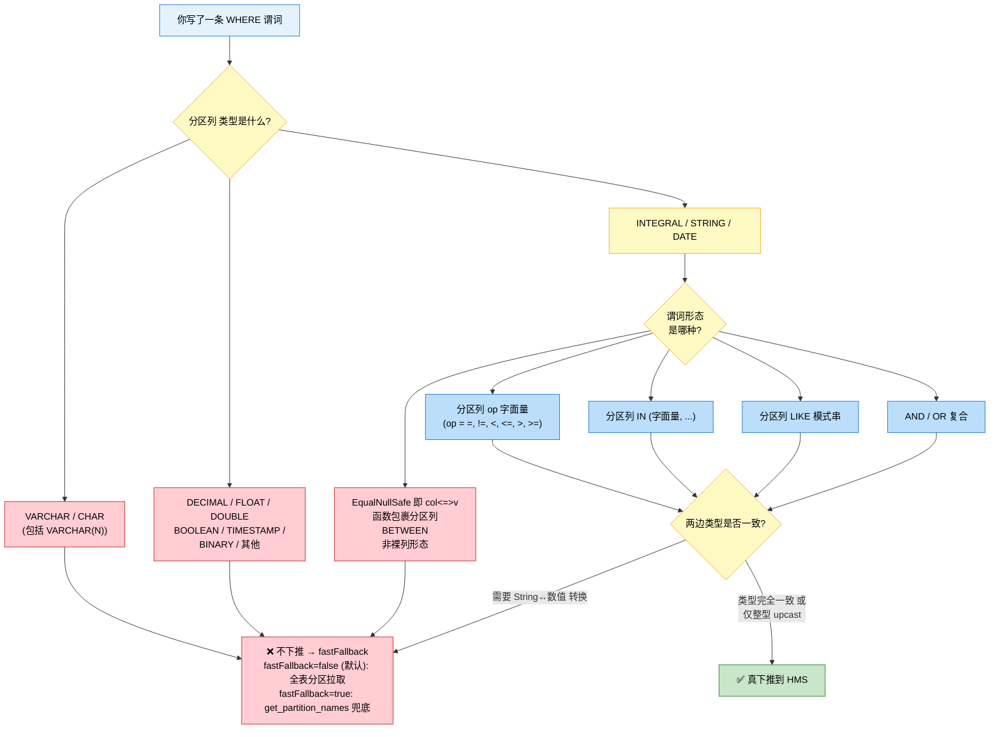

# Spark 3.3.2 Hive 分区谓词下推完全速查手册

> **作者**：eric  
> **日期**：2026-06-01  
> **适用版本**：Spark 3.3.x（emr-3.3.2 已实测）  
> **目标**：读完此手册不用回头看源码就能 100% 判定一条 SQL 谓词在 Hive 分区表上能否下推到 HMS  
> **配套案例**：`Spark3.3.2-string分区列与数字字面量谓词不下推案例.md`  
> **配套实测脚本**：`./Spark3.3.2-分区谓词下推全场景实测脚本.scala`

---

## 〇、本手册的可信级别

每条结论都标了 [✅ 已实测] 或 [⚙️ 源码推断]。来源：

- **[✅ 已实测]**：在 EMR 测试集群（172.21.240.4）用 `HiveCatalogMetrics.METRIC_PARTITIONS_FETCHED` 实测过，铁证
- **[⚙️ 源码推断]**：基于 `HiveShim.convertFilters`（`HiveShim.scala` L857-1074）+ `TypeCoercion.PromoteStrings`（`TypeCoercion.scala` L1059-1091）+ `AnsiTypeCoercion.PromoteStrings`（`AnsiTypeCoercion.scala` L229-271）+ `ExtractAttribute`（L980-990）+ `SupportedAttribute`（L944-962）逐 case 推导，**未必每个都跑过实测，但根据这几段源码可以严格演绎**

**ANSI 模式说明**：本手册同时覆盖 `spark.sql.ansi.enabled=false`（默认）和 `=true` 两种模式。两种模式的类型提升规则不同，**部分场景下推行为相反**（详见 §二½）。如未特别标注，默认指 `ansi=false`。

如发现任何标 [⚙️ 源码推断] 的与实测不符，请反馈，我会修正手册。

---

## 一、判定流程图（最快上手）



---

## 二、三条铁律（背下来即可）

### 🎯 铁律 1：分区列必须以"裸列"或"整型 upcast"形式出现

```sql
WHERE dt = ...                           -- ✅ 裸列
WHERE cast(int_dt as bigint) = ...       -- ✅ int → bigint 是 upcast，能解包
WHERE cast(string_dt as int) = ...       -- ❌ string → int 不被解包
WHERE substr(dt, 1, 6) = '...'           -- ❌ 函数包裹
WHERE upper(dt) = '...'                  -- ❌ 函数包裹
WHERE date_format(dt, 'yyyyMMdd') = '...' -- ❌ 函数包裹
WHERE dt + 1 = ...                       -- ❌ 算术包裹
```

**源码依据**：`ExtractAttribute.unapply`（`HiveShim.scala` L980-990）只放过 `Attribute` 和"整型 upcast"两种 case。

### 🎯 铁律 2：分区列与字面量类型必须严格一致

```sql
-- 假设 dt 列是 STRING 类型
WHERE dt = '20260601'                    -- ✅ 同类型
WHERE dt = 20260601                      -- ❌ Catalyst 改写为 cast(dt as int) = 20260601

-- 假设 dt 列是 INT 类型
WHERE dt = 20260601                      -- ✅ 同类型
WHERE dt = '20260601'                    -- ❌ 反向 cast，且 string → int 不被解包

-- 假设 dt 列是 BIGINT 类型
WHERE dt = 20260601                      -- ✅ int 字面量被提升到 bigint，分区列不带 cast
WHERE dt = 20260601L                     -- ✅ 同类型
WHERE dt = '20260601'                    -- ❌
```

**源码依据**：`TypeCoercion.PromoteStrings`（`TypeCoercion.scala` L1086-1090）→ `findCommonTypeForBinaryComparison`（L884-911）会把 String 一边降级到对面的 AtomicType；`ExtractAttribute` 拒绝 string→数值方向的 cast。

### 🎯 铁律 3：VARCHAR / CHAR 分区列**永远不下推**

无论 SQL 怎么写、字面量类型怎么对，VARCHAR/CHAR 分区列都不下推。**强烈建议改用 STRING**。

**源码依据**：`SupportedAttribute`（`HiveShim.scala` L944-962）显式黑名单：

> ```944:962:sql/hive/src/main/scala/org/apache/spark/sql/hive/client/HiveShim.scala
>     object SupportedAttribute {
>       // hive varchar is treated as catalyst string, but hive varchar can't be pushed down.
>       private val varcharKeys = table.getPartitionKeys.asScala
>         .filter(col => col.getType.startsWith(serdeConstants.VARCHAR_TYPE_NAME) ||
>           col.getType.startsWith(serdeConstants.CHAR_TYPE_NAME))
>         .map(col => col.getName).toSet
>
>       def unapply(attr: Attribute): Option[String] = {
>         val resolver = SQLConf.get.resolver
>         if (varcharKeys.exists(c => resolver(c, attr.name))) {
>           None                        // ← varchar/char 列直接拒绝
>         } else if (attr.dataType.isInstanceOf[IntegralType] || attr.dataType == StringType ||
>             attr.dataType == DateType) {
>           Some(attr.name)             // ← 仅放过整型 / String / Date
>         } else {
>           None                        // ← 其他都拒绝
>         }
>       }
>     }
> ```

---

## 二½、ANSI 模式对下推的影响（必读）

`spark.sql.ansi.enabled` 是 Spark 3.x 的**重大行为开关**。它决定 Catalyst 在做类型提升（即决定"`分区列 op 字面量`"两边要 cast 成什么类型）时走两条**完全不同的代码路径**：

- `ansi=false`（**默认**）：走 `TypeCoercion.scala` 里的 `PromoteStrings` → `findCommonTypeForBinaryComparison`
- `ansi=true`：走 `AnsiTypeCoercion.scala` 里的 `PromoteStrings` → `findWiderTypeForString`

**核心规则差异**（决定字符串与数值如何对齐）：

| 字面量类型 | 列类型 | ansi=false 选 commonType | ansi=true 选 commonType |
|---|---|---|---|
| String | IntegralType（Int/Long/Short/Byte） | **对面类型**（Int/Long/...）| **`LongType`**（统一选 long） |
| String | FractionalType（Float/Double） | **对面类型** | **`DoubleType`**（统一选 double） |
| String | DateType | **`DateType`**（除非 `castDatetimeToString`） | DateType |
| String | TimestampType | **`TimestampType`** | TimestampType |
| String | DecimalType | **`DoubleType`**（SPARK-22469） | DecimalType |
| String | NullType | StringType | StringType |

**关键源码**（ansi=true 路径）：

> ```139:152:sql/catalyst/src/main/scala/org/apache/spark/sql/catalyst/analysis/AnsiTypeCoercion.scala
>   private def findWiderTypeForString(dt1: DataType, dt2: DataType): Option[DataType] = {
>     (dt1, dt2) match {
>       case (StringType, _: IntegralType) => Some(LongType)
>       case (StringType, _: FractionalType) => Some(DoubleType)
>       case (StringType, NullType) => Some(StringType)
>       case (StringType, _: AnsiIntervalType) => None
>       case (StringType, a: AtomicType) => Some(a)
>       case (other, StringType) if other != StringType => findWiderTypeForString(StringType, other)
>       case _ => None
>     }
>   }
> ```

### 二½.1 ANSI 模式对下推的两类影响

#### 影响 A：cast 目标类型变化（结论可能不变）

```sql
-- string 分区列, 数字字面量
WHERE string_dt = 20260601
```

| 模式 | Analyzer 改写 | ExtractAttribute 判定 | 下推 |
|---|---|---|---|
| ansi=false | `cast(dt as int) = 20260601` | child=String 非 IntegralType → 拒 | ❌ |
| ansi=true | `cast(dt as bigint) = cast(20260601 as bigint)` | child=String 非 IntegralType → 拒 | ❌ |

🟢 **业务结论一致：都不下推**，但 cast 目标类型不同（int vs bigint）。

#### 影响 B：⚠️ ansi=true 让某些原本不下推的场景反过来能下推

```sql
-- INT 分区列, 字符串字面量（ansi 切换会造成下推行为相反）
WHERE int_dt = '20260601'
```

| 模式 | Analyzer 改写 | ExtractAttribute 判定 | 下推 |
|---|---|---|---|
| ansi=false | `cast(int_dt as string) = '20260601'` | child=Int → IntegralType ✓，但 dt=String 非 IntegralType → 拒（第二 case 守卫不满足）| ❌ |
| ansi=true | `cast(int_dt as bigint) = cast('20260601' as bigint)` | child=Int → IntegralType，dt=Bigint → IntegralType，且 `Cast.canUpCast(Int, Long)=true` → **解包成功** | **✅** |

🚨 **业务结论相反**：ansi 切换导致下推行为反过来！相同的 SQL 在不同集群可能完全不同表现。

#### 影响 C：⚠️ ansi=true 下 string 字面量解析失败会**抛运行时异常**

```sql
-- 注意: ansi=true 下, 如果字符串无法解析为对应数值类型, 运行时会抛 SparkNumberFormatException
WHERE int_dt = 'abc'        -- ansi=false: Filter 求值得 NULL, 不命中
                            -- ansi=true: 运行时抛错
WHERE int_dt = '20260601a'  -- 同上
```

这是 ANSI SQL 标准的"严格类型转换"语义。**实测时要预期看到异常而不是空结果**，本手册标注的"下推 ✅"指逻辑层面真下推到 HMS，不代表 SQL 一定能跑出结果。

### 二½.2 ANSI 模式下的对照速查表（重要场景）

| 分区列 | SQL 谓词 | ansi=false 下推 | ansi=true 下推 | 行为相同？ |
|---|---|---|---|---|
| STRING | `dt = '20260601'` | ✅ | ✅ | ✓ |
| STRING | `dt = 20260601` | ❌ 全拉 | ❌ 全拉 | ✓ |
| STRING | `dt > '20260601'` | ✅ | ✅ | ✓ |
| INT | `dt = 20260601` | ✅ | ✅（cast 到 bigint upcast 解包） | ✓ |
| INT | `dt = '20260601'` | ❌ 全拉 | **✅** | ✗ **相反！** |
| BIGINT | `dt = 20260601` | ✅ | ✅ | ✓ |
| BIGINT | `dt = '20260601'` | ❌ 全拉 | **✅** | ✗ **相反！** |
| BIGINT | `dt = 20260601L` | ✅ | ✅ | ✓ |
| DATE | `dt = DATE '2026-06-01'` | ✅ | ✅ | ✓ |
| DATE | `dt = '2026-06-01'` | ✅ | ✅ | ✓ |
| DATE | `dt = 20260601`（数字） | ❌ 全拉 | ❌ 全拉 | ✓ |
| VARCHAR(N) | 任意 | ❌ 全拉 | ❌ 全拉 | ✓ |
| FLOAT/DOUBLE | 任意 | ❌ 全拉 | ❌ 全拉 | ✓ |

**两条铁律的修订（覆盖 ANSI 模式）**：

- **铁律 1**（不变）：分区列必须以"裸列"或"整型 upcast"形式出现 → ANSI 不影响
- **铁律 2 修订**：分区列与字面量类型严格一致 → 在 ANSI 模式下放宽：**INT/BIGINT 分区列与字符串字面量"事实上能下推"**（因 string 字面量被 cast 到 bigint，且 int→bigint 是 upcast，分区列上的 cast 被 ExtractAttribute 解包）；但**仍强烈建议类型对齐**，因为：
  1. ansi=true 不是默认值，业务方未必都开
  2. ansi=true 下字符串解析失败会抛运行时异常，比 ansi=false 下"NULL+无结果"更难 debug
  3. 为防止集群 ANSI 配置变更导致行为飘移，**写 SQL 应当类型严格一致**，不依赖 ANSI 路径
- **铁律 3**（不变）：VARCHAR/CHAR 分区列永远不下推 → ANSI 不影响

### 二½.3 检查你集群当前模式

```sql
SET spark.sql.ansi.enabled;
```

如果你的集群默认开了 ansi=true（部分 EMR / Databricks 自定义版会默认开），**要重点检查**手册中带 ✗ 标记的场景。

---

## 三、按"分区列类型"分类的完全速查表

> 📌 **以下所有表格的"下推"列默认为 `spark.sql.ansi.enabled=false`（默认模式）的结果**。
> 若集群 ANSI 模式开启，请同时对照 §二½ 「ANSI 模式对下推的影响」中标 ✗ 的差异场景。

### 3.1 STRING 分区列（最常见）

| SQL 写法 | Analyzer 改写后 | 下推 | 状态 |
|---|---|---|---|
| `dt = '20260601'` | 同形态 | ✅ | [✅ 已实测] |
| `dt = 20260601` | `cast(dt as int) = 20260601` | ❌ 全拉 | [✅ 已实测] |
| `cast(dt as int) = 20260601` | 同上 | ❌ 全拉 | [✅ 已实测] |
| `cast(dt as bigint) = 20260601` | `cast(dt as bigint) = 20260601` | ❌ 全拉 | [⚙️ 源码推断]（同理 string→bigint 非 upcast） |
| `dt != '20260601'` | `Not(EqualTo(dt, '20260601'))` | ✅ | [⚙️ 源码推断]（命中 L1062 case） |
| `dt > '20260601'` | 同形态 | ✅ | [⚙️ 源码推断]（命中 L1031 case） |
| `dt >= '20260601' AND dt < '20260701'` | And 拆解 | ✅ | [⚙️ 源码推断]（命中 L1048 And case） |
| `dt IN ('20260601', '20260602')` | `In(dt, ...)` | ✅ | [⚙️ 源码推断]（命中 L999 case，会展开成 OR） |
| `dt IN (20260601, 20260602)` | 内部带 cast | ❌ 全拉 | [⚙️ 源码推断]（ExtractAttribute 拒 cast） |
| `dt NOT IN ('20260601', '20260602')` | `Not(In(...))` | ✅ | [⚙️ 源码推断]（命中 L1003 case，但若含 NULL 字面量则不下推 L996） |
| `dt LIKE '202606%'` | `StartsWith(dt, '202606')` | ✅ | [⚙️ 源码推断]（命中 L1042 case，下推为 `dt like "202606.*"`） |
| `dt LIKE '%0601'` | `EndsWith(dt, '0601')` | ✅ | [⚙️ 源码推断]（命中 L1045 case） |
| `dt LIKE '%0601%'` | `Contains(dt, '0601')` | ✅ | [⚙️ 源码推断]（命中 L1039 case） |
| `dt LIKE '202606_1'` | 复杂 like 模式 | ❌ 全拉 | [⚙️ 源码推断]（不命中 StartsWith/Contains/EndsWith） |
| `dt <=> '20260601'` | `EqualNullSafe` | ❌ 全拉 | [⚙️ 源码推断]（`SpecialBinaryComparison.unapply` L867 显式拒 EqualNullSafe） |
| `dt = '20260601' OR dt = '20260602'` | Or 拆解 | ✅ | [⚙️ 源码推断]（命中 L1056 Or case） |
| `dt IS NULL` | `IsNull(dt)` | ❌ 全拉 | [⚙️ 源码推断]（convertFilters 没有 IsNull case） |
| `dt IS NOT NULL` | `IsNotNull(dt)` | ❌ 全拉 | [⚙️ 源码推断] |
| `dt BETWEEN '20260601' AND '20260603'` | `dt >= '...' AND dt <= '...'` | ✅ | [⚙️ 源码推断]（Optimizer 会先把 BETWEEN 拆成 And(GreaterThanOrEqual, LessThanOrEqual)） |
| `substr(dt, 1, 6) = '202606'` | 同形态 | ❌ 全拉 | [⚙️ 源码推断]（分区列被函数包裹） |
| `concat(dt, '_x') = '20260601_x'` | 同形态 | ❌ 全拉 | [⚙️ 源码推断] |
| `length(dt) = 8` | 同形态 | ❌ 全拉 | [⚙️ 源码推断] |
| `dt RLIKE '^2026.*'` | `RegExpLike(...)` | ❌ 全拉 | [⚙️ 源码推断]（convertFilters 没有 RLike/RegExp case） |

### 3.2 INT / BIGINT / SMALLINT / TINYINT 分区列

| SQL 写法 | Analyzer 改写后 | 下推 | 状态 |
|---|---|---|---|
| `dt = 20260601`（dt 是 INT） | 同形态 | ✅ | [⚙️ 源码推断]（裸列，命中 L1031） |
| `dt = 20260601L`（dt 是 INT） | `cast(dt as bigint) = 20260601L` | ✅ | [⚙️ 源码推断]（int→bigint 是 upcast，ExtractAttribute 解包成功） |
| `dt = 20260601`（dt 是 BIGINT） | `dt = 20260601L`（字面量提升） | ✅ | [⚙️ 源码推断] |
| `dt = '20260601'`（dt 是 INT/BIGINT） | ansi=false: `cast(dt as string) = '20260601'` | ❌ 全拉 | [⚙️ 源码推断] |
| 🚨 同上 + **ansi=true** | `cast(dt as bigint) = cast('20260601' as bigint)` | **✅** | [⚙️ 源码推断]（详见 §二½ 影响 B） |
| `dt = 20260601D` 即 double 字面量（dt 是 INT） | `cast(dt as double) = 20260601D` | ❌ 全拉 | [⚙️ 源码推断]（int→double 不是 upcast，且 SupportedAttribute 不支持 double） |
| `dt > 20260601`（dt 是 INT） | 同形态 | ✅ | [⚙️ 源码推断] |
| `dt IN (20260601, 20260602)`（dt 是 INT） | 同形态 | ✅ | [⚙️ 源码推断] |
| `dt = -1`（dt 是 BIGINT） | 同形态 | ✅ | [⚙️ 源码推断]（负整数也是 IntegralType Literal） |

### 3.3 DATE 分区列

| SQL 写法 | Analyzer 改写后 | 下推 | 状态 |
|---|---|---|---|
| `dt = DATE '2026-06-01'`（dt 是 DATE） | 同形态 | ✅ | [⚙️ 源码推断]（命中 L877 ExtractableLiteral DateType） |
| `dt = '2026-06-01'`（dt 是 DATE） | `dt = cast('2026-06-01' as date)` Catalyst 把字面量 cast 成 DATE | ✅ | [⚙️ 源码推断]（PromoteStrings L1081 是 string↔Timestamp 不是 string↔Date，这条由 ImplicitTypeCasts 处理；常量字面量被 ConstantFolding 折叠成 Date Literal）|
| `dt = 20260601`（dt 是 DATE） | `cast(dt as int) = 20260601` | ❌ 全拉 | [⚙️ 源码推断]（DATE → int 不是 upcast） |
| `dt = current_date()` | `dt = <const>`（ConstantFolding 折叠后是 Date Literal） | ✅ | [⚙️ 源码推断]（前提是 ConstantFolding 在 PruneHiveTablePartitions 之前跑） |
| `year(dt) = 2026` | 同形态 | ❌ 全拉 | [⚙️ 源码推断]（函数包裹）|
| `dt >= DATE '2026-06-01' AND dt < DATE '2026-07-01'` | And 拆解 | ✅ | [⚙️ 源码推断] |

### 3.4 VARCHAR(N) / CHAR(N) 分区列

| SQL 写法 | 下推 | 状态 |
|---|---|---|
| 任意 SQL 写法 | ❌ 全拉 | [⚙️ 源码推断]（`SupportedAttribute` 黑名单显式排除） |

**唯一规避**：建表时改用 STRING。已建表无法在线修改分区列类型，需要重建表迁数据。

### 3.5 其他类型（DECIMAL / FLOAT / DOUBLE / BOOLEAN / TIMESTAMP / BINARY）

| 分区列类型 | 下推 | 状态 |
|---|---|---|
| `DECIMAL(p,s)` | ❌ 全拉 | [⚙️ 源码推断]（`SupportedAttribute` 不在白名单） |
| `FLOAT` / `DOUBLE` | ❌ 全拉 | [⚙️ 源码推断] |
| `BOOLEAN` | ❌ 全拉 | [⚙️ 源码推断] |
| `TIMESTAMP` | ❌ 全拉 | [⚙️ 源码推断]（白名单只有 IntegralType / StringType / DateType） |
| `BINARY` | ❌ 全拉 | [⚙️ 源码推断] |

**规避**：分区列只用 STRING / INT / BIGINT / DATE 这四种。**永远不要用其他类型做分区列**。

---

## 四、谓词形态分类速查（不分列类型，看 SQL 长什么样）

### 4.1 ✅ 一定能下推的形态（前提：列类型 + 字面量类型对齐）

```sql
-- 二元比较（=, !=, <, <=, >, >=）
WHERE 分区列 op 字面量
WHERE 字面量 op 分区列     -- 反过来也行 (L1035)

-- IN / NOT IN（要求所有 element 都是 ExtractableLiteral，不含 null）
WHERE 分区列 IN (字面量1, 字面量2, ...)
WHERE 分区列 NOT IN (字面量1, 字面量2, ...)

-- LIKE 三种简单模式（前缀/后缀/包含）
WHERE 分区列 LIKE '前缀%'
WHERE 分区列 LIKE '%后缀'
WHERE 分区列 LIKE '%包含%'

-- AND / OR
WHERE p1 AND p2 AND p3 ...   -- 部分能下推也算赚（L1048-1054：转出哪个保留哪个）
WHERE p1 OR p2 OR p3 ...     -- 必须每个 sub-predicate 都能下推（L1056-1060）

-- BETWEEN（被 Optimizer 展开成 And(>=, <=)）
WHERE 分区列 BETWEEN 字面量1 AND 字面量2
```

### 4.2 ❌ 一定不下推的形态

```sql
-- 1. 分区列被任何函数 / cast / 算术包裹
WHERE substr(分区列, ...) = ...
WHERE upper(分区列) = ...
WHERE 分区列 + 1 = ...
WHERE date_format(分区列, ...) = ...
WHERE cast(string_dt as int) = ...
WHERE cast(string_dt as bigint) = ...
WHERE cast(int_dt as smallint) = ...    -- downcast 不解包
WHERE cast(bigint_dt as int) = ...      -- downcast 不解包

-- 2. 类型不一致（依赖 PromoteStrings 隐式 cast）
WHERE string_dt = 20260601              -- string → int
WHERE int_dt = '20260601'               -- string → int 字面量
WHERE bigint_dt = '20260601'            -- string → bigint 字面量

-- 3. EqualNullSafe（NULL-safe 等于）
WHERE 分区列 <=> 字面量

-- 4. IS NULL / IS NOT NULL
WHERE 分区列 IS NULL
WHERE 分区列 IS NOT NULL

-- 5. 复杂 LIKE / RLIKE / REGEXP
WHERE 分区列 LIKE '%a%b%'                -- 中间还有 %
WHERE 分区列 LIKE '_2026%'               -- 含 _
WHERE 分区列 RLIKE '^2026.*'
WHERE 分区列 REGEXP '...'

-- 6. IN 列表含 NULL 字面量 + Not 的组合
WHERE 分区列 NOT IN ('a', NULL)         -- L996-997 显式拒绝

-- 7. InSet（数量超过 inSetThreshold=1000 的 IN）
WHERE 分区列 IN (1000+ 个值)            -- 会变成 InSet，部分形态下推（L1023）部分不

-- 8. 子查询
WHERE 分区列 IN (SELECT ... FROM ...)    -- 不是 ExtractableLiterals
WHERE 分区列 = (SELECT ...)
WHERE EXISTS (...)

-- 9. 与非分区列谓词被 OR 连起来
WHERE 分区列 = '...' OR 非分区列 = '...'  -- L57 normalizeExprs 之前可能被 PartitionPruning 拒掉

-- 10. 非分区列被错误当分区列写
WHERE id = 100                           -- id 不是分区列，根本不进 PruneHiveTablePartitions
```

### 4.3 ⚠️ 边界场景（要小心）

```sql
-- IN 列表元素数量
WHERE dt IN ('a', 'b', ..., 1001 个)   -- 超过 inSetThreshold(默认1000)，变成 InSet
                                        -- L1007: 转成 dt >= min AND dt <= max（范围降级），有可能下推
                                        -- 但 NOT InSet 超阈值就直接 None (L993)

-- 含 NULL 字面量的 IN
WHERE dt IN ('a', NULL)                 -- IN 内部 NULL 被丢弃 (L897-901)，剩下 'a' 可下推
WHERE dt NOT IN ('a', NULL)             -- ❌ 直接 None (L996)，NULL 在 NOT IN 语义上有特殊性

-- 谓词中含子查询（SubqueryExpression）
WHERE dt = (SELECT max(dt) FROM other_table)
                                        -- L52-53: PruneHiveTablePartitions.getPartitionKeyFilters
                                        -- 直接 filter 掉 hasSubquery 的谓词，不会传给 convertFilters
```

---

## 五、不下推时的"减灾"配置

如果你确认某些 SQL 改不动（历史 SQL、第三方工具生成的 SQL），至少打开 fastFallback 把杀伤力降一个量级：

```properties
# 必加（强烈建议平台层 spark-defaults.conf 默认开启）
spark.sql.hive.metastorePartitionPruningFastFallback=true

# 可选（让 Hive metastore 解析失败时自动降级而不是报错）
spark.sql.hive.metastorePartitionPruningFallbackOnException=true
```

| 配置 | 不下推时的 HMS 行为 | 杀伤量级 |
|---|---|---|
| `fastFallback=false`（**3.3.x 默认**） | `get_partitions(db, tbl, -1)` 拉**全分区元数据**（join 7~8 张元数据表）| 大（百万分区可拖死 HMS）|
| `fastFallback=true` | `get_partition_names`（单表单列）+ driver 端按谓词评估 + `get_partitions_by_names`（仅命中分区）| 中（轻一个量级） |
| 谓词真下推 | `get_partitions_by_filter('...')` | 小（最优） |

---

## 六、监控配套（怎么发现自己中招了）

### 6.1 Driver 端

```scala
// 单条 SQL 跑前 reset，跑后 fetched 远大于命中分区数 → 不下推
import org.apache.spark.metrics.source.HiveCatalogMetrics
HiveCatalogMetrics.reset()
spark.sql("...").collect()
val n = HiveCatalogMetrics.METRIC_PARTITIONS_FETCHED.getCount
```

阈值参考：单 query `n > 10000` 就该告警。

### 6.2 HMS Server 端

audit log 里 `cmd=get_partitions` 占比突增 → 客户端有 SQL 写错型不下推。

```bash
HMSLOG=/usr/local/service/hive/logs/hivemetastore.log
grep -oE 'cmd=get_partitions[a-z_]*' $HMSLOG | sort | uniq -c | sort -rn
# 健康集群应该 get_partitions_by_filter 占大头
# 如果 get_partitions 突然占比高 → 有人在拉全量
```

### 6.3 Driver 日志关键字

打开 DEBUG（`org.apache.spark.sql.hive.client=DEBUG`）后：

- 看到 `Hive metastore filter is 'dt = "..."'` → 真下推
- 看到 `Falling back to fetching all partition metadata` → 真的撞了 fallback-on-exception 路径
- 两者都没看到但实际 fetched 大 → fastFallback=false 的隐式全拉

---

## 七、给业务方的"安全 SQL 模板"（背下来）

### 7.1 String 分区列（最常见，dt 类型 STRING）

```sql
-- 单值
WHERE dt = '20260601'

-- 区间
WHERE dt >= '20260601' AND dt < '20260701'

-- 列举
WHERE dt IN ('20260601', '20260602', '20260603')

-- 前缀
WHERE dt LIKE '202606%'

-- 排除
WHERE dt != '20260601'
WHERE dt NOT IN ('20260601', '20260602')

-- 用 BETWEEN 也行（被展开成 And(>=, <=)）
WHERE dt BETWEEN '20260601' AND '20260603'
```

### 7.2 INT/BIGINT 分区列（dt 类型 INT 或 BIGINT）

```sql
-- 单值
WHERE dt = 20260601

-- 区间
WHERE dt >= 20260601 AND dt < 20260701
WHERE dt BETWEEN 20260601 AND 20260603

-- 列举
WHERE dt IN (20260601, 20260602, 20260603)
```

### 7.3 DATE 分区列（dt 类型 DATE）

```sql
-- 单值（推荐显式 DATE 字面量）
WHERE dt = DATE '2026-06-01'

-- 区间
WHERE dt >= DATE '2026-06-01' AND dt < DATE '2026-07-01'

-- 当天（推荐用常量函数，会被 ConstantFolding 折叠）
WHERE dt = current_date()
```

### 7.4 永远别这样写

```sql
WHERE dt = 20260601                      -- ❌ string 列被 cast 成 int
WHERE substr(dt, 1, 6) = '202606'        -- ❌ 函数包裹分区列
WHERE date_format(dt, 'yyyyMMdd') = '...' -- ❌ 函数包裹
WHERE dt RLIKE '^2026'                   -- ❌ 不下推
WHERE dt IS NULL                         -- ❌ IsNull 不下推
WHERE dt <=> '20260601'                  -- ❌ EqualNullSafe 不下推
WHERE cast(dt as int) = 20260601         -- ❌ string→int cast 不解包
WHERE dt IN (SELECT ...)                 -- ❌ 子查询元素不可下推
```

---

## 八、关键源码与默认值速查

### 8.1 SQL 配置参数

| 参数 | 默认值 / 引入版本 | 位置 |
|---|---|---|
| `spark.sql.hive.metastorePartitionPruning` | `true`（1.5.0+） | `SQLConf.scala` L1135-1141 |
| `spark.sql.hive.metastorePartitionPruningInSetThreshold` | `1000`（3.1.0+） | `SQLConf.scala` L1143-1155 |
| `spark.sql.hive.metastorePartitionPruningFallbackOnException` | `false`（3.3.0+） | `SQLConf.scala` L1157-1165 |
| `spark.sql.hive.metastorePartitionPruningFastFallback` | `false`（3.3.0+） | `SQLConf.scala` L1167-1176 |
| `spark.sql.hive.advancedPartitionPredicatePushdown.enabled` | `true`（2.3.0+） | `SQLConf.scala` L530-536 |
| `spark.sql.ansi.enabled` | `false`（3.0.0+） | 决定走 `TypeCoercion` 还是 `AnsiTypeCoercion` |

### 8.2 关键源码定位

| 模块 | 文件 | 关键行 | 作用 |
|---|---|---|---|
| Hive 端 filter 转换 | `sql/hive/.../client/HiveShim.scala` | L857-1074 `convertFilters` | 把 Catalyst expr 转成 Hive metastore filter 字符串 |
| 同上 | 同上 | L980-990 `ExtractAttribute` | 决定 cast 是否解包 |
| 同上 | 同上 | L944-962 `SupportedAttribute` | 分区列类型白名单 |
| 同上 | 同上 | L1138-1194 `prunePartitionsFastFallback` | 不下推时的兜底路径 |
| 类型提升（默认） | `sql/catalyst/.../analysis/TypeCoercion.scala` | L1059-1091 `PromoteStrings` | string ↔ 数值的 cast 改写 |
| 同上 | 同上 | L884-911 `findCommonTypeForBinaryComparison` | 决定 commonType 选哪个 |
| **类型提升（ANSI）** | `sql/catalyst/.../analysis/AnsiTypeCoercion.scala` | L229-271 `PromoteStrings` | ansi=true 路径的 cast 改写 |
| 同上 | 同上 | L139-152 `findWiderTypeForString` | string + IntegralType 统一选 LongType |
| 入口规则 | `sql/hive/.../execution/PruneHiveTablePartitions.scala` | L93-108 `apply` | 整条链路入口 |

---

## 九、常见误区

### 误区 1：「我加了 cast 让类型对齐就行」

❌ `WHERE cast(dt as int) = 20260601`（dt 是 string）。

把 cast 写在分区列上**没用**——`ExtractAttribute` 不解包 string→int cast。正确做法是把字面量类型写对。

### 误区 2：「EXPLAIN 显示 Pruned Partitions: [(dt=20260601)] 就是下推成功了」

❌。`EXPLAIN` 显示的是逻辑层面"最终保留分区"，**不能反映 HMS 端实际拉了几个分区元数据**。

正确的判别方式：
1. `HiveCatalogMetrics.METRIC_PARTITIONS_FETCHED`（spark-shell 直读）
2. HMS server 端 audit log 的 RPC 方法名（`get_partitions` vs `get_partitions_by_filter`）
3. driver 端 DEBUG 日志（`Hive metastore filter is '...'`）

### 误区 3：「字符串字面量加引号永远是对的」

❌。字符串字面量加引号只对 STRING 分区列对。如果分区列是 INT/BIGINT/DATE，加引号反而触发反向 cast 不下推。

**类型对齐才是核心**，不是引号本身。

### 误区 4：「partitionFilters 在 EXPLAIN 里有就一定下推了」

❌。`Pruned Partitions:` 列表只有命中的分区数 ≠ HMS 端只拉了那么多元数据。

详见上方误区 2 的判别方式。

### 误区 5：「SHOW PARTITIONS 是轻量调用」

⚠️ 不一定。在 Spark/Hive 客户端里 `SHOW PARTITIONS db.tbl`（无 partition spec）会调 HMS 的 `get_partition_names_ps` 或 `get_partitions`，**百万级分区表上仍然慢**。建议 platform 层屏蔽超大表的 SHOW PARTITIONS。

---

## 十、一页纸总结（贴墙用）

### 分区列类型 × 安全字面量

| 分区列类型 | 推荐字面量 | 下推 |
|---|---|---|
| INT / BIGINT / SMALLINT / TINYINT | 同类型整数字面量（不加引号）| ✅ |
| STRING | 单引号包裹的字符串字面量 | ✅ |
| DATE | `DATE 'yyyy-MM-dd'` 显式 DATE 字面量 | ✅ |
| DECIMAL / FLOAT / DOUBLE / BOOLEAN / TIMESTAMP / BINARY | 任意 | ❌ 永远不下推 |
| VARCHAR(N) / CHAR(N) | 任意 | ❌ 永远不下推 |

### 谓词形态白名单 / 黑名单

| ✅ 白名单（能下推）| ❌ 黑名单（不下推）|
|---|---|
| 裸列 `op` 字面量（`op` = `=`/`!=`/`<`/`<=`/`>`/`>=`）| 分区列被函数 / cast / 算术包裹 |
| 字面量 `op` 裸列（反过来也行） | 类型不一致（依赖 string↔数值 隐式 cast） |
| 裸列 `IN (字面量, ...)` | EqualNullSafe（`col <=> v`） |
| 裸列 `NOT IN (字面量, ...)`（无 NULL） | `IS NULL` / `IS NOT NULL` |
| 裸列 `LIKE '前缀%'` / `'%后缀'` / `'%包含%'` | 复杂 LIKE / RLIKE / REGEXP |
| 裸列 `BETWEEN x AND y`（展开成 And） | `IN (子查询)` |
| `AND` / `OR`（子谓词都满足上面） | `NOT IN` 含 NULL 元素 |

### 不下推时的杀伤量级

| 配置 | HMS 端调用 | 杀伤 |
|---|---|---|
| `fastFallback=false`（**3.3 默认**） | `get_partitions(db, tbl, -1)` 全拉 | 大（百万分区拖死 HMS） |
| `fastFallback=true` | `get_partition_names` + 按 names 取 | 中（轻一个量级） |
| 真下推 | `get_partitions_by_filter` | 小（最优） |

### 一句话铁律

> **分区列以"裸列"或"整型 upcast"形式出现，且与字面量类型严格一致，且谓词形态在白名单内 → 下推成功**。三个条件缺一不可。

---

## 十一、本手册的局限

1. **范围**：仅覆盖 Spark 3.3.x + Hive 元数据存储。不涉及 Iceberg / Delta / Hudi 等表格式（它们走自己的分区裁剪路径，不经过 `HiveShim.convertFilters`）。
2. **版本**：Spark 4.x 增强了 fast-fallback 的逻辑（SPARK-44388 / SPARK-48037 等），3.5/4.x 行为可能不同。下次升级要重做实测。
3. **DataSource v2 / file source**：本手册仅对 `HiveTableRelation`。对 `LogicalRelation(... HadoopFsRelation)` 路径走 `PruneFileSourcePartitions`，逻辑独立。
4. **ANSI 模式**：本手册同时覆盖 `spark.sql.ansi.enabled=false`（默认）和 `=true`，差异在 §二½ 集中说明。但 ANSI 模式下的所有结论目前是 [⚙️ 源码推断]，**未经 EMR 集群实测**。如果你的集群默认开 ansi=true，建议跑配套实测脚本验证后再依赖手册结论。

如遇到本手册没覆盖的场景，按 §六 的金标准做实测，欢迎补充进来。

---

## 十二、变更记录

| 日期 | 变更 | 触发 |
|---|---|---|
| 2026-06-01 | 初稿 | 配套案例归档完成后产出 |
| 2026-06-01 | 新增 §二½ ANSI 模式对下推的影响专章；§3.2 加 ANSI 高亮行；§八 新增源码定位表 | eric challenge: ansi=true 路径未覆盖 |
