# challenge 过程：Spark 3.3.2 string 分区列与数字字面量谓词不下推案例

> **审查目标**：本案例 `Spark3.3.2-string分区列与数字字面量谓词不下推案例.md` 的分析过程  
> **审查角色**：eric（自我 challenge）  
> **日期**：2026-06-01  
> **目的**：把分析过程中的 6 处失误、纠错路径、教训沉淀单独归档，与正式案例分离

---

## 一、按时间顺序复盘失误链

### 失误 1：口糊"`findWiderTypeForTwo(StringType, LongType)` 选 wider type = LongType"

**犯错位置**：第一轮回答中分析 `dt = 20260601`（dt 为 STRING）的类型提升路径时，凭直觉说出"走 `findWiderTypeForTwo`"。

**eric 当场质疑**：用户 eric 直接问"在代码里如何体现的"——这句质疑非常关键，直接逼我回去查源码。

**实际真相**：

```
真正的路径是 PromoteStrings 规则（TypeCoercion.scala L1059-1091），
内部调用的是 findCommonTypeForBinaryComparison（L884-911），
不是 findWiderTypeForTwo。
```

`findWiderTypeForTwo` 走的是另一套逻辑（Union/Coalesce/Greatest 等多路合并），其内部 `stringPromotion` fallback 对 (String, Int) 实际返回 String，**方向跟 BinaryComparison 是反的**。

**为什么社区给比较算子写专路**：注释（L880-883）写得明明白白——"比较场景里 string 跟数值比应该按数值语义比，不应该按字典序按 string 比"。这是 Spark 刻意为之的"用户更想要的语义"。

**教训**：

> **类型提升不是一套规则。Catalyst 在 BinaryComparison 上有专门的 `findCommonTypeForBinaryComparison`，与通用合并 `findWiderTypeForTwo` 是两条独立路径，方向都不一定相同。下次遇到任何"类型提升"场景必须先确认是哪条路径，不允许凭"通用合并 wider type"推。**

---

### 失误 2：口糊"`cast(dt as bigint)`"

**犯错位置**：在分析改写后谓词形态时多次说"`cast(dt as bigint) = 20260601L`"。

**eric 实测反驳**：在 EMR 集群跑 `EXPLAIN EXTENDED SELECT * FROM t_str WHERE dt = 20260601;`，Analyzed Logical Plan 显示：

```
Filter (cast(dt#24 as int) = 20260601)
```

**实际真相**：cast 目标是 `IntegerType`，不是 `LongType` / `BigIntType`。原因：字面量 `20260601` 在 Int 范围内（`Int.MaxValue = 2147483647`），Catalyst 默认 `IntegerLiteral` 类型推断成 `IntegerType`，`PromoteStrings` 选 `commonType = IntegerType` 后两边都对齐到 IntegerType。如果字面量超 int 范围（如 `dt = 99999999999`），cast 才会是 `LongType`。

**为什么这个口糊不影响最终结论**：`ExtractAttribute` 的守卫 `child @ IntegralType()` 关心的是 cast 的 child（StringType）不是 IntegralType，cast 目标到底是 Int 还是 Long 都被一样拒掉。

**教训**：

> **写源码分析时不要凭脑内推 cast 目标类型，要么直接读 EXPLAIN，要么追到 TypeCoercion 实际匹配的 case 上。"int → bigint" 这种细节虽然不一定影响最终结论，但属于"不应该发生的不准确"，会被 eric 抓出来。**

---

### 失误 3：单分区表 EXPLAIN 当作判别证据

**犯错位置**：eric 第一次跑 EXPLAIN 时表里只有 `dt=20260601` 一个分区，结果是：

```
Pruned Partitions: [(dt=20260601)]
```

我当时**差点直接接受这个 EXPLAIN 作为"印证源码分析"的证据**——好在临时悬崖勒马，意识到："表只有 1 个分区时，无论 HMS 全拉还是真下推，结果都长一样，无判别力"。

**实际真相**：单分区表 EXPLAIN 完全无法区分 B1（真下推）/ B2（fastFallback else 分支）/ B3（HMS 全拉 + driver 端二次过滤）/ B4（其他兜底裁剪）四种路径。

**教训**：

> **任何"分区裁剪是否生效"的实测必须用多分区表（且分区数 > 命中数）。单分区或全命中场景没有判别能力，写报告时严禁用作证据。**

---

### 失误 4：把"5 个分区"当作实际数据分布

**犯错位置**：让 eric `INSERT` 5 个分区后，看到 `Pruned Partitions: [(dt=20260601)]` 仍是 1 个，瞬间陷入"源码分析 vs EXPLAIN 矛盾"的迷茫，怀疑是不是 PruneHiveTablePartitions 之后还有别的二次过滤规则。

为此还专门去翻了 `UnwrapCastInBinaryComparison`（最后确认 `canUnwrapCast` 不处理 string）、`extractPredicatesWithinOutputSet`（不动 cast）等代码，浪费了一次完整的源码翻查回合。

**实际真相**：等 eric 跑 `SHOW PARTITIONS t_str;` 才发现：

```
+-----------+
|  partition|
+-----------+
|dt=20260601|
|dt=20260602|
|dt=20260603|
+-----------+
```

只有 **3 个**分区，不是 5 个！20260604/05 那两个 INSERT 大概率根本没真的跑进去。

后来用 metric 跑出 `delta=3`，刚好匹配实际分区数 3 = 全表分区数 → 直接证明"全拉"。**如果一开始就确认了实际分区数，根本不需要怀疑源码分析**。

**教训**：

> **造完测试数据要先 `SHOW PARTITIONS` + `SELECT count(*) GROUP BY 分区列` 双重确认。绝对不能预设"我让你 INSERT 5 个，所以表里就有 5 个"。INSERT 失败、空文件、CTAS 异常、目录权限等任何因素都可能让"以为造了"和"实际造了"不一致。**

---

### 失误 5：误把 `listPartitionsWithAuthInfo` 异常栈当作"授权 hook 绕开下推"

**犯错位置**：metric 实测结果出来时（数字字面量 delta=3），看到中间穿插了一条 stack trace：

```
TTransportException: Cannot write to null outputStream
... HiveTableScanExec.rawPartitions
... HiveExternalCatalog.listPartitions
... HiveClientImpl.getPartitions
... ThriftHiveMetastore$Client.send_get_partitions_ps_with_auth
```

我当时立刻惊呼"集群开了 SQLStdHiveAccessController，整个谓词下推路径都被授权 hook 绕开了！前面源码分析路径根本不对！"，差点又开一轮 reset 重做。

**实际真相**：栈里 `HiveTableScanExec.rawPartitions` 是**物理执行阶段**的调用，发生在 `PruneHiveTablePartitions` 已经把分区裁剪完之后，做的是"对裁剪后的分区取详细元数据用于真正扫文件"。它和**逻辑优化阶段**的 `PruneHiveTablePartitions → HiveClientImpl.getPartitionsByFilter → Shim.getPartitionsByFilter` 是两条独立路径：

| 阶段 | 路径 | 职责 |
|---|---|---|
| 逻辑优化 | `PruneHiveTablePartitions → ...getPartitionsByFilter → Shim.getPartitionsByFilter` | 决定**裁剪到几个分区**（关键，决定 HMS 拉几个）|
| 物理执行 | `HiveTableScanExec.rawPartitions → ...getPartitions → listPartitionsWithAuthInfo` | 决定**对裁剪后的分区取详细元数据**（用于真扫）|

授权 hook 影响的只是物理执行阶段的取详路径，**对逻辑优化阶段的下推完全没影响**。我前面整套源码分析的方向完全成立。

**教训**：

> **看到任何"看起来颠覆性的发现"时先 hold 一秒，自问：这是逻辑优化阶段还是物理执行阶段？是 catalyst 路径还是 hive client 路径？两条路径独立，不要看到一个就推翻另一个。**

---

### 失误 6：复现脚本未说清 `METRIC_PARTITIONS_FETCHED` 是累加 Counter

**犯错位置**：归档完正式案例后，eric 立刻 challenge："你这个例子不太对，那个分区 count 是个累加值吧"。

**实际真相**：`HiveCatalogMetrics.METRIC_PARTITIONS_FETCHED` 是 codahale `Counter`，**单调递增累加，不会自动 reset**。源码三件套：

> ```70:99:core/src/main/scala/org/apache/spark/metrics/source/StaticSources.scala
>   val METRIC_PARTITIONS_FETCHED = metricRegistry.counter(MetricRegistry.name("partitionsFetched"))
>   ...
>   def reset(): Unit = {
>     METRIC_PARTITIONS_FETCHED.dec(METRIC_PARTITIONS_FETCHED.getCount())
>     ...
>   }
> ```

> ```105:105:core/src/main/scala/org/apache/spark/metrics/source/StaticSources.scala
>   def incrementFetchedPartitions(n: Int): Unit = METRIC_PARTITIONS_FETCHED.inc(n)
> ```

`HiveClientImpl` 两处累加调用：

| 调用点 | 路径 | 触发场景 |
|---|---|---|
| `HiveClientImpl.scala:772` | `getPartitions` | 物理执行阶段取裁剪后分区详细元数据 |
| `HiveClientImpl.scala:784` | `getPartitionsByFilter` | 逻辑优化阶段 PruneHiveTablePartitions 触发的下推/降级路径 |

**Spark 社区自己测试代码（PartitionedTablePerfStatsSuite / OptimizeHiveMetadataOnlyQuerySuite）里都先 `reset()` 再断言绝对值**，证明累加性质是 well-known 的，不是我曲解。

**结论的对错**：实际跑出的 `total=0 → 3 → 4 → 7 → 10`，**delta 一栏（3 / 1 / 3 / 3）刚好就是各 SQL 独立的 fetch 数**，业务结论完全成立。但**复现脚本的可读性有问题**：
- 别人重启 spark-shell 跑会发现 baseline ≠ 0（如果 spark-shell 启动期 `setupCatalog` 等内部操作触发过分区拉取）→ 困惑
- 多次连跑同一段会被上一轮累加值干扰
- 把 `getCount()` 当瞬时值读会误导

**纠错动作**：
1. 案例文档 §5.4 显式加上"该 metric 累加性质"小节，引用源码三件套
2. 案例文档复现脚本改成每段查询前 `HiveCatalogMetrics.reset()` 显式归零，输出 `fetched=N` 而不是 `delta=N`，避免读者搞错语义
3. 保留原始累加观察的输出（0 → 3 → 4 → 7 → 10）作为"真实跑出来什么样"的诚实记录，并解释 delta 等价性

**教训**：

> **凡是用全局 metric / counter / static field 做实测时，必须先确认它的 reset 语义、累加语义、调用点覆盖范围。codahale Counter 默认只能 inc/dec，没有 set；写测试用 reset() 是社区标准做法。复现脚本要让读者一看就懂"这条数到底是这次查询的还是累加的"，绝对不能只输出绝对值让读者自己算。**

---


## 二、纠错路径总览

```mermaid
flowchart LR
    Q1["eric 问:<br/>'dt = 20260601' 这种<br/>能下推吗"]:::user
    A1["回答 1: 凭直觉说<br/>findWiderTypeForTwo<br/>选 wider = Long → cast as bigint"]:::red

    Q2["eric 追问:<br/>代码里如何体现"]:::user
    A2["回去查源码:<br/>实际是 PromoteStrings →<br/>findCommonTypeForBinaryComparison<br/>cast 目标 = Int 不是 Long"]:::green

    Q3["eric 实测 1 分区表:<br/>Pruned 仍 1 个"]:::user
    A3["差点接受<br/>悬崖勒马:<br/>1 分区无判别力"]:::yellow

    Q4["造 5 分区<br/>实测仍 1 个"]:::user
    A4["怀疑源码分析<br/>翻 UnwrapCast 等<br/>无果"]:::red

    Q5["SHOW PARTITIONS<br/>实际 3 个"]:::user
    A5["真相: INSERT 失败<br/>表里只有 3 个"]:::green

    Q6["metric delta=3<br/>(全拉)<br/>delta=1<br/>(下推)"]:::user
    A6["源码分析方向<br/>完全成立"]:::green

    Q7["eric 追问:<br/>那个 count 是<br/>累加值吧"]:::user
    A7["确认: 是 codahale Counter<br/>单调累加, 需要 reset()<br/>结论不变, 但脚本写法改进"]:::green

    Q1 --> A1 --> Q2 --> A2 --> Q3 --> A3 --> Q4 --> A4 --> Q5 --> A5 --> Q6 --> A6 --> Q7 --> A7

    classDef user fill:#e3f2fd,stroke:#1976d2,color:#000
    classDef red fill:#ffcdd2,stroke:#c62828,color:#000
    classDef yellow fill:#fff9c4,stroke:#f9a825,color:#000
    classDef green fill:#c8e6c9,stroke:#2e7d32,color:#000
```



---

## 三、教训沉淀（提炼为可复用规则）

### 规则 A：源码分析"三件套"先于直觉

任何涉及"参数默认值 / 类型提升方向 / 内部常量"的回答必须先查源码，禁止凭"业界通常这样"或"我记得是"作答。可参考 memory 91435632（产出文档源码三件套规则）。

### 规则 B：EXPLAIN 不是金标准

`EXPLAIN EXTENDED` 显示的 `Pruned Partitions:` 是**逻辑层面的"最终保留分区"**，**不能反映 HMS 端实际拉了几个分区元数据**。验证 HMS 端实际 RPC 行为必须用：
1. `HiveCatalogMetrics.METRIC_PARTITIONS_FETCHED` 计数器（首选，spark-shell 直读）
2. HMS server 端 audit log（最铁，可看到具体 RPC 方法名）
3. driver 端 `org.apache.spark.sql.hive.client` DEBUG 日志（看 `Hive metastore filter is '...'` 是否出现）

### 规则 C：实测必须有判别力的样本

- 多分区表（分区数 > 命中数）
- 命中数 < 全表分区数
- 测试前必须 `SHOW PARTITIONS` + `SELECT count(*) GROUP BY 分区列` 双重确认实际数据分布
- 避免"全命中"或"无命中"边界场景

### 规则 D：异常栈定位先分阶段

看到任何 Spark 内部异常栈，第一件事不是看异常类型，而是问：

| 是什么阶段 | 关键帧特征 |
|---|---|
| Parser / Analyzer | `SparkSession.sql`, `UnresolvedRelation`, `Analyzer.execute` |
| Optimizer | `RuleExecutor.execute`, `PruneHiveTablePartitions.apply`, `Optimizer.execute` |
| Physical Plan | `QueryExecution.executedPlan`, `SparkPlanner.plan` |
| **物理执行** | `SparkPlan.execute`, `HiveTableScanExec.rawPartitions`, `doExecute` |

**不要把物理执行阶段的现象当作逻辑优化阶段的证据**，反之亦然。

### 规则 E：Challenge 自己的"看起来颠覆性"发现

任何"看起来颠覆前面分析"的证据必须先 hold 一秒做以下自检：

1. 测试前提对吗？（数据分布 / 表结构 / 配置）
2. 异常 / 现象属于哪条路径？（逻辑优化 vs 物理执行 vs 别的兜底）
3. 我有没有忽略 EXPLAIN 之类工具的"假象能力"？

很多看似颠覆的发现，最终都是测试方法或观察方法本身的偏差。**重做实验比重做源码分析便宜得多**。

### 规则 F：用全局 metric / counter 实测时先看 reset 与累加语义

任何用 `HiveCatalogMetrics` / `HiveCatalogMetrics.METRIC_*` / driver 端全局 codahale metric 实测时，必须先做完三件事再写脚本：

1. **看是 Counter / Gauge / Histogram 哪种类型**：Counter 单调累加只能 inc/dec、没有 set；Gauge 是瞬时值；Histogram 有 reservoir
2. **看 reset 是不是支持**：codahale Counter 没有 reset() 方法，但 Spark `HiveCatalogMetrics.reset()` 用 `dec(getCount())` 模拟实现了一个，**这是 Spark 私有约定不是 codahale 标准**
3. **看 inc 调用点的覆盖范围**：`incrementFetchedPartitions` 只在 `HiveClientImpl.getPartitions` 与 `getPartitionsByFilter` 两处累加。datasource v2 / file source 的分区拉取**不走这个 metric**

复现脚本的写法：
- ✅ 每段查询前 `HiveCatalogMetrics.reset()` 显式归零，输出绝对值（语义清晰）
- ⚠️ 也可以记录 `b0/b1/b2/...` 算 delta（语义等价），但脚本必须显式说明"这是累加值，看 delta 不看 total"
- ❌ 直接输出 `getCount()` 让读者自己算差，且不说明累加性质（容易误导）

---

## 四、对未来同类案例的输入

下次遇到任何 Spark / Hive 谓词下推 / 分区裁剪类问题：

1. 第一步：用 `HiveCatalogMetrics.METRIC_PARTITIONS_FETCHED` 实测，**不要先看 EXPLAIN**
2. 第二步：用源码确认改写路径（PromoteStrings / Cast / convertFilters）
3. 第三步：用多分区 + 部分命中表做实验
4. 第四步：必要时 driver/HMS 双端 DEBUG 日志兜底

**绝对不要**：
- 看到 EXPLAIN `Pruned Partitions: [...]` 只剩命中分区就声称"下推成功"
- 凭"业界通常如此"推导默认值
- 把物理执行阶段栈帧当作逻辑优化路径的证据

---

## 五、对正式案例的影响

正式案例 `Spark3.3.2-string分区列与数字字面量谓词不下推案例.md` 的所有结论已用 metric 实测铁证验证。本 challenge 文件中的 5 处失误**没有进入正式案例正文**，仅作为方法论训练材料保留在 challenge 子目录。

按 memory 71373557 的 challenge 归档纪律：

| 类型 | 位置 | 内容 |
|---|---|---|
| 正式案例 | `bigdata-study/spark/案例/Spark3.3.2-...md` | 仅技术结论，不留 challenge 痕迹 |
| challenge 过程 | `bigdata-study/spark/案例/challenge/challenge-Spark3.3.2-...md` | 失误链 + 教训沉淀（本文件）|

两份文件名以 `challenge-<原文件名>` 关联，便于互查互对照。

---

**完。**
