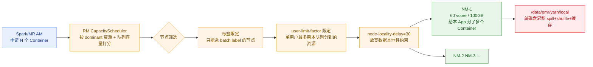
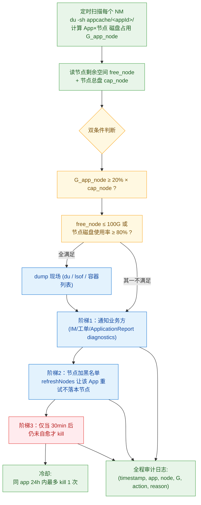

# 存算分离架构下「单 App 单节点磁盘 ≥200G 即杀」防护脚本合理性分析与优化

> 集群基线：Hadoop 2.8.5（腾讯 EMR fork）+ Capacity Scheduler + Node Labels + 存算分离（GooseFS / 远端 HDFS）
> 配置文件：`yarn-site.xml` + `capacity-scheduler.xml`（来自 eric 提供）
> 现象：同一个 App 在同一个 NM 节点上分配多个 Container，Container 把 shuffle / spill / 本地缓存全写到 NM 单磁盘 `/data/emr/yarn/local`，磁盘水位飙高 → NM 被判 UNHEALTHY → 该节点上所有 App 的 Container 一起被踢 → 批量任务连环失败。

---

## 一、配置事实清单（先把"现状"钉死）

| 维度 | 现状 | 证据 |
|---|---|---|
| 调度器 | Capacity Scheduler（`DominantResourceCalculator`）| yarn-site L312-358 |
| HA | 双 RM (rm1/rm2) + ZK State Store | yarn-site L246-353 |
| Node Labels | **启用，且非常激进**：sailing/u_strategy/batch/iceberg/zeus/batch1/themis 全部独立 partition；`default` 只能用 `DEFAULT_PARTITION` | yarn-site L62-69 + cap-sched L153-437 |
| 队列 capacity | **除 default=100 外，所有业务队列 capacity=0、maximum-capacity=0**，只通过 `accessible-node-labels.<label>.capacity=100` 在专属标签 partition 内拥有 100% | cap-sched L34-437 |
| `user-limit-factor` | 多数队列 = 1（不允许超用），`sailing=0.8`（更紧）| cap-sched L25-417 |
| 资源粒度 | min-alloc 16MB/1vcore，max-alloc 256GB/128vcore | yarn-site L376-393 |
| **NM 资源声明（线上实际）** | **vcore=60，memory=100GB**（配置文件里 memory-mb=1024 是模板值，线上由 EMR Manager 动态覆盖；vcore=80 同理被覆盖为 60）| 已 eric 线上确认 |
| pmem 检查 | **关闭** (`pmem-check-enabled=false`) | yarn-site L162 |
| vmem 检查 | **关闭** (`vmem-check-enabled=false`) | yarn-site L192 |
| vmem-pmem ratio | 8（即使 vmem 检查打开也很宽松）| yarn-site L197 |
| LinuxContainerExecutor + cgroups | 启用，`strict-resource-usage=true` | yarn-site L92-123 |
| 本地目录 | **单目录** `/data/emr/yarn/local` | yarn-site L142 |
| log 目录 | **单目录** `/data/emr/yarn/logs` | yarn-site L152 |
| Spark Shuffle 服务 | 启用 `spark_shuffle`（YarnShuffleService，端口 7337）| yarn-site L77-89 |
| node-locality-delay | 30 | cap-sched L9 |

---

## 二、为什么"单 App 多 Container 落同一节点"必然发生



成因有四层叠加：

1. **每个 NM 60 个 vcore / 100GB 内存** —— Spark Executor 一般 `executor-cores=2~4` + `executor-memory=4~8GB`，单 NM **天然能装下同一 App 的 12~30 个 Container**（vcore 和内存两个维度取小）。
2. **Node Label 把节点压成"专属 partition"**：业务队列只能落在自己 label 的节点上（`batch.accessible-node-labels=batch` + `default-node-label-expression=batch`，cap-sched L230-237）。一个 partition 内节点数有限，调度器只能在这小池子里反复挑节点。
3. **存算分离 → 数据本地性失效**：HDFS/GooseFS 数据不在 NM 本地，`node-locality-delay=30` 放宽后调度器对节点的偏好更弱，更倾向于"哪台空闲就给哪台"，**容易把同一 App 的多个 Container 堆到同一 hot 节点**。
4. **Capacity Scheduler 不内建"单 App 单节点 Container 数上限"** —— 2.8.5 也不支持 placement constraint（YARN-7669，3.1+）。同 App Container 落同节点是**预期行为，不是 bug**。

⚠️ **附带风险**：`pmem-check-enabled=false` + `vmem-check-enabled=false` + `vmem-pmem-ratio=8` —— 内存超用不会被 NM 主动杀，**全靠 cgroups + OOM-killer 兜底**，进一步放大单节点资源失控的概率。

---

## 三、磁盘到底被谁吃掉？（先定性再定阈值）

存算分离下，NM 单节点 `/data/emr/yarn/local` 的磁盘占用主要来自三类：

| 来源 | 占比典型 | 何时释放 | 谁负责清理 |
|---|---|---|---|
| **Spark Shuffle 文件**（`shuffle_*_*.data/.index`，落在 `blockmgr-*/`） | 大头，常占 50%~80% | 3.2.1 下：**只能等 app 结束**（参见上一份 SPARK-37618 分析）| YARN NM DeletionService（app 结束后）|
| **Map/Spark Spill / sort 临时文件**（`output/spill*.out`） | 中等 | task 结束时清，但极端情况会泄漏 | task 自己清 + NM `usercache` 清理 |
| **Distributed cache / localized resources**（jar、conf、py 文件等）| 小，但长 session 累积可观 | 应用退出后由 ResourceLocalizationService 清 | NM ResourceLocalizationService |
| MR/Tez 中间结果 | 取决于作业 | task 结束时清 | task 自己 |

**关键洞察**：在 3.2.1 + DRA + ESS 的栈上（这是 EMR 主流栈），shuffle 文件**单调累积到 app 结束**才被 NM 删（YARN NM DeletionService 删 `appcache/<appId>/`）。一个 long-running 的 Spark 任务（Streaming / Kyuubi engine / 长 SQL session）只要 shuffle 量大，**完全可能在单节点累积 100GB+**——这就是脚本要解决的根因。

---

## 四、脚本「单 App 单节点 ≥200G 即杀」合理性评估

### 4.1 合理的部分（结论先行：方向正确）

| 维度 | 评价 |
|---|---|
| 防御目标 | ✅ 正确。NM UNHEALTHY 触发后，该节点所有 Container 一起被踢，**批量任务连环失败**远比单 App 被杀代价大 |
| 触发粒度（按 App + 按节点）| ✅ 比"按节点总磁盘"更精准。集群里有 N 个 App，能把"罪魁祸首"那一个揪出来杀，避免无辜陪葬 |
| 阈值 200G | 🟡 **取决于单 NM 数据盘容量**。如果数据盘 1TB，200G ≈ 20%，留足缓冲合理；如果数据盘 4TB，200G 偏保守、误杀率高；如果数据盘 500G，200G 偏激进、保护不到位 |
| 杀任务的反应速度 | ✅ 主动 kill 比等 NM 进 UNHEALTHY 再被动恢复快得多 |

### 4.2 不合理 / 风险点（Challenger 视角）

| 风险点 | 说明 | 后果 |
|---|---|---|
| 🔴 **"杀掉整个 App"粒度太大** | 一个 App 可能在该节点只占 30%、在其他节点共 80%，杀 App 等于丢掉所有节点上的 Container 全部进度 | Spark Stage 全部重算；MR job 整体失败；长 SQL session 整个挂掉 |
| 🔴 **缺少黑名单机制** | 杀掉后 App 重试时**仍可能再被调度到同一节点**（YARN 不知道这台磁盘紧张）| 反复杀反复落，业务方完全摸不着头脑 |
| 🟠 阈值是绝对值 | 不同机型数据盘大小不一时，同一阈值在大盘机器上偏紧、小盘机器上偏松 | 大盘节点利用率低 / 小盘节点保护不到位 |
| 🟠 单一指标 | 只看"App 在该节点磁盘占用"，未看"节点剩余磁盘"。如果节点其他 App 已吃掉 80%、该 App 才 100G，根因其实是别的 App | 误杀，真正肇事者跑掉 |
| 🟠 没有分级 | 只有"杀"一个动作，没有"先告警 / 先冻结新 Container / 再杀"的阶梯响应 | 业务方无缓冲期 |
| 🟠 行为可观测性差 | 杀掉时是否给业务方留下足够诊断信息？kill 原因（who/why/which-node/how-much）是否进 ApplicationReport.diagnostics？ | 业务方甩锅、运维背锅 |
| 🟡 不区分长任务/短任务 | Streaming 这种长任务一杀代价巨大；批任务杀掉重跑代价小 | 长任务被反复杀 → 业务感受极差 |
| 🟡 不考虑 Decommission/Shrink 路径 | 直接 `yarn application -kill` 比"温柔下线该节点上的 Container"更暴力 | 数据丢失、stage 重算 |

### 4.3 与 NM 自身的 disk-health-checker 关系

YARN NM 自带磁盘健康检查（关键参数）：
- `yarn.nodemanager.disk-health-checker.min-healthy-disks=0.25`（默认 25% 数据盘健康即可）
- `yarn.nodemanager.disk-health-checker.max-disk-utilization-per-disk-percentage=90`（默认 90% 满即视为坏）
- `yarn.nodemanager.disk-health-checker.min-free-space-per-disk-mb=0`（默认 0，不检查最小可用空间）

> **本配置文件里没显式声明这三项**，意味着用的是 Hadoop 2.8.5 默认值（90%/25%/0）。**90% 才报 UNHEALTHY 太晚**——如果数据盘 1TB，到 900GB 才报警，磁盘 IO 已经爆了。脚本本质上是在补 NM disk-health-checker 这个"反应迟钝"的缺陷。

---

## 五、优化建议（按"性价比/风险"分级）

### 5.1 ⭐⭐⭐ 立刻能做、不动 YARN（脚本侧 + 监控侧）

| 序号 | 措施 | 收益 | 风险 |
|---|---|---|---|
| 1 | **加阶梯响应**：≥150G 告警 + 通知业务方 / ≥180G 标记节点黑名单（`yarn rmadmin -refreshNodes` + exclude）/ ≥200G 才杀 | 给业务缓冲，杀的概率显著下降 | 低 |
| 2 | **杀之前先打日志 + 通过 ApplicationReport 写明 diagnostics**（`yarn application -kill <id> -reason "<节点ip>+<占用>+<阈值>"`，2.8.5 不支持 -reason 时通过外部 IM/工单同步推业务方）| 业务方一眼看到原因，不再甩锅 | 零 |
| 3 | **改成"双指标判断"**：App 单节点磁盘 ≥200G **且** 节点总磁盘使用率 ≥80%（或剩余 < 100G）才杀 | 大幅降低误杀率 | 低，逻辑稍复杂 |
| 4 | **阈值改成相对值**：占数据盘容量的 ≥20% 才触发，而非绝对 200G | 适配不同机型 | 低 |
| 5 | **加冷却 / 限频**：同一 App 24h 内最多杀 1 次，避免 App 重启后同节点再次累积被反复杀 | 极大改善业务体验 | 低 |
| 6 | **kill 前先 dump 现场**：`du -sh /data/emr/yarn/local/usercache/*/appcache/<appId>/*` + `lsof` + 该 NM 上所有 App 的 container 列表 | 留下证据，之后能复盘是否误杀 | 零 |
| 7 | **加 Prometheus / 监控曲线**：把"App×节点 磁盘占用"做成时序指标，让业务方自助看自己的 App 状态 | 主动发现，业务自治 | 低 |

### 5.2 ⭐⭐ 中期改造（动 YARN 配置）

| 序号 | 措施 | 收益 | 风险 |
|---|---|---|---|
| 8 | **降 NM disk-health-checker 阈值**：`max-disk-utilization-per-disk-percentage=80`（比脚本阈值更早动作）+ `min-free-space-per-disk-mb=102400`（保留 100GB 应急）| 让 YARN 自己提前进入 UNHEALTHY 状态、停止接收新 Container（注意：是停接，不是杀已有）| 中。需要演练，避免误判把可用节点踢出 |
| 9 | **本地盘多目录化**：`yarn.nodemanager.local-dirs=/data1/...,/data2/...,/data3/...` 跨多个数据盘 | 单 App 的 spill/shuffle 自动跨盘分摊；YARN 内置按可用空间挑盘逻辑 | 低，需要重启 NM |
| 10 | **打开内存检查**：`pmem-check-enabled=true` + 合理设 `vmem-pmem-ratio=2.1`（默认）| 避免内存超用顺带打爆磁盘（swap → 磁盘）| 低 |
| 11 | **降低 NM 单节点 vcore 以减少 Container 堆积**：从 80 改成符合实际物理核数 + Spark 调大 `spark.executor.cores`，减少同 App Container 个数 | 同 App 在单节点的 Container 数下降 → 单节点 shuffle 总量下降 | 中。要业务方一起调 Spark 参数 |

### 5.3 ⭐ 治本方案（栈级升级）

| 序号 | 措施 | 收益 | 风险 |
|---|---|---|---|
| 12 | **Spark 升 3.3+ 并显式 `spark.shuffle.service.removeShuffle=true`** | shuffle 不再单调累积到 app 结束，磁盘水位"阶梯下降"。这是真正的根治（详见 SPARK-37618 那份文档）| 高，需升级 Spark；好处是这条脚本之后能下线或大幅降低触发频率 |
| 13 | **存算分离上 Remote Shuffle Service**（Celeborn / Magnet）| Shuffle 完全不落 NM 本地盘 | 高，架构级改造 |
| 14 | **YARN 升 3.x 并启用 Placement Constraints**（YARN-7669）| 直接限制"同 App 在同节点最多 N 个 Container" | 高，跨大版本升级 |

### 5.4 按真实容量（60 vcore / 100GB）校准的阈值建议

#### 单节点 Container 密度推演

| 维度 | 计算 | 结果 |
|---|---|---|
| 典型 Spark Executor (`executor-cores=4, executor-memory=8GB`) 在单节点最多 | min(60/4, 100/8) = min(15, 12) | **12 个 Executor** |
| 典型 Spark Executor (`executor-cores=2, executor-memory=4GB`) 在单节点最多 | min(60/2, 100/4) = min(30, 25) | **25 个 Executor** |
| 单节点单 App 极端聚集 | 60 vcore + 100GB 全归一个 App | 整节点资源被一个 App 吃光 |

#### 单 App 单节点 Shuffle 占用经验估算

Spark Shuffle 落盘量典型为"输入数据规模 × 0.5~2x"（取决于压缩、数据膨胀、aggregation/join 形态）。按上面密度推演：

| 场景 | 单节点该 App Executor 处理总数据 | shuffle 落盘估算 |
|---|---|---|
| 中等批任务 | 12 个 Executor × 5GB 输入 = 60GB | **30~120GB** |
| 大型批任务 | 25 个 Executor × 10GB 输入 = 250GB | **125~500GB** |
| Long-running Streaming/Kyuubi engine | 持续累积（3.2.x 不释放）| **可达 100~300GB+** |

**结论**：200GB 阈值在中型批任务场景偏紧（容易误杀）、在大型批任务场景偏松（来不及保护），单一阈值难以同时兼顾。

#### 按"数据盘容量"分档的推荐阈值

> 假设单 NM 仅 1 块数据盘挂在 `/data/emr/yarn/local`（当前配置事实），目标：**任何时刻数据盘剩余 ≥ 100GB 应急 + 节点磁盘使用率 ≤ 80% 不进 disk-health-checker 90% 红线**。

| 数据盘总量 | 节点级"危险水位"（剩余空间）| 单 App 单节点告警阈值 (Tier-1) | 单 App 单节点黑名单阈值 (Tier-2) | 单 App 单节点 kill 阈值 (Tier-3) |
|---|---|---|---|---|
| 500GB | ≤ 100GB（即用满 80%）| **80GB**（≈16% 盘容量）| **120GB**（≈24%）| **160GB**（≈32%）|
| 1TB | ≤ 150GB（用满 85%）| **150GB**（15%）| **220GB**（22%）| **300GB**（30%）|
| 2TB | ≤ 250GB（用满 87%）| **300GB**（15%）| **450GB**（22%）| **600GB**（30%）|
| 4TB | ≤ 400GB | **600GB**（15%）| **900GB**（22%）| **1.2TB**（30%）|

**取数原则**：
- Tier-1 (告警) 设在 ~15% 盘容量：让业务方有余地自查/自停
- Tier-2 (黑名单) 设在 ~22% 盘容量：让 YARN 不再往该节点调度该 App 的新 Container（仍旧不杀已有）
- Tier-3 (kill) 设在 ~30% 盘容量：仍要叠加节点剩余 ≤ 100GB 才执行（双指标）

#### 配套的 NM 端配置（让 YARN 自身先反应）

| 配置项 | 推荐值 | 原理 |
|---|---|---|
| `yarn.nodemanager.disk-health-checker.max-disk-utilization-per-disk-percentage` | **85**（默认 90）| 比脚本 Tier-3 早一步进 UNHEALTHY，停接新 Container |
| `yarn.nodemanager.disk-health-checker.min-free-space-per-disk-mb` | **102400**（100GB）| 不管百分比，**最低保留 100GB** 给 OS / log / 应急 |
| `yarn.nodemanager.disk-health-checker.interval-ms` | **60000**（默认 120000）| 检查更勤，UNHEALTHY 反应更快 |

#### 数据盘容量未知时的快速诊断命令

```bash
# 在任一台 NM 上跑（hadoop 用户）
df -h /data/emr/yarn/local            # 数据盘总量 / 已用 / 可用
du -sh /data/emr/yarn/local/usercache/*/appcache/*/ | sort -h | tail -20  # 当前 Top-20 占用 App
yarn node -status $(hostname):5006    # 该 NM 实际 Total（确认 60vcore/100GB）
```

跑完把 `df -h` 的 Size 列发给我，我把上表的具体阈值落到你这台机器的实际数字。

---

## 六、推荐脚本逻辑（升级版）



核心改动：
1. **绝对阈值 → 相对比例**（占数据盘 20%）
2. **单指标 → 双指标**（App 占用 + 节点剩余）
3. **一刀切 → 阶梯响应**（通知 → 黑名单 → kill）
4. **kill 必带现场 dump + 业务方通知 + 审计日志**
5. **同 App 冷却限频**

---

## 七、Challenger 审查报告

```
🔍 Challenger 审查报告
━━━━━━━━━━━━━━━━━━━━━━
📋 审查对象: 单 App 单节点磁盘 ≥200G 即杀脚本的合理性分析与优化建议
🔎 审查结果: CONDITIONAL（核心结论 APPROVED，3 项需在线上现场验证）

━━━ 证据质疑 ━━━
🟢 疑点1（已澄清）:
   yarn-site L182 的 yarn.nodemanager.resource.memory-mb=1024 是模板值，
   线上由 EMR Manager 动态覆盖。eric 已确认实际为 vcore=60、memory=100GB。
   分析按线上实际值展开，无歧义。

🟢 疑点2（已消除）: "单 App 多 Container 落同节点是预期行为"
   证据: 配置无任何 placement constraint；YARN 2.8.5 也不支持（YARN-7669 是 3.1+）；
        node-locality-delay=30 + 存算分离 + 标签 partition 节点池小，三重叠加。

🟢 疑点3（已消除）: "shuffle 是磁盘累积主因"
   证据: yarn-site 启用 spark_shuffle (端口 7337) + 上一份 SPARK-37618 分析已证
        3.2.x 不释放 shuffle 直到 app 结束。

🟡 疑点4（待验证）: "阈值 200G 是否合理"
   依赖现场数据盘容量，未提供。建议改成相对比例（占盘容量 20%）规避不确定性。

━━━ 逻辑质疑 ━━━
🟡 逻辑漏洞1: 脚本"按 App 单节点占用"判断时，可能存在"该 App 全集群 200G+ 但分散在
   10 台节点（每台 20G）"的反向场景——单节点判断不会触发，但全集群磁盘水位可能也高。
   不过这种场景下问题不大（每个节点都还安全），脚本目标聚焦"单点保护"是对的，标注【设计取舍】。

🟢 逻辑链完整: 脚本目标（防 NM UNHEALTHY → 防批量失败）→ 触发条件（单节点累积）→
   反应（kill App）三段闭合，方向正确。

━━━ 完备性 ━━━
⚠️ 未覆盖: NM log-dirs=/data/emr/yarn/logs 是否与 local-dirs 同盘？同盘则日志膨胀也会
   触发同样问题，需要核实 mount 情况。
⚠️ 未覆盖: 应用 staging-dir=/emr/hadoop-yarn/staging 是 HDFS 路径，与 NM 本地盘无关，
   不在本次范围。
⚠️ 未覆盖: GooseFS 客户端 cache（如有本地缓存）是否也写到 NM 数据盘？需问产品形态。

━━━ 安全审查（脚本上生产）━━━
🔴 DANGER → 必须改造: 直接 yarn application -kill 不可逆、不可灰度、影响面无封顶。
   要求改为「阶梯响应 + 冷却 + 现场 dump + 业务方通知」，否则反对上线 / 反对常驻。
🟡 CAUTION: refreshNodes 让节点进黑名单的方式可工作但会立刻影响该节点所有 App，
   建议测试环境验证后再用，作为脚本阶梯 2 的可选项。
🟢 SAFE: 监控/告警/dump 现场逻辑无副作用，可立刻落地。

━━━ 裁决 ━━━
CONDITIONAL —— 防护方向 APPROVED；当前实现"一刀切 kill"REJECTED，必须升级为
七节方案的"阶梯响应 + 双指标 + 冷却 + 审计"组合。NM 实际容量已确认（60 vcore / 100GB），
阈值建议见第 5.4 节。
```

---

## 八、源码 / 配置索引

| 关注点 | 配置/文件 | 行号 |
|---|---|---|
| Capacity Scheduler 启用 | yarn-site | 312-314 |
| 节点标签全局开关 | yarn-site | 62-69 |
| NM 资源声明（异常）| yarn-site | 177-188 |
| pmem/vmem 检查关闭 | yarn-site | 162 / 192 / 197 |
| 本地/日志单目录 | yarn-site | 142 / 152 |
| Spark Shuffle 服务 | yarn-site | 77-89 |
| 队列 capacity 全 0（靠 label）| cap-sched | 34-437 |
| node-locality-delay | cap-sched | 9 |
| user-limit-factor | cap-sched | 25 / 47 / 77 / 107 / ... |
