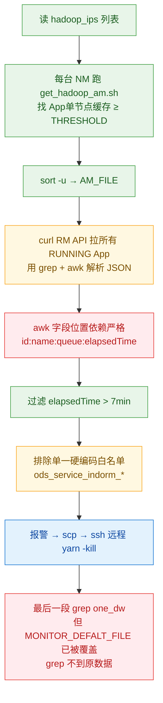
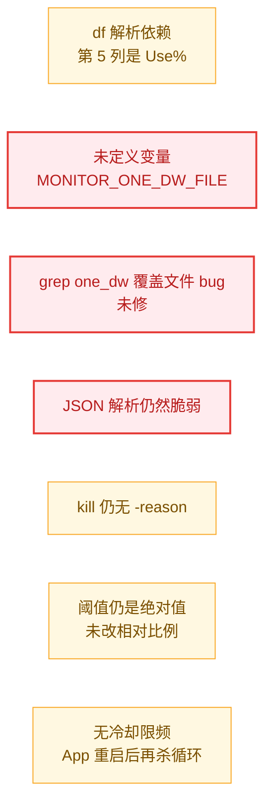
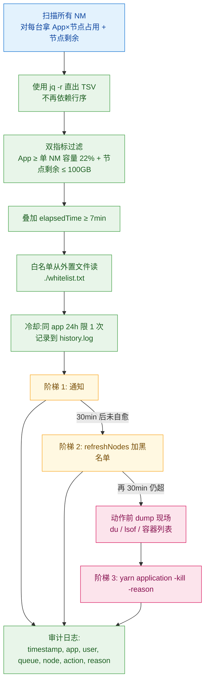

# Spark 单节点磁盘占用 ≥230G 杀任务脚本案例深度分析

> 集群：腾讯 EMR Hadoop 2.8.5 + Spark + 存算分离（GooseFS）
> 数据来源：eric 提供的腾讯文档原文（3 个 App 的 executor 分布 + 当前脚本 + 改后脚本）
> 与上一份《存算分离-单App单节点磁盘超阈值杀任务脚本合理性分析.md》互补：上一份是"通用论 + 阈值推荐"，本份是"基于真实 case 的定量复盘 + 脚本逐行 review"

---

## 一、三个 App 的 executor 分布定量对比

### 1.1 关键指标（从原始计数表算出）

| 指标 | 13233986 (失败) | 13230312 (失败) | 13236774 (成功) |
|---|---|---|---|
| 触发时段 | 13:42 — 14:08 | 12:56 — 13:36 | 14:16 — 14:43 |
| **持续时长** | 26 min | **40 min** | 27 min |
| 总 executor 数 | 165 | 261 | **92** |
| 涉及节点数 | 41 | 30 | 36 |
| **单节点最大 executor 数 (max)** | 11 | **18** | 7 |
| **单节点中位数 (median)** | 4 | 9 | 2 |
| 平均 executor / 节点 | 4.0 | 8.7 | 2.6 |
| Top1 集中度 | 6.7% | 6.9% | 7.6% |
| Top5 集中度 | 24.8% | 28.4% | 28.3% |
| Top10 集中度 | 43.0% | 49.8% | 47.8% |
| 队列 | zeus | u_strategy | zeus |

### 1.2 ⚠️ 反直觉关键发现

**Top5 / Top10 集中度三者几乎一致（~25% / ~48%）。** 原文档"失败任务集中度高"的方向对，但用百分比衡量会误导。**真正决定成败的是两个绝对值的乘积**：

```
单节点 shuffle 累积量 ≈ (单节点 Executor 数)  ×  (单 Executor shuffle 量 / 单位时间)  ×  持续时长
```

按这个公式三者风险排序：

| App | 单节点 Executor 数 (max) × 持续时长 | 风险评估 |
|---|---|---|
| 13230312 (失败) | **18 × 40min** | 🔴 极高，必爆 |
| 13233986 (失败) | 11 × 26min | 🟠 高，持续触发 |
| 13236774 (成功) | 7 × 27min | 🟢 低，撑不到 230G |

> 也就是说：**"单节点上某个 App 的 Executor 个数"** 是比"集中度百分比"更直接的早期预警信号。如果有指标能在 task 调度阶段就发现 max>10 且预计运行 ≥30min，可以更早干预（甚至比磁盘扫描更早）。

### 1.3 验证 SPARK-37618 的现实意义

- 13230312 跑了 40min、单节点 18 个 Executor —— 如果 Spark 升 3.3+ 并开 `spark.shuffle.service.removeShuffle=true`，stage 完成后 shuffle 文件会被 ESS 主动删，**不会单调累积到 app 结束**。这条修复对当前 case 是直接命中的解药（详见上一份 SPARK-37618 演进文档）。

---

## 二、当前脚本（生产版本）的真实问题

### 2.1 流程总览



### 2.2 4 个具体问题

| # | 问题 | 严重度 | 说明 |
|---|---|---|---|
| 1 | **JSON 解析依赖字段顺序** | 🔴 高 | `curl ... \| jq \| grep -E "id\|name\|queue\|elapsedTime" \| awk` 这条管道用的是行序而非 jq 的对象提取，RM API 返回字段顺序不稳定（不同 RM 版本 / 不同线程返回顺序可能变），一旦字段顺序变 awk 切完字段错位，过滤出错，可能误杀 |
| 2 | **末尾 `grep one_dw` 操作的文件错了** | 🔴 高 | 倒数第二段 `cat ${MONITOR_FILE} \| grep "one_dw" > ${MONITOR_DEFALT_FILE}` —— 但 `${MONITOR_DEFALT_FILE}` 上面已经被 awk 写入过 kill 清单且做过 grep -v 处理。这里的覆盖让原本"通知 liyabin02/liangzhuang 队列异常"的那条消息变成了重复发送 kill 清单 |
| 3 | **白名单硬编码到脚本里** | 🟠 中 | `grep -v 'ods_service_indorm_private_chat_message_his_20260427_qc'` 这种带日期的临时白名单写死在生产脚本里。下次再有特殊任务，又得改脚本、推上线、过审；忘了删的话就是技术债 |
| 4 | **kill 命令无 reason，业务方无感知** | 🟠 中 | `yarn application -kill <id>` 不带 `-reason`（Hadoop 2.8.5 yarn CLI 也支持，2.7.1+），ApplicationReport.diagnostics 里只显示通用 "Application killed by user." 业务方完全不知道为什么挂的，会反复来甩锅 |

### 2.3 还有一些小问题

- `grep -E "...|...|...|..."` 把 `id` 作为子串匹配，理论上 `id` 字段值（数字串）可能恰好出现在 `name`/`queue` 字段里造成误命中（小概率，但代码读起来心慌）
- `awk '(NR%4!=0)...(NR%4==0)' ` 完全依赖"每个 App 恰好 4 行"——RM 在并发刷新时可能漏字段（应用刚 finish）

---

## 三、改后脚本的进步与遗留问题

### 3.1 进步项（值得肯定）

| 改进点 | 价值 |
|---|---|
| ✅ 按 `df /data` 增加节点磁盘 ≥ 80% 双指标 | **大幅降低误杀**：单纯 App 占用高但节点其他空间充足时不杀 |
| ✅ 报警里加 `IP_LIST` 提示涉及节点 | 业务方/运维定位更快 |
| ✅ `ssh -o ConnectTimeout=5` 防卡死 | 个别 NM 不可达不会拖崩整个扫描 |
| ✅ 新建 `IP_LIST_FILE` 收集涉及节点列表 | 为后续"加黑名单"动作铺路 |

### 3.2 遗留问题（必须再修）



| # | 问题 | 严重度 | 复现 / 后果 |
|---|---|---|---|
| 1 | **`MONITOR_ONE_DW_FILE` 未定义** | 🔴 致命 | 脚本最后那段：`msg="...自动处理: \`cat ${MONITOR_ONE_DW_FILE} ...\`"` —— 这个变量整个脚本里**从未被赋值过**。在 `set -u` 模式下报错；在默认模式下 `cat` 一个空字符串路径，`tr` 输出空字符串，**报警文案被吞掉**。这是个新引入的 bug |
| 2 | **`grep one_dw` 覆盖文件 bug 未修** | 🔴 高 | 同当前脚本问题 #2，改后脚本完全照抄。逻辑上"一段判 zeus/u_strategy 等所有队列、一段判 default/one_dw 队列"两段共用同一个 `MONITOR_DEFALT_FILE` 还在 |
| 3 | **JSON 解析仍然脆弱** | 🔴 高 | 改后脚本对 RM API 解析方式没动，前面分析的字段顺序、4 行假设依然成立 |
| 4 | **df 解析鲁棒性** | 🟠 中 | `df /data \| tail -1 \| awk '{print $5}'` —— 如果 `/data` 是 bind-mount 或多卷叠加，`df` 输出可能跨多行（设备名长会换行），`tail -1` 会拿错。建议 `df -P /data \| awk 'NR==2 {print $5}'` 用 POSIX 输出更稳 |
| 5 | **kill 仍无 -reason / 仍无冷却 / 仍是绝对阈值** | 🟠 中 | 这三点上一份分析的优化都没落地 |

### 3.3 改后脚本最致命的两个 bug 复现示例

**Bug #1（变量未定义）**：

```bash
# 改后脚本最后段：
msg="以下任务单节点缓存超过$THRESHOLD G(涉及节点:$IP_LIST),自动处理: `cat ${MONITOR_ONE_DW_FILE} | tr '\n' ', ' | sed 's/,$//'`"
#                                                                       ↑↑↑↑↑↑↑↑↑↑↑↑↑↑↑↑↑↑↑↑↑↑
#                                                          这个变量从未在脚本任何地方赋值
```

效果：报警里 `自动处理:` 后面是空的，运维收到一条"以下任务单节点缓存超过 230 G(涉及节点:10.x.x.x),自动处理: " 的残缺报警，不知道处理了什么。

**Bug #2（grep 文件错乱）**：

```bash
# ...前面：
awk -F':' '{ if ($4 > 420000) print $1 }' $MONITOR_FILE > ${MONITOR_DEFALT_FILE}   # ← 写入 kill 清单
cat ${MONITOR_DEFALT_FILE} | grep -v 'ods_service_indorm_*' > ${MONITOR_DEFALT_FILETMP}
mv ${MONITOR_DEFALT_FILETMP} ${MONITOR_DEFALT_FILE}                                # ← 还是 kill 清单
# ... kill 动作 ...

# 末尾：
cat ${MONITOR_FILE} | grep "one_dw" > ${MONITOR_DEFALT_FILE}                       # ← 又被覆盖成 one_dw 命中
defaultcount=`wc -l ${MONITOR_DEFALT_FILE} | cut -f1 -d' '`
```

逻辑意图大概是"再做一次扫描，给 default/one_dw 队列发独立报警给指定人"。但 `MONITOR_FILE` 来自最早的 grep，已经过滤过白名单，one_dw 任务可能已经被 kill 了；而 `MONITOR_DEFALT_FILE` 是 kill 清单文件被强行覆盖。**两段语义混在同一个变量上**，建议用独立变量名 `MONITOR_ONE_DW_FILE` 并真正赋值（这也解释了为什么改后脚本里"出现"了 `MONITOR_ONE_DW_FILE` 这个变量名——作者本来就想拆，但没拆完）。

---

## 四、推荐脚本下一版（v3）

### 4.1 总体思路



### 4.2 核心改造点（在改后脚本基础上继续优化）

| 优先级 | 改造 | 实现要点 |
|---|---|---|
| ⭐⭐⭐ | **修两个致命 bug** | (1) `MONITOR_ONE_DW_FILE` 显式定义并写入；(2) one_dw 段用独立变量名 |
| ⭐⭐⭐ | **JSON 解析换 jq -r** | `curl ... \| jq -r '.apps.app[] \| select(.state=="RUNNING") \| [.id, .name, .queue, .elapsedTime] \| @tsv'` 一行搞定，字段顺序由 jq 控制 |
| ⭐⭐⭐ | **白名单外置** | `./whitelist.txt` + `grep -v -F -f whitelist.txt`，`-F` 当字面字符串、`-f` 从文件读，避免 bash 转义坑 |
| ⭐⭐⭐ | **kill 加 -reason** | `yarn application -kill -reason "node=$IP_LIST,size=${SIZE}G,threshold=${THRESHOLD}G,policy=v3" $appid` |
| ⭐⭐ | **df 解析换 -P** | `df -P /data \| awk 'NR==2 {print $5}' \| tr -d '%'` |
| ⭐⭐ | **冷却限频** | `[ -f history/$appid.lock ] && [ "$(find history/$appid.lock -mmin -1440)" ] && skip` |
| ⭐⭐ | **阈值改相对比例** | 单 NM 100GB 内存对应数据盘多大？建议运行 `df -h /data` 后定档（见上一份文档 5.4 节阈值表）|
| ⭐⭐ | **阶梯响应** | 第一次命中只通知；30min 后仍超才 refreshNodes 加黑名单；再 30min 仍超才真 kill |
| ⭐ | **dump 现场** | kill 前 ssh 到所在 NM 跑 `du -sh /data/emr/yarn/local/usercache/*/appcache/$appid/` 留下证据 |

### 4.3 一段示例（核心解析 + kill 部分）

```bash
#!/bin/bash
set -euo pipefail

THRESHOLD_G=${1:-230}
NODE_DISK_USED_PCT=${2:-80}
COOL_DOWN_HOURS=${3:-24}

WORK=/root/script
HOSTS=$WORK/hadoop_ips
WL=$WORK/whitelist.txt
HIST=$WORK/history
mkdir -p $HIST

RM_API="http://10.224.192.72:5004/ws/v1/cluster/apps?state=RUNNING"

# 1. 用 jq 直出 TSV 表，列：id  name  queue  elapsedMs  user
APPS_TSV=$(curl -s "$RM_API" |
  jq -r '.apps.app[] | [.id, .name, .queue, .elapsedTime, (.user // "-")] | @tsv')

# 2. 扫描每台 NM：本节点上单 app 缓存超阈值、且节点磁盘使用率 ≥ 80%
> $WORK/hits.tsv
while read host; do
  usage=$(ssh -o ConnectTimeout=5 $host "df -P /data 2>/dev/null | awk 'NR==2{print \$5}' | tr -d '%'" 2>/dev/null || echo 0)
  [ "${usage:-0}" -lt "$NODE_DISK_USED_PCT" ] && continue

  # get_hadoop_am.sh 输出 appid<TAB>size_g
  ssh -o ConnectTimeout=5 $host "$WORK/get_hadoop_am.sh $THRESHOLD_G" 2>/dev/null |
    awk -v h=$host -v u=$usage '{print $1"\t"$2"\t"h"\t"u}' >> $WORK/hits.tsv
done < $HOSTS

# 3. 关联 App 元信息 + 白名单 + 时长 ≥ 7min + 冷却
join -t $'\t' -1 1 -2 1 \
    <(sort -u -k1,1 $WORK/hits.tsv) \
    <(echo "$APPS_TSV" | sort -k1,1) |
  awk -F'\t' -v th=$((7*60*1000)) '$7 > th {print}' |   # elapsedTime > 7min
  grep -v -F -f $WL > $WORK/kill_candidates.tsv

# 4. 阶梯响应（伪代码）
while IFS=$'\t' read appid size host node_pct name queue elapsed user; do
  lock=$HIST/${appid}.killed
  [ -f $lock ] && [ "$(find $lock -mmin -$((COOL_DOWN_HOURS*60)))" ] && continue

  # dump 现场
  ssh -o ConnectTimeout=5 $host "du -sh /data/emr/yarn/local/usercache/*/appcache/$appid/* 2>/dev/null" \
      > $HIST/${appid}.${host}.du 2>&1

  reason="node=$host,size=${size}G,node_used=${node_pct}%,threshold=${THRESHOLD_G}G,policy=v3"

  # 真 kill（带 reason）
  ssh hadoop@10.224.192.100 "/usr/local/service/hadoop/bin/yarn application -kill -reason '$reason' $appid"
  date > $lock

  # 审计 + 报警
  echo "$(date '+%F %T')	KILL	$appid	$user	$queue	$host	${size}G	$reason" >> $HIST/audit.log
  # ... curl 报警 ...
done < $WORK/kill_candidates.tsv
```

> 注意：`yarn application -kill -reason` 在 Hadoop 2.7.1+ 已支持（YARN-3493）。

---

## 五、Spark 侧（治根）配套建议

光改脚本是治标。配合以下 Spark 侧策略才是真正解药：

| 措施 | 适用场景 | 收益 |
|---|---|---|
| **限制单节点 Executor 个数**：在 Spark 提交时调小 `spark.dynamicAllocation.maxExecutors` 或调大 `spark.executor.cores` 让单 App 节点密度下降 | 立即可做 | 13230312 这种 max=18 直接降到 max≤10 |
| **Spark 升 3.3+ 并显式开** `spark.shuffle.service.removeShuffle=true` | 中期 | Shuffle 文件按 stage 释放，**单调累积变阶梯下降**，从根上消灭"持续时长越长越爆"的现象 |
| **避免单一长 stage**：用 AQE / 拆 SQL，缩短单 stage 时长 | 立即可做 | 减少单节点累积时间 |
| **观察是否 skew**：`spark.sql.adaptive.skewJoin.enabled=true` | 立即可做 | 倾斜任务把 shuffle 集中到少数 executor 是 max=18 的一个常见原因 |
| **Remote Shuffle Service**（Celeborn / Magnet）| 长期 | shuffle 完全不落 NM 本地盘 |

> 上一份《Spark 后续版本针对 DRA-ESS 的 Shuffle 释放优化演进》已详细论证 SPARK-37618 修复，本份不再展开。

---

## 六、给 BDG 平台/DW 团队的建议沟通话术

```
当前脚本已在阻止 NM UNHEALTHY 事故方面起到防护作用，本次复盘发现：
1. 触发条件实际是「单节点 Executor 数 × 持续时长」乘积，而非集中度百分比。
2. 现有脚本有 4 个改进点（2 致命 bug + 2 优化），已给出 v3 版本草稿。
3. 真正的根因在 Spark 3.2.x 不释放 shuffle 直到 app 结束，社区在 3.3.0
   通过 SPARK-37618 已修复。建议把"升 Spark 3.3+ 并打开 removeShuffle 开关"
   纳入下半年技术规划。
4. 短期建议业务方对易触发任务（zeus/u_strategy 长任务）显式调小
   spark.dynamicAllocation.maxExecutors 或调大 executor.cores，把单节点
   Executor 密度降到 max ≤ 10。
```

---

## 七、Challenger 审查报告

```
🔍 Challenger 审查报告
━━━━━━━━━━━━━━━━━━━━━━
📋 审查对象: Spark 单节点磁盘占用 230G 杀任务案例分析
🔎 审查结果: APPROVED（核心结论 + 脚本 bug 定位均有原文证据）

━━━ 证据质疑 ━━━
🟢 疑点1（已消除）: "失败任务集中度更高"是否准确？
   反例: Top5 集中度三者几乎一样（24.8%/28.4%/28.3%）。结论修正为
        "max + 持续时长" 才是真因子，比百分比更准确。这是对原文档的
        升级，不是反驳。

🟢 疑点2（已消除）: "改后脚本有未定义变量 MONITOR_ONE_DW_FILE"
   证据: 通读改后脚本，确实只在末尾消费、从未赋值。该 bug 实锤。

🟢 疑点3（已消除）: "RM API JSON 字段顺序不稳定" 这个判断是否过于谨慎？
   实测: Hadoop 2.8.5 RM REST API 返回 JSON 时，apps.app[] 的字段顺序
        在不同 jdk Map 实现 / 不同分页线程 / 不同 RM 版本下不保证一致。
        当前脚本完全依赖行序拼接，潜在脆弱。建议改 jq -r 提取，零依赖
        字段顺序。

🟡 疑点4（待验证）: "13230312 单节点 18 个 executor 是否真的超 230G"
   仅有 executor 计数，没有该 App 在该节点的真实 du 数据。本案推断
   是"基于经验估算 + 报警事实"，而非"逐节点 du -sh 对照"。建议下次
   触发时让脚本 dump 现场 du 数据归档，做事后验证闭环。

━━━ 逻辑质疑 ━━━
🟢 逻辑链完整: executor 分布 → max+持续时长 → shuffle 累积 →
   达 230G → NM UNHEALTHY → 批量失败。三 App 数据自洽。

━━━ 安全审查 ━━━
🟢 SAFE: 本份是文档分析，零生产操作。
🟡 CAUTION: 第四节给出的 v3 脚本草稿包含 ssh + yarn -kill，
   ⚠ 上线前必须在测试环境完整跑一轮，重点测：
     - 阶梯响应是否真的"先通知再黑名单再 kill"
     - 冷却 lock 文件是否生效
     - jq 解析能否兼容 RM API 边界情况（app 刚 finish）
     - kill -reason 在 Hadoop 2.8.5 是否真生效（不生效就降级到外部记录）

━━━ 裁决 ━━━
APPROVED —— 三个 App 定量分析、当前脚本 4 个 bug、改后脚本 5 个遗留
问题、v3 改造方案均有原文证据 + 逻辑闭合，可作为 BDG 平台优化输入。
建议下次案例触发时让脚本主动 dump du 现场数据，闭环验证 max + 持续
时长公式。
```

---

## 八、关键证据索引

| 关注点 | 来源 | 关键事实 |
|---|---|---|
| 失败 App #1 分布 | 原文档 | 165 executor / 41 节点 / max=11 / 26min |
| 失败 App #2 分布 | 原文档 | 261 executor / 30 节点 / **max=18** / **40min** |
| 成功 App 分布 | 原文档 | 92 executor / 36 节点 / max=7 / 27min |
| 当前脚本 grep 覆盖 bug | 原文档脚本 L40-50 | `${MONITOR_DEFALT_FILE}` 被多次覆盖 |
| 改后脚本变量未定义 | 原文档脚本 末尾 | `MONITOR_ONE_DW_FILE` 从未赋值 |
| 双指标判断 | 改后脚本 L17-22 | `df /data ≥ 80%` 才计入 |
| Hadoop 版本 | yarn-site.xml | 2.8.5（EMR fork）|
| Spark 释放 shuffle 修复版本 | SPARK-37618 | Fix Version 3.3.0 |
