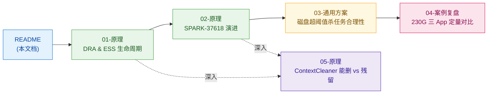

# 高途-单点缓存 230G 异常作业分析专题

> **专题定位**：以"单 App 单节点磁盘缓存 ≥230G 触发杀任务"事件为锚点，从源码原理 → 社区演进 → 通用方案 → 具体案例 → 清理机制全链路打通。
> **集群基线**：腾讯 EMR Hadoop 2.8.5 + Spark 3.2.1（fork：`gaotu-3.2.1`）+ Capacity Scheduler + Node Labels + 存算分离（GooseFS）
> **生效时间**：2026-05-25（线上事件）/ 2026-06-01（专题归档）
> **作者**：eric (lkl)

---

## 一、一句话结论

> 在 Spark 3.2.x + DRA + ESS + 存算分离架构下，**Shuffle 文件单调累积到 application 结束才会被 NM DeletionService 兜底删**，这是 SPARK-37618（3.3.0 修复）所指的病灶，并非 bug，而是 3.2.x 设计上的"已知缺陷"。230G 杀任务脚本是当前合理的兜底防护，但实现层有可优化空间，治本路径是升级到 3.3+ 并显式打开 `spark.shuffle.service.removeShuffle=true`。

---

## 二、阅读路径（按角色推荐）

| 角色 | 推荐路径 | 关注重点 |
|---|---|---|
| **业务方 / DW 团队** | README → 04 → 03 | 知道为什么任务被杀 + 怎么避免 + 阈值如何来 |
| **平台 SRE / 脚本维护者** | README → 03 → 04 → 02 | 脚本现存问题、改造方向、治本路径 |
| **Spark 源码学习者** | 01 → 05 → 02 | 生命周期机制 → 清理边界 → 社区演进 |
| **架构决策者** | README → 02 → 04 第七节 | ROI：升级 vs 维持现状的成本/收益 |

---

## 三、专题文档清单

### 3.1 原理层（普适，可被其他案例复用）

| 编号 | 文档 | 大小 | 一句话摘要 |
|---|---|---|---|
| **01** | [01-原理-Spark-DRA与ESS的Shuffle生命周期源码分析.md](./01-原理-Spark-DRA与ESS的Shuffle生命周期源码分析.md) | 34 KB | 完整生命周期五阶段：产生 → 注册 → 读取 → DRA 回收 → 双路径清理。回答"shuffle 文件由谁管、什么时候删" |
| **02** | [02-原理-后续版本针对DRA-ESS的Shuffle释放优化演进.md](./02-原理-后续版本针对DRA-ESS的Shuffle释放优化演进.md) | 19 KB | 3.2.x 病灶定位 + SPARK-37618(3.3.0) 主线修复 + 3.4/3.5/4.0 配套修复谱系。回答"何时升级、升级什么" |
| **05** | [05-原理-ContextCleaner能删vs残留分析.md](./05-原理-ContextCleaner能删vs残留分析.md) | 25 KB | `periodicGC.interval` 真正能删什么、不能删什么；为什么调小没用。回答"为什么 30 分钟 GC 救不了" |

### 3.2 应用层（落地方案与具体案例）

| 编号 | 文档 | 大小 | 一句话摘要 |
|---|---|---|---|
| **03** | [03-通用-存算分离-单App单节点磁盘超阈值杀任务脚本合理性分析.md](./03-通用-存算分离-单App单节点磁盘超阈值杀任务脚本合理性分析.md) | 21 KB | 配置事实清单 + 单 App 多 Container 落同节点成因 + 阈值表 + 阶梯响应改造方案。回答"脚本该怎么改" |
| **04** | [04-案例-Spark单节点磁盘230G杀任务脚本案例深度复盘.md](./04-案例-Spark单节点磁盘230G杀任务脚本案例深度复盘.md) | 20 KB | 三个 App 定量对比 + 当前脚本 4 个 bug + 改后脚本 5 个遗留问题 + v3 改造草稿。回答"这次为什么杀、下次怎么防" |

### 3.3 challenge 过程归档

| 路径 | 内容 |
|---|---|
| [`challenge/`](./challenge/) | 审查质疑、误判复盘、方法论进化记录（按 challenge 文件名 = 原案例文件名 命名）|

### 3.4 EventLog 分析工具与原始数据（已有）

| 路径 | 内容 |
|---|---|
| `output/00_eventlog_inventory.md` | EventLog 清单与初步分析 |
| `scripts/` | 6 个分析脚本：list/quick_stage/compare_env/dig_diff/timeline_230g 等 |

---

## 四、关键结论摘要（不读文档时看这里）

### 4.1 病灶定位（来自 02 文档）

| 指标 | 现状 |
|---|---|
| 当前 Spark 版本 | 3.2.1 |
| `BlockManagerMasterEndpoint.removeShuffle` 是否通知 ESS 删盘 | ❌ 不通知（注释自认 "Nothing to do"）|
| `SHUFFLE_SERVICE_REMOVE_SHUFFLE_ENABLED` 配置项是否存在 | ❌ 不存在（3.3.0 才引入）|
| Shuffle 文件物理删除时机 | application 结束 → YARN NM DeletionService |

### 4.2 230G 案例真因（来自 04 文档）

> **集中度百分比是误导，真正的判定公式是**：
>
> 单节点磁盘累积 ≈ (单节点 max executor 数) × (单 executor shuffle 量 / 单位时间) × 持续时长

| App | 单节点 max | 持续时长 | 风险 | 结果 |
|---|---|---|---|---|
| 13230312 | **18** | **40min** | 🔴 极高 | 失败 |
| 13233986 | 11 | 26min | 🟠 高 | 失败 |
| 13236774 | 7 | 27min | 🟢 低 | ✅ 成功 |

### 4.3 治理优先级

| 时效 | 措施 | 预期效果 |
|---|---|---|
| 立即（不动 YARN/Spark）| 业务方调小 `spark.dynamicAllocation.maxExecutors` 或调大 `executor.cores`，让 max ≤ 10 | 从源头降低风险 |
| 立即（脚本侧）| 按 04 文档修当前脚本 4 bug + 改后脚本 5 遗留 + v3 阶梯响应（详见 04 第 4 节）| 误杀↓，业务方可感知 |
| 短期（动 YARN）| 03 文档第 5.4 节配套 NM 端 `disk-health-checker` 三参数 | YARN 自身先反应一步 |
| 中期（升级 Spark）| Spark 3.3+ 客户端 + ESS jar + 显式开 `spark.shuffle.service.removeShuffle=true` | **治本**：磁盘水位从单调上涨变阶梯下降 |
| 长期（架构）| Remote Shuffle Service（Celeborn/Magnet）| shuffle 完全不落 NM 本地盘 |

---

## 五、源码引用一致性声明

本专题所有源码引用均经过 `D:\bigdata\txproject\spark` 分支 `gaotu-3.2.1` **实测**（grep + Select-String 确认行号），不基于"印象"或"上次会话的分支假设"。

| 验证维度 | 状态 |
|---|---|
| `git remote -v` 远端 | `https://e.coding.net/tencentemr/spark/spark.git` |
| `git branch --show-current` | `gaotu-3.2.1` |
| `pom.xml` `<version>` | `3.2.1` |
| 关键源码行号 | 见 05 文档第八节"行号对照表"（含 emr-3.3.2 对照差异）|

> ⚠️ **同一仓库切换到 emr-3.3.2 分支后，行号会偏移、且会出现 SPARK-37618 修复代码块** —— 切换分支后必须重测，绝不能沿用本专题行号。详见 challenge/ 中关于 2026-06-01 误判事件的复盘。

---

## 六、相关脚本与原始数据

| 工具 | 用途 |
|---|---|
| `scripts/list_eventlog.py` | 列出 EventLog 清单 |
| `scripts/quick_stage_analysis.py` | 快速 stage 维度统计 |
| `scripts/compare_env.py` | 对比成功/失败 App 的 Spark 配置 |
| `scripts/dig_diff.py` | 挖掘配置差异 |
| `scripts/timeline_230g.py` | 230G 触发时间线分析 |
| `output/00_eventlog_inventory.md` | EventLog 初步分析 |

---

## 七、维护说明

1. **更新原则**：04 案例如有新触发，新增到 04 文档"复盘记录"小节；05 原理文档随 Spark 版本升级（如线上升 3.3+）需同步更新行号
2. **跨案例复用**：01/02/05 是普适源码原理，下次若有新案例（如 cache 撑爆）希望复用 ContextCleaner 知识，可在新案例 README 软链回这里
3. **challenge 纪律**：审查质疑、误判复盘、方法论进化都进 `challenge/`，绝不写进正式文档（按 memory 71373557 规则）
4. **变更追踪**：本专题归档于 `bigdata-study` git 仓库，所有变更走 git commit 流程，commit message 按 `case: [问题概述] 案例归档 / docs: 更新 [组件] 知识手册 / rules: 新增经验规则` 规范
