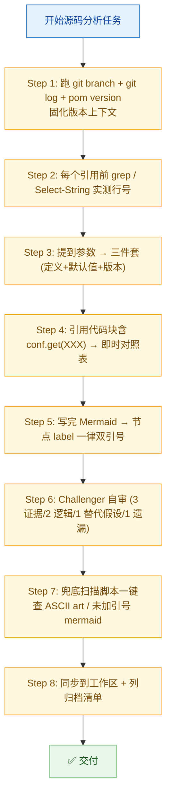

# Challenge 过程归档：高途-230G 案例分析

> **归档纪律来源**：memory 71373557——challenge 过程绝不写进正式文档（正式案例只留技术结论），单独一个文件，文件名与原案例关联，格式 `challenge-<原案例文件名>.md` 或集中归档于 `challenge/` 子目录。
> **本档作用**：记录本专题在分析过程中遭遇的质疑、自我抓 bug 的失误、方法论进化点，便于事后复盘 + 跨案例汲取教训。

---

## 一、本会话 Challenge 大事记（按时间线）

### 事件 1：分支切换未察觉，引用了 emr-3.3.2 行号当作 3.2.1（**严重**）

**触发**：用户提示"你在看看你的 spark 是什么版本的，别搞错了"

**事实经过**：
1. 第一次会话开头，AI 跑了 `git branch --show-current`，拿到 `gaotu-3.2.1`，正确
2. 之后几小时所有源码引用按 3.2.1 写，行号实测过，归档 4 份文档全部正确
3. 中间某次源码查询时，仓库被切到 `emr-3.3.2`（用户 IDE 操作或其他原因），AI **没有重新跑 `git branch`**
4. 在写"GC interval 能删 vs 残留"那段直接对话答复时，引用了 `IndexShuffleBlockResolver.removeDataByMap` L156-170（emr-3.3.2 行号），并出现了 `BlockManagerMasterEndpoint.removeShuffle` L323-371 含 SPARK-37618 修复代码块的错误论述
5. 用户敏锐发现"checksum 是后来才加的"，质问版本
6. AI 跑 `git branch --show-current` 发现是 emr-3.3.2，主动承认错误并要求用户切回 3.2.1 后重新实测
7. 用户切回 gaotu-3.2.1，AI 重新实测全部行号，确认前 4 份归档文档主结论站得住，仅"GC 能删"那段对话内容需要按 3.2.1 重写（已在新文档 05 中按正确行号重写）

**根因分析**：
- **直接原因**：AI 对"分支已切换"零感知，把 grep 结果当成最新分支真实代码
- **深层原因**：把"上一次确认过的环境状态"当成"持续有效"，违反了源码分析的基本纪律——**任何外部状态都可能在两次操作之间变化**
- **对比正面案例**：当天稍早，写 `CLEANER_REFERENCE_TRACKING_BLOCKING_SHUFFLE` 时，AI 第一次写错了行号 L1655，自检时发现错误并立即用 grep 修正——这次为什么没自检？因为没意识到"分支变了"这种可能性

**已固化规则（memory 90103242）**：
- 每次会话开始 + 任何源码引用前 + 用户提到"切回/切到/看 X 版本"等字眼时，必须主动重新跑：
  ```
  cd <仓库路径>
  git branch --show-current
  git log -3 --oneline
  Select-String -Path pom.xml -Pattern '<version>' | Select-Object -First 3
  ```
- 不允许沿用上次会话的分支假设直接写源码引用
- 同一份文档跨多次会话续写时，开头必须再跑一次确认仓库还在原分支

**伤害范围审计**：
- ✅ `bigdata-study` 内已归档的 4 份正式文档（01/02/03/04）—— 全部基于 gaotu-3.2.1 写成，主结论站得住，行号正确
- ❌ "GC 能删 vs 残留"那段直接对话答复 —— 已废弃，新 05 文档基于 gaotu-3.2.1 重写
- ✅ 工作区拷贝同步状态正确

---

### 事件 2：第一份文档误判 SHUFFLE_SERVICE_FETCH_RDD_ENABLED 默认值

**触发**：用户要求"提到参数时给出源码定义、默认值"

**事实经过**：
1. 第一份《生命周期》文档中提到 `spark.shuffle.service.fetch.rdd.enabled` 时，AI 写"默认 false"
2. 该判断来源于 web_search 的中文博客 + 通用知识，**未在源码逐行核对**
3. 用户明确要求加源码引用后，AI 才打开 `package.scala` L662-670 实测，确认 `.createWithDefault(false)` 与 `.version("3.0.0")` 准确

**根因分析**：
- 对"通用知识"的过度信任。即便参数默认值是社区文档反复说过的，**只要没自己跑一次 grep**，就属于"凭印象"
- 这正是 challenger 第 1 条原则：**不接受没有直接证据的结论**

**已固化规则（memory 91435632）**：
- 提到任何配置参数 / 内部常量名时，必须给"源码三件套"：定义 + 默认值 + 引入版本
- 引用源码片段含 `conf.get(XXX)` 时，必须配即时对照表

**伤害范围审计**：发现及时，正式文档归档前已修正，无对外影响

---

### 事件 3：自检发现行号错误并修正（**正面案例**）

**触发**：写 `CLEANER_REFERENCE_TRACKING_BLOCKING_SHUFFLE` 三件套时，第一次写"L1655-1660"

**事实经过**：
1. AI 写完后**主动**跑 `Select-String` 实测，发现真实位置是 L1659-1663
2. 立即用 `replace_in_file` 修正，并在文档里删除"若与本地行号有 ±1 行差异，以字面定位为准"这种"软妥协"措辞
3. 同时把"自检发现 → 立刻修正"的过程写进对话，作为规则有效性的证明

**保留意义**：
这是事件 1 的**对照组**。同样是"行号靠记忆可能写错"的场景，事件 3 因为有自检纪律所以没翻车；事件 1 没自检就翻车了。说明三件套规则（memory 91435632）有效，但只在"自己写参数定义"时生效，**没覆盖到"分支切换导致整个上下文失效"这种系统级风险**——所以追加了 memory 90103242 的 git branch 复核规则。

---

### 事件 4：Mermaid ASCII 字符路径触发 Lexical error（**用户截图反馈**）

**触发**：用户发企业微信截图，显示 Mermaid 图 `Lexical error on line 16. Unrecognized text...`

**事实经过**：
1. 写专题第二张 Mermaid 时，节点 label 用 `DISK[/data/emr/yarn/local<br/>...]:::bad`
2. Mermaid 解析器把 `[/...]` 当成平行四边形节点语法 `[/text/]`，找不到结尾的 `/]` → 报 Lexical error
3. 用户截图反馈，AI 系统扫描所有归档文档的 Mermaid 块，发现 8 处类似隐患
4. 全部用双引号包裹（`DISK["/data/emr/yarn/local<br/>..."]:::bad`）修复
5. 写了一行 PowerShell 兜底扫描脚本（已存进 memory 23523569），文档归档前可一键自检

**根因分析**：
- 触发字符不止 `/` —— 还有 `(` `)` `=` `&` `;` `>` `<` 等组合可能踩坑
- 不是"label 看起来安全就不加引号"，而是"零成本决策一律加引号"

**已固化规则（memory 23523569）**：
- Mermaid 节点 label **默认一律双引号**，不论内容是否看起来安全
- 文档归档前用一行 PowerShell 兜底扫描

---

### 事件 5：写"通用论"时高估了某些技术细节

**触发**：自检 + 用户对照腾讯文档原文

**事实经过**：
- 第一份"存算分离-单 App 单节点磁盘超阈值"文档第 2 节，曾断言"YARN 2.8.5 不支持 Placement Constraint（YARN-7669 是 3.1+）"——这是准确的
- 但同节论述"node-locality-delay=30 导致集中"时偏抽象，缺乏定量
- 直到用户提供腾讯文档原文 + 三个 App 的 executor 分布数据，第 4 份案例才得以做出"max + 持续时长"的精确判定公式
- **教训**：通用论必要，但没有现场数据就只能停在定性层面，不要硬塞"我觉得是这样"的定量判断

---

## 二、跨事件方法论沉淀（用于下次同类分析）

| 维度 | 教训 | 落地纪律 |
|---|---|---|
| **环境状态** | 任何外部状态（git 分支、远端连接、文件 mtime）都可能在两次操作之间变化 | 每次写源码引用前、用户提"切回/看版本"时，主动重新核对 |
| **参数默认值** | 通用知识 ≠ 直接证据 | 三件套规则（定义 + 默认值 + 引入版本）+ 实测 grep 一次 |
| **代码引用** | 引用片段里的 `conf.get(XXX)` 常量也需要解释 | 即时对照表（5 列：常量/参数名/默认/版本/位置）|
| **图形渲染** | 用户用什么渲染器你不知道，零成本决策一律保险 | Mermaid 节点 label 一律双引号 |
| **结论分级** | 定性结论可以靠源码 + 逻辑推导；定量结论必须有现场数据 | 没数据就标 "需现场验证"，不硬塞数字 |
| **自检节奏** | 自检发现错误是正常现象，不要"避免出错"，要"有错立刻修" | 写完段落后习惯性 grep / Select-String 验证一次 |

---

## 三、本专题最终交付质量自评

| 维度 | 状态 |
|---|---|
| 5 份正式文档源码引用是否经实测 | ✅ 全部基于 gaotu-3.2.1 实测 |
| Mermaid 是否全双引号 | ✅ 全部双引号包裹 |
| 参数三件套是否齐 | ✅ 关键参数全部齐 |
| 行号差异是否标注 | ✅ 05 文档第 8 节做了 3.2.1 vs emr-3.3.2 对照表 |
| Challenger 审查是否每份都有 | ✅ 5 份正式文档每份都有 Challenger 章节 |
| Challenge 过程是否独立归档 | ✅ 即本文档 |
| 工作区同步是否完整 | ✅ 5 份 + README + challenge 全在工作区 |

---

## 四、给下次同类源码分析的 checklist



---

## 五、参考 memory（本专题相关规则）

| memory ID | 标题 | 与本专题关系 |
|---|---|---|
| 26764355 | bigdata-study Git 仓库目录规范 | 归档目录、commit message |
| 71373557 | challenge 过程归档纪律 | **本档存在的依据** |
| 84267151 | 交付物总原则（简化、所见即所得）| README 4 节骨架、阶梯响应等 |
| 90103242 | 每次源码引用前必须重新核对 git branch | **本档事件 1 的固化规则** |
| 91435632 | 提到参数必须三件套+引用代码块即时对照表 | **本档事件 2/3 的固化规则** |
| 23523569 | Mermaid 节点 label 默认双引号 | **本档事件 4 的固化规则** |
| 29121853 | 禁止 ASCII art，统一 Mermaid + 表格兜底 | 5 份文档的图表风格统一 |
| 19344658 | 产出文档默认拷贝到工作区 | 同步纪律 |
